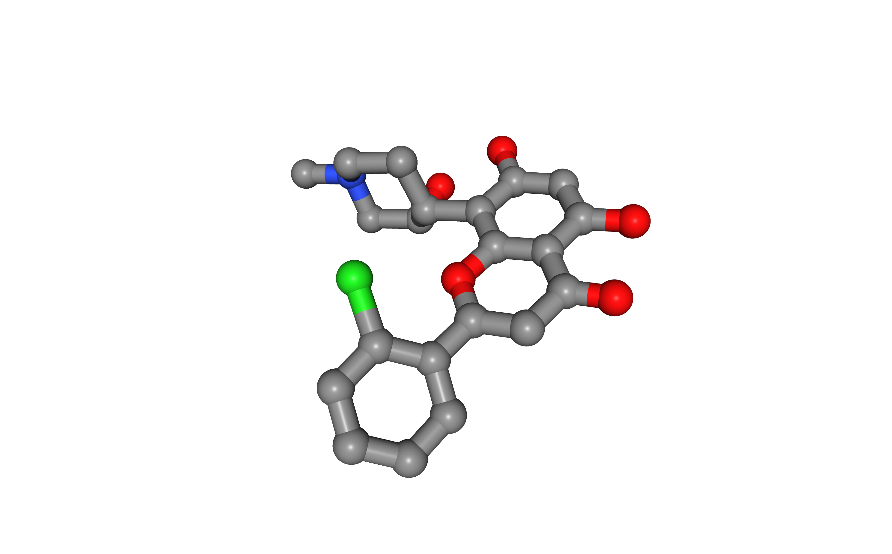

# The BioBB REST API

The [BioBB REST API](https://mmb.irbbarcelona.org/biobb-api) allows the execution of the [BioExcel Building Blocks](https://mmb.irbbarcelona.org/biobb/) in a remote server.

## Documentation

For an extense documentation section, please go to the [BioBB REST API website help](https://mmb.irbbarcelona.org/biobb-api/rest).

## Settings

### Auxiliar libraries used

* [requests](https://pypi.org/project/requests/): Requests allows you to send *organic, grass-fed* HTTP/1.1 requests, without the need for manual labor.
* [nb_conda_kernels](https://github.com/Anaconda-Platform/nb_conda_kernels): Enables a Jupyter Notebook or JupyterLab application in one conda environment to access kernels for Python, R, and other languages found in other environments.
* [nglview](http://nglviewer.org/#nglview): Jupyter/IPython widget to interactively view molecular structures and trajectories in notebooks.
* [ipywidgets](https://github.com/jupyter-widgets/ipywidgets): Interactive HTML widgets for Jupyter notebooks and the IPython kernel.
* [plotly](https://plot.ly/python/offline/): Python interactive graphing library integrated in Jupyter notebooks.

### Conda Installation and Launch

```console
git clone https://github.com/bioexcel/biobb_REST_API_documentation.git
cd biobb_REST_API_documentation
conda env create -f conda_env/environment.yml
conda activate biobb_REST_API_documentation
jupyter-nbextension enable --py --user widgetsnbextension
jupyter-nbextension enable --py --user nglview
jupyter-notebook biobb_REST_API_documentation/notebooks/biobb_REST_API_documentation.ipynb
```

***

## Index

 * [Behaviour](#behaviour)
     * [Tools information](#tools_info)
         * [List of packages](#list_pckg)
         * [List of tools](#list_tools)
         * [Tool's properties](#tools_prop)
     * [Launch tool](#launch_tool)
     * [Retrieve status](#retrieve_status)
     * [Retrieve data](#retrieve_data)         
 * [Examples](#examples)
     * [Tools information](#tools_info_ex)
         * [List of packages](#list_pckg_ex)
         * [List of tools from a specific package](#list_tools_ex)
         * [Tool's properties](#tools_prop_ex)
     * [Launch tool](#launch_tool_ex)
         * [Launch job with a YAML file config](#tool_yml_ex)
         * [Launch job with a JSON file config](#tool_json_ex)
         * [Launch job with a piython dictionary config](#tool_dict_ex)
     * [Retrieve status](#retrieve_status_ex)
     * [Retrieve data](#retrieve_data_ex)
 * [Practical cases](#practical_cases)
     * [Example 1: download PDB file from RSCB database](#example1)
     * [Example 2: extract heteroatom from a given structure](#example2)
     * [Example 3: extract energy components from a given GROMACS energy file](#example3)

***

***

<a id="behaviour"></a>
## Behaviour

The BioBB REST API works as an asynchronous launcher of jobs, as these jobs can last from a few seconds to several minutes, there are some steps that must be performed for having the complete results of every tool.

BioExcel Building Blocks are structured in [packages and tools](http://mmb.irbbarcelona.org/biobb/availability/source). Every call to the BioBB REST API executes one single tool and returns the output file(s) related to this specific tool.

<a id="tools_info"></a>
### Tools information

<a id="list_pckg"></a>
#### List of packages

In order to get a complete list of available packages, we must do a GET request to the following endpoint:

`http://mmb.irbbarcelona.org/biobb-api/rest/v1/launch`

This endpoint returns a JSON HTTP response with status `200`. More information in the [BioBB REST API help section](http://mmb.irbbarcelona.org/biobb-api/rest/#/List%20of%20Services/getPckgList).

<a id="list_tools"></a>
#### List of tools

If there is need for a list of tools for a single package, we must do a GET request to the following endpoint:

`http://mmb.irbbarcelona.org/biobb-api/rest/v1/launch/{package}`

This endpoint returns a JSON HTTP response with status `200` or a `404` status if the package id is incorrect. More information in the [BioBB REST API help section](http://mmb.irbbarcelona.org/biobb-api/rest/#/List%20of%20Services/getToolsList).

<a id="tools_prop"></a>
#### Tool's properties

If there is only need for the information of a single tool, we must do a GET request to the following endpoint:

`http://mmb.irbbarcelona.org/biobb-api/rest/v1/launch/{package}/{tool}`

This endpoint returns a JSON HTTP response with status `200` or a `404` status if the package id and / or the tool id are incorrect. The reason for failure should be detailed in the JSON response. More information in the [BioBB REST API help section](http://mmb.irbbarcelona.org/biobb-api/rest/#/Launch%20Tool/getLaunchTool).

<a id="launch_tool"></a>
### Launch tool

For launching a tool, we must do a POST request to the following endpoint:

`http://mmb.irbbarcelona.org/biobb-api/rest/v1/launch/{package}/{tool}`

In the body of this POST request, we must add the file(s) needed as input (included the properties config file in JSON or YAML format) and the name for the output(s). The detailed list of inputs and outputs with its respectives properties can be found in the GET request of this same endpoint.

This endpoint returns a JSON HTTP response with the following possible status:

* `303`: The job has been successfully launched and the user must save the token provided and follow to the next endpoint (defined in the same JSON response)
* `404`: There was some error launching the tool. The reason for failure should be detailed in the JSON response.
* `500`: The job has been launched, but some internal server error has occurred during the execution.

More information in the [BioBB REST API help section](http://mmb.irbbarcelona.org/biobb-api/rest/#/Launch%20Tool/postLaunchTool).

<a id="retrieve_status"></a>
### Retrieve status

If the previous endpoint returned a `303` status, we must do a GET request to the following endpoint providing the given token in the path:

`http://mmb.irbbarcelona.org/biobb-api/rest/v1/retrieve/status/{token}`

This endpoint checks the state of the job and returns a JSON HTTP response with the following possible status:

* `200`: The job has finished successfully and in the JSON response we can found a list of output files generated by the job with its correspondent id for retrieving them on the next endpoint (defined in the same JSON message).
* `202`: The job is still running.
* `404`: Token incorrect, job unexisting or expired.
* `500`: Some internal server error has occurred during the execution.

More information in the [BioBB REST API help section](http://mmb.irbbarcelona.org/biobb-api/rest/#/Retrieve/getRetrieveStatus).

<a id="retrieve_data"></a>
### Retrieve data

Once the previous endpoint returns a `200` status, the output file(s) are ready for its retrieval, so we must do a GET request to the following endpoint providing the given file id in the path:

`http://mmb.irbbarcelona.org/biobb-api/rest/v1/retrieve/data/{id}`

This endpoint returns the requested file with a `200` status or a `404` status if the provided id is incorrect, the file doesn't exist or it has expired. More information in the [BioBB REST API help section](http://mmb.irbbarcelona.org/biobb-api/rest/#/Retrieve/getRetrieveData).

Note that if we have executed a job that returns multiple output files, a call to this endpoint must be done for each of the output files generated by the job.

<a id="examples"></a>
## Examples

Below we will do calls to all the previously defined endpoints and define some functions for make easier the connection to the BioBB REST API through Jupyter Notebook.

First off, we will import the Python requests and json library and set the root URI for the BioBB REST API.


```python
import requests
import json

apiURL  = "http://mmb.irbbarcelona.org/biobb-api/rest/v1/"
```

<a id="tools_info_ex"></a>
### Tools information

Definition of simple GET / POST request functions and a class Response:


```python
# Class for returning response status and json content of a requested URL
class Response:
  def __init__(self, status, json):
    self.status = status
    self.json = json

# Perform GET request
def get_data(url):
    r = requests.get(url)
    return Response(r.status_code, json.loads(r.text))

# Perform POST request
def post_data(url, d, f):
    r = requests.post(url, data = d, files = f)
    return Response(r.status_code, json.loads(r.text))
```

<a id="list_pckg_ex"></a>
#### List of packages


```python
url = apiURL + 'launch'
response = get_data(url)

print(json.dumps(response.json, indent=2))
```

    {
      "packages": [
        {
          "id": "biobb_analysis",
          "tools": [
            {
              "id": "gmx_cluster",
              "description": "Creates cluster structures from a given GROMACS compatible trajectory",
              "arguments": [
                {
                  "id": "config",
                  "required": false,
                  "description": "Configuration file for the gmx_cluster tool",
                  "filetype": "input",
                  "sample": "https://raw.githubusercontent.com/bioexcel/biobb_analysis/master/biobb_analysis/test/data/config/config_gmx_cluster.json",
                  "formats": [
                    ".*\\.json$",
                    ".*\\.yml$"
                  ]
                },
                {
                  "id": "input_structure_path",
                  "required": true,
                  "description": "Path to the input structure file",
                  "filetype": "input",
                  "sample": "https://github.com/bioexcel/biobb_analysis/raw/master/biobb_analysis/test/data/gromacs/topology.tpr",
                  "formats": [
                    ".*\\.tpr$",
                    ".*\\.gro$",
                    ".*\\.g96$",
                    ".*\\.pdb$",
                    ".*\\.brk$",
                    ".*\\.ent$"
                  ]
                },
                {
                  "id": "input_traj_path",
                  "required": true,
                  "description": "Path to the GROMACS trajectory file",
                  "filetype": "input",
                  "sample": "https://github.com/bioexcel/biobb_analysis/raw/master/biobb_analysis/test/data/gromacs/trajectory.trr",
                  "formats": [
                    ".*\\.xtc$",
                    ".*\\.trr$",
                    ".*\\.cpt$",
                    ".*\\.gro$",
                    ".*\\.g96$",
                    ".*\\.pdb$",
                    ".*\\.tng$"
                  ]
                },
                {
                  "id": "input_index_path",
                  "required": false,
                  "description": "Path to the GROMACS index file",
                  "filetype": "input",
                  "sample": "https://github.com/bioexcel/biobb_analysis/raw/master/biobb_analysis/test/data/gromacs/index.ndx",
                  "formats": [
                    ".*\\.ndx$"
                  ]
                },
                {
                  "id": "output_pdb_path",
                  "required": true,
                  "description": "Path to the output cluster file",
                  "filetype": "output",
                  "sample": "https://github.com/bioexcel/biobb_analysis/raw/master/biobb_analysis/test/reference/gromacs/ref_cluster.pdb",
                  "formats": [
                    ".*\\.xtc$",
                    ".*\\.trr$",
                    ".*\\.cpt$",
                    ".*\\.gro$",
                    ".*\\.g96$",
                    ".*\\.pdb$",
                    ".*\\.tng$"
                  ]
                }
              ]
            },
            {
              "id": "gmx_rms",
              "description": "Performs a Root Mean Square deviation (RMSd) analysis from a given GROMACS compatible trajectory.",
              "arguments": [
                {
                  "id": "config",
                  "required": false,
                  "description": "Configuration file for the gmx_rms tool",
                  "filetype": "input",
                  "sample": "https://raw.githubusercontent.com/bioexcel/biobb_analysis/master/biobb_analysis/test/data/config/config_gmx_rms.json",
                  "formats": [
                    ".*\\.json$",
                    ".*\\.yml$"
                  ]
                },
                {
                  "id": "input_structure_path",
                  "required": true,
                  "description": "Path to the input structure file",
                  "filetype": "input",
                  "sample": "https://github.com/bioexcel/biobb_analysis/raw/master/biobb_analysis/test/data/gromacs/topology.tpr",
                  "formats": [
                    ".*\\.tpr$",
                    ".*\\.gro$",
                    ".*\\.g96$",
                    ".*\\.pdb$",
                    ".*\\.brk$",
                    ".*\\.ent$"
                  ]
                },
                {
                  "id": "input_traj_path",
                  "required": true,
                  "description": "Path to the GROMACS trajectory file",
                  "filetype": "input",
                  "sample": "https://github.com/bioexcel/biobb_analysis/raw/master/biobb_analysis/test/data/gromacs/trajectory.trr",
                  "formats": [
                    ".*\\.xtc$",
                    ".*\\.trr$",
                    ".*\\.cpt$",
                    ".*\\.gro$",
                    ".*\\.g96$",
                    ".*\\.pdb$",
                    ".*\\.tng$"
                  ]
                },
                {
                  "id": "input_index_path",
                  "required": false,
                  "description": "Path to the GROMACS index file",
                  "filetype": "input",
                  "sample": "https://github.com/bioexcel/biobb_analysis/raw/master/biobb_analysis/test/data/gromacs/index.ndx",
                  "formats": [
                    ".*\\.ndx$"
                  ]
                },
                {
                  "id": "output_xvg_path",
                  "required": true,
                  "description": "Path to the XVG output file",
                  "filetype": "output",
                  "sample": "https://github.com/bioexcel/biobb_analysis/raw/master/biobb_analysis/test/reference/gromacs/ref_rms.xvg",
                  "formats": [
                    ".*\\.xvg$"
                  ]
                }
              ]
            },
            {
              "id": "gmx_rgyr",
              "description": "Computes the radius of gyration (Rgyr) of a molecule about the x-, y- and z-axes, as a function of time, from a given GROMACS compatible trajectory.",
              "arguments": [
                {
                  "id": "config",
                  "required": false,
                  "description": "Configuration file for the gmx_rgyr tool",
                  "filetype": "input",
                  "sample": "https://raw.githubusercontent.com/bioexcel/biobb_analysis/master/biobb_analysis/test/data/config/config_gmx_rgyr.json",
                  "formats": [
                    ".*\\.json$",
                    ".*\\.yml$"
                  ]
                },
                {
                  "id": "input_structure_path",
                  "required": true,
                  "description": "Path to the input structure file",
                  "filetype": "input",
                  "sample": "https://github.com/bioexcel/biobb_analysis/raw/master/biobb_analysis/test/data/gromacs/topology.tpr",
                  "formats": [
                    ".*\\.tpr$",
                    ".*\\.gro$",
                    ".*\\.g96$",
                    ".*\\.pdb$",
                    ".*\\.brk$",
                    ".*\\.ent$"
                  ]
                },
                {
                  "id": "input_traj_path",
                  "required": true,
                  "description": "Path to the GROMACS trajectory file",
                  "filetype": "input",
                  "sample": "https://github.com/bioexcel/biobb_analysis/raw/master/biobb_analysis/test/data/gromacs/trajectory.trr",
                  "formats": [
                    ".*\\.xtc$",
                    ".*\\.trr$",
                    ".*\\.cpt$",
                    ".*\\.gro$",
                    ".*\\.g96$",
                    ".*\\.pdb$",
                    ".*\\.tng$"
                  ]
                },
                {
                  "id": "input_index_path",
                  "required": false,
                  "description": "Path to the GROMACS index file",
                  "filetype": "input",
                  "sample": "https://github.com/bioexcel/biobb_analysis/raw/master/biobb_analysis/test/data/gromacs/index.ndx",
                  "formats": [
                    ".*\\.ndx$"
                  ]
                },
                {
                  "id": "output_xvg_path",
                  "required": true,
                  "description": "Path to the XVG output file",
                  "filetype": "output",
                  "sample": "https://github.com/bioexcel/biobb_analysis/raw/master/biobb_analysis/test/reference/gromacs/ref_rgyr.xvg",
                  "formats": [
                    ".*\\.xvg$"
                  ]
                }
              ]
            },
            {
              "id": "gmx_energy",
              "description": "Extracts energy components from a given GROMACS energy file.",
              "arguments": [
                {
                  "id": "config",
                  "required": false,
                  "description": "Configuration file for the gmx_energy tool",
                  "filetype": "input",
                  "sample": "https://raw.githubusercontent.com/bioexcel/biobb_analysis/master/biobb_analysis/test/data/config/config_gmx_energy.json",
                  "formats": [
                    ".*\\.json$",
                    ".*\\.yml$"
                  ]
                },
                {
                  "id": "input_energy_path",
                  "required": true,
                  "description": "Path to the input EDR file",
                  "filetype": "input",
                  "sample": "https://github.com/bioexcel/biobb_analysis/raw/master/biobb_analysis/test/data/gromacs/energy.edr",
                  "formats": [
                    ".*\\.edr$"
                  ]
                },
                {
                  "id": "output_xvg_path",
                  "required": true,
                  "description": "Path to the XVG output file",
                  "filetype": "output",
                  "sample": "https://github.com/bioexcel/biobb_analysis/raw/master/biobb_analysis/test/reference/gromacs/ref_energy.xvg",
                  "formats": [
                    ".*\\.xvg$"
                  ]
                }
              ]
            },
            {
              "id": "gmx_image",
              "description": "Corrects periodicity (image) from a given GROMACS compatible trajectory file.",
              "arguments": [
                {
                  "id": "config",
                  "required": false,
                  "description": "Configuration file for the gmx_image tool",
                  "filetype": "input",
                  "sample": "https://raw.githubusercontent.com/bioexcel/biobb_analysis/master/biobb_analysis/test/data/config/config_gmx_image.json",
                  "formats": [
                    ".*\\.json$",
                    ".*\\.yml$"
                  ]
                },
                {
                  "id": "input_traj_path",
                  "required": true,
                  "description": "Path to the GROMACS trajectory file",
                  "filetype": "input",
                  "sample": "https://github.com/bioexcel/biobb_analysis/raw/master/biobb_analysis/test/data/gromacs/trajectory.trr",
                  "formats": [
                    ".*\\.xtc$",
                    ".*\\.trr$",
                    ".*\\.cpt$",
                    ".*\\.gro$",
                    ".*\\.g96$",
                    ".*\\.pdb$",
                    ".*\\.tng$"
                  ]
                },
                {
                  "id": "input_top_path",
                  "required": true,
                  "description": "Path to the GROMACS input topology file",
                  "filetype": "input",
                  "sample": "https://github.com/bioexcel/biobb_analysis/raw/master/biobb_analysis/test/data/gromacs/topology.tpr",
                  "formats": [
                    ".*\\.tpr$",
                    ".*\\.gro$",
                    ".*\\.g96$",
                    ".*\\.pdb$",
                    ".*\\.brk$",
                    ".*\\.ent$"
                  ]
                },
                {
                  "id": "input_index_path",
                  "required": false,
                  "description": "Path to the GROMACS index file",
                  "filetype": "input",
                  "sample": "https://github.com/bioexcel/biobb_analysis/raw/master/biobb_analysis/test/data/gromacs/index.ndx",
                  "formats": [
                    ".*\\.ndx$"
                  ]
                },
                {
                  "id": "output_traj_path",
                  "required": true,
                  "description": "Path to the output file",
                  "filetype": "output",
                  "sample": "https://github.com/bioexcel/biobb_analysis/raw/master/biobb_analysis/test/reference/gromacs/ref_image.xtc",
                  "formats": [
                    ".*\\.xtc$",
                    ".*\\.trr$",
                    ".*\\.gro$",
                    ".*\\.g96$",
                    ".*\\.pdb$",
                    ".*\\.tng$"
                  ]
                }
              ]
            },
            {
              "id": "gmx_trjconv_str",
              "description": "Converts between GROMACS compatible structure file formats and/or extracts a selection of atoms.",
              "arguments": [
                {
                  "id": "config",
                  "required": false,
                  "description": "Configuration file for the gmx_trjconv_str tool",
                  "filetype": "input",
                  "sample": "https://raw.githubusercontent.com/bioexcel/biobb_analysis/master/biobb_analysis/test/data/config/config_gmx_trjconv_str.json",
                  "formats": [
                    ".*\\.json$",
                    ".*\\.yml$"
                  ]
                },
                {
                  "id": "input_structure_path",
                  "required": true,
                  "description": "Path to the input structure file",
                  "filetype": "input",
                  "sample": "https://github.com/bioexcel/biobb_analysis/raw/master/biobb_analysis/test/data/gromacs/trajectory.trr",
                  "formats": [
                    ".*\\.xtc$",
                    ".*\\.trr$",
                    ".*\\.cpt$",
                    ".*\\.gro$",
                    ".*\\.g96$",
                    ".*\\.pdb$",
                    ".*\\.tng$"
                  ]
                },
                {
                  "id": "input_top_path",
                  "required": true,
                  "description": "Path to the GROMACS input topology file",
                  "filetype": "input",
                  "sample": "https://github.com/bioexcel/biobb_analysis/raw/master/biobb_analysis/test/data/gromacs/topology.tpr",
                  "formats": [
                    ".*\\.tpr$",
                    ".*\\.gro$",
                    ".*\\.g96$",
                    ".*\\.pdb$",
                    ".*\\.brk$",
                    ".*\\.ent$"
                  ]
                },
                {
                  "id": "input_index_path",
                  "required": false,
                  "description": "Path to the GROMACS index file",
                  "filetype": "input",
                  "sample": "https://github.com/bioexcel/biobb_analysis/raw/master/biobb_analysis/test/data/gromacs/index.ndx",
                  "formats": [
                    ".*\\.ndx$"
                  ]
                },
                {
                  "id": "output_str_path",
                  "required": true,
                  "description": "Path to the output file",
                  "filetype": "output",
                  "sample": "https://github.com/bioexcel/biobb_analysis/raw/master/biobb_analysis/test/reference/gromacs/ref_trjconv.str.pdb",
                  "formats": [
                    ".*\\.xtc$",
                    ".*\\.trr$",
                    ".*\\.gro$",
                    ".*\\.g96$",
                    ".*\\.pdb$",
                    ".*\\.tng$"
                  ]
                }
              ]
            },
            {
              "id": "gmx_trjconv_str_ens",
              "description": "Extracts an ensemble of frames containing a selection of atoms from GROMACS compatible trajectory files.",
              "arguments": [
                {
                  "id": "config",
                  "required": false,
                  "description": "Configuration file for the gmx_trjconv_str_ens tool",
                  "filetype": "input",
                  "sample": "https://raw.githubusercontent.com/bioexcel/biobb_analysis/master/biobb_analysis/test/data/config/config_gmx_trjconv_str_ens.json",
                  "formats": [
                    ".*\\.json$",
                    ".*\\.yml$"
                  ]
                },
                {
                  "id": "input_traj_path",
                  "required": true,
                  "description": "Path to the GROMACS trajectory file",
                  "filetype": "input",
                  "sample": "https://github.com/bioexcel/biobb_analysis/raw/master/biobb_analysis/test/data/gromacs/trajectory.trr",
                  "formats": [
                    ".*\\.xtc$",
                    ".*\\.trr$",
                    ".*\\.cpt$",
                    ".*\\.gro$",
                    ".*\\.g96$",
                    ".*\\.pdb$",
                    ".*\\.tng$"
                  ]
                },
                {
                  "id": "input_top_path",
                  "required": true,
                  "description": "Path to the GROMACS input topology file",
                  "filetype": "input",
                  "sample": "https://github.com/bioexcel/biobb_analysis/raw/master/biobb_analysis/test/data/gromacs/topology.tpr",
                  "formats": [
                    ".*\\.tpr$",
                    ".*\\.gro$",
                    ".*\\.g96$",
                    ".*\\.pdb$",
                    ".*\\.brk$",
                    ".*\\.ent$"
                  ]
                },
                {
                  "id": "input_index_path",
                  "required": false,
                  "description": "Path to the GROMACS index file",
                  "filetype": "input",
                  "sample": "https://github.com/bioexcel/biobb_analysis/raw/master/biobb_analysis/test/data/gromacs/index.ndx",
                  "formats": [
                    ".*\\.ndx$"
                  ]
                },
                {
                  "id": "output_str_ens_path",
                  "required": true,
                  "description": "Path to the output file",
                  "filetype": "output",
                  "sample": "https://github.com/bioexcel/biobb_analysis/raw/master/biobb_analysis/test/reference/gromacs/ref_trjconv.str.ens.zip",
                  "formats": [
                    ".*\\.zip$"
                  ]
                }
              ]
            },
            {
              "id": "gmx_trjconv_trj",
              "description": "Converts between GROMACS compatible trajectory file formats and/or extracts a selection of atoms.",
              "arguments": [
                {
                  "id": "config",
                  "required": false,
                  "description": "Configuration file for the gmx_trjconv_trj tool",
                  "filetype": "input",
                  "sample": "https://raw.githubusercontent.com/bioexcel/biobb_analysis/master/biobb_analysis/test/data/config/config_gmx_trjconv_trj.json",
                  "formats": [
                    ".*\\.json$",
                    ".*\\.yml$"
                  ]
                },
                {
                  "id": "input_traj_path",
                  "required": true,
                  "description": "Path to the GROMACS trajectory file",
                  "filetype": "input",
                  "sample": "https://github.com/bioexcel/biobb_analysis/raw/master/biobb_analysis/test/data/gromacs/trajectory.trr",
                  "formats": [
                    ".*\\.xtc$",
                    ".*\\.trr$",
                    ".*\\.cpt$",
                    ".*\\.gro$",
                    ".*\\.g96$",
                    ".*\\.pdb$",
                    ".*\\.tng$"
                  ]
                },
                {
                  "id": "input_index_path",
                  "required": false,
                  "description": "Path to the GROMACS index file",
                  "filetype": "input",
                  "sample": "https://github.com/bioexcel/biobb_analysis/raw/master/biobb_analysis/test/data/gromacs/index.ndx",
                  "formats": [
                    ".*\\.ndx$"
                  ]
                },
                {
                  "id": "output_traj_path",
                  "required": true,
                  "description": "Path to the output file",
                  "filetype": "output",
                  "sample": "https://github.com/bioexcel/biobb_analysis/raw/master/biobb_analysis/test/reference/gromacs/ref_trjconv.trj.xtc",
                  "formats": [
                    ".*\\.xtc$",
                    ".*\\.trr$",
                    ".*\\.gro$",
                    ".*\\.g96$",
                    ".*\\.pdb$",
                    ".*\\.tng$"
                  ]
                }
              ]
            },
            {
              "id": "cpptraj_average",
              "description": "Calculates a structure average of a given cpptraj compatible trajectory.",
              "arguments": [
                {
                  "id": "config",
                  "required": false,
                  "description": "Configuration file for the cpptraj_average tool",
                  "filetype": "input",
                  "sample": "https://raw.githubusercontent.com/bioexcel/biobb_analysis/master/biobb_analysis/test/data/config/config_cpptraj_average.json",
                  "formats": [
                    ".*\\.json$",
                    ".*\\.yml$"
                  ]
                },
                {
                  "id": "input_top_path",
                  "required": true,
                  "description": "Path to the input structure or topology file",
                  "filetype": "input",
                  "sample": "https://github.com/bioexcel/biobb_analysis/raw/master/biobb_analysis/test/data/ambertools/cpptraj.parm.top",
                  "formats": [
                    ".*\\.top$",
                    ".*\\.pdb$",
                    ".*\\.prmtop$",
                    ".*\\.parmtop$",
                    ".*\\.zip$"
                  ]
                },
                {
                  "id": "input_traj_path",
                  "required": true,
                  "description": "Path to the input trajectory to be processed",
                  "filetype": "input",
                  "sample": "https://github.com/bioexcel/biobb_analysis/raw/master/biobb_analysis/test/data/ambertools/cpptraj.traj.dcd",
                  "formats": [
                    ".*\\.crd$",
                    ".*\\.cdf$",
                    ".*\\.netcdf$",
                    ".*\\.restart$",
                    ".*\\.ncrestart$",
                    ".*\\.restartnc$",
                    ".*\\.dcd$",
                    ".*\\.charmm$",
                    ".*\\.cor$",
                    ".*\\.pdb$",
                    ".*\\.mol2$",
                    ".*\\.trr$",
                    ".*\\.gro$",
                    ".*\\.binpos$",
                    ".*\\.xtc$",
                    ".*\\.cif$",
                    ".*\\.arc$",
                    ".*\\.sqm$",
                    ".*\\.sdf$",
                    ".*\\.conflib$"
                  ]
                },
                {
                  "id": "output_cpptraj_path",
                  "required": true,
                  "description": "Path to the output processed structure",
                  "filetype": "output",
                  "sample": "https://github.com/bioexcel/biobb_analysis/raw/master/biobb_analysis/test/reference/ambertools/ref_cpptraj.average.pdb",
                  "formats": [
                    ".*\\.crd$",
                    ".*\\.netcdf$",
                    ".*\\.rst7$",
                    ".*\\.ncrst$",
                    ".*\\.dcd$",
                    ".*\\.pdb$",
                    ".*\\.mol2$",
                    ".*\\.binpos$",
                    ".*\\.trr$",
                    ".*\\.xtc$",
                    ".*\\.sqm$"
                  ]
                }
              ]
            },
            {
              "id": "cpptraj_bfactor",
              "description": "Calculates the Bfactor fluctuations of a given cpptraj compatible trajectory.",
              "arguments": [
                {
                  "id": "config",
                  "required": false,
                  "description": "Configuration file for the cpptraj_bfactor tool",
                  "filetype": "input",
                  "sample": null,
                  "formats": [
                    ".*\\.json$",
                    ".*\\.yml$"
                  ]
                },
                {
                  "id": "input_top_path",
                  "required": true,
                  "description": "Path to the input structure or topology file",
                  "filetype": "input",
                  "sample": "https://github.com/bioexcel/biobb_analysis/raw/master/biobb_analysis/test/data/ambertools/cpptraj.parm.top",
                  "formats": [
                    ".*\\.top$",
                    ".*\\.pdb$",
                    ".*\\.prmtop$",
                    ".*\\.parmtop$",
                    ".*\\.zip$"
                  ]
                },
                {
                  "id": "input_traj_path",
                  "required": true,
                  "description": "Path to the input trajectory to be processed",
                  "filetype": "input",
                  "sample": "https://github.com/bioexcel/biobb_analysis/raw/master/biobb_analysis/test/data/ambertools/cpptraj.traj.dcd",
                  "formats": [
                    ".*\\.crd$",
                    ".*\\.cdf$",
                    ".*\\.netcdf$",
                    ".*\\.restart$",
                    ".*\\.ncrestart$",
                    ".*\\.restartnc$",
                    ".*\\.dcd$",
                    ".*\\.charmm$",
                    ".*\\.cor$",
                    ".*\\.pdb$",
                    ".*\\.mol2$",
                    ".*\\.trr$",
                    ".*\\.gro$",
                    ".*\\.binpos$",
                    ".*\\.xtc$",
                    ".*\\.cif$",
                    ".*\\.arc$",
                    ".*\\.sqm$",
                    ".*\\.sdf$",
                    ".*\\.conflib$"
                  ]
                },
                {
                  "id": "input_exp_path",
                  "required": false,
                  "description": "Path to the experimental reference file (required if reference = experimental)",
                  "filetype": "input",
                  "sample": "https://github.com/bioexcel/biobb_analysis/raw/master/biobb_analysis/test/data/ambertools/experimental.1e5t.pdb",
                  "formats": null
                },
                {
                  "id": "output_cpptraj_path",
                  "required": true,
                  "description": "Path to the output processed analysis",
                  "filetype": "output",
                  "sample": "https://github.com/bioexcel/biobb_analysis/raw/master/biobb_analysis/test/reference/ambertools/ref_cpptraj.bfactor.first.dat",
                  "formats": [
                    ".*\\.dat$",
                    ".*\\.agr$",
                    ".*\\.xmgr$",
                    ".*\\.gnu$"
                  ]
                }
              ]
            },
            {
              "id": "cpptraj_rms",
              "description": "Calculates the Root Mean Square deviation (RMSd) of a given cpptraj compatible trajectory.",
              "arguments": [
                {
                  "id": "config",
                  "required": false,
                  "description": "Configuration file for the cpptraj_rms tool",
                  "filetype": "input",
                  "sample": null,
                  "formats": [
                    ".*\\.json$",
                    ".*\\.yml$"
                  ]
                },
                {
                  "id": "input_top_path",
                  "required": true,
                  "description": "Path to the input structure or topology file",
                  "filetype": "input",
                  "sample": "https://github.com/bioexcel/biobb_analysis/raw/master/biobb_analysis/test/data/ambertools/cpptraj.parm.top",
                  "formats": [
                    ".*\\.top$",
                    ".*\\.pdb$",
                    ".*\\.prmtop$",
                    ".*\\.parmtop$",
                    ".*\\.zip$"
                  ]
                },
                {
                  "id": "input_traj_path",
                  "required": true,
                  "description": "Path to the input trajectory to be processed",
                  "filetype": "input",
                  "sample": "https://github.com/bioexcel/biobb_analysis/raw/master/biobb_analysis/test/data/ambertools/cpptraj.traj.dcd",
                  "formats": [
                    ".*\\.crd$",
                    ".*\\.cdf$",
                    ".*\\.netcdf$",
                    ".*\\.restart$",
                    ".*\\.ncrestart$",
                    ".*\\.restartnc$",
                    ".*\\.dcd$",
                    ".*\\.charmm$",
                    ".*\\.cor$",
                    ".*\\.pdb$",
                    ".*\\.mol2$",
                    ".*\\.trr$",
                    ".*\\.gro$",
                    ".*\\.binpos$",
                    ".*\\.xtc$",
                    ".*\\.cif$",
                    ".*\\.arc$",
                    ".*\\.sqm$",
                    ".*\\.sdf$",
                    ".*\\.conflib$"
                  ]
                },
                {
                  "id": "input_exp_path",
                  "required": false,
                  "description": "Path to the experimental reference file (required if reference = experimental)",
                  "filetype": "input",
                  "sample": "https://github.com/bioexcel/biobb_analysis/raw/master/biobb_analysis/test/data/ambertools/experimental.1e5t.pdb",
                  "formats": null
                },
                {
                  "id": "output_cpptraj_path",
                  "required": true,
                  "description": "Path to the output processed analysis",
                  "filetype": "output",
                  "sample": "https://github.com/bioexcel/biobb_analysis/raw/master/biobb_analysis/test/reference/ambertools/ref_cpptraj.rms.first.dat",
                  "formats": [
                    ".*\\.dat$",
                    ".*\\.agr$",
                    ".*\\.xmgr$",
                    ".*\\.gnu$"
                  ]
                }
              ]
            },
            {
              "id": "cpptraj_rmsf",
              "description": "Calculates the Root Mean Square fluctuations (RMSf) of a given cpptraj compatible trajectory.",
              "arguments": [
                {
                  "id": "config",
                  "required": false,
                  "description": "Configuration file for the cpptraj_rmsf tool",
                  "filetype": "input",
                  "sample": null,
                  "formats": [
                    ".*\\.json$",
                    ".*\\.yml$"
                  ]
                },
                {
                  "id": "input_top_path",
                  "required": true,
                  "description": "Path to the input structure or topology file",
                  "filetype": "input",
                  "sample": "https://github.com/bioexcel/biobb_analysis/raw/master/biobb_analysis/test/data/ambertools/cpptraj.parm.top",
                  "formats": [
                    ".*\\.top$",
                    ".*\\.pdb$",
                    ".*\\.prmtop$",
                    ".*\\.parmtop$",
                    ".*\\.zip$"
                  ]
                },
                {
                  "id": "input_traj_path",
                  "required": true,
                  "description": "Path to the input trajectory to be processed",
                  "filetype": "input",
                  "sample": "https://github.com/bioexcel/biobb_analysis/raw/master/biobb_analysis/test/data/ambertools/cpptraj.traj.dcd",
                  "formats": [
                    ".*\\.crd$",
                    ".*\\.cdf$",
                    ".*\\.netcdf$",
                    ".*\\.restart$",
                    ".*\\.ncrestart$",
                    ".*\\.restartnc$",
                    ".*\\.dcd$",
                    ".*\\.charmm$",
                    ".*\\.cor$",
                    ".*\\.pdb$",
                    ".*\\.mol2$",
                    ".*\\.trr$",
                    ".*\\.gro$",
                    ".*\\.binpos$",
                    ".*\\.xtc$",
                    ".*\\.cif$",
                    ".*\\.arc$",
                    ".*\\.sqm$",
                    ".*\\.sdf$",
                    ".*\\.conflib$"
                  ]
                },
                {
                  "id": "input_exp_path",
                  "required": false,
                  "description": "Path to the experimental reference file (required if reference = experimental)",
                  "filetype": "input",
                  "sample": "https://github.com/bioexcel/biobb_analysis/raw/master/biobb_analysis/test/data/ambertools/experimental.1e5t.pdb",
                  "formats": null
                },
                {
                  "id": "output_cpptraj_path",
                  "required": true,
                  "description": "Path to the output processed analysis",
                  "filetype": "output",
                  "sample": "https://github.com/bioexcel/biobb_analysis/raw/master/biobb_analysis/test/reference/ambertools/ref_cpptraj.rmsf.first.dat",
                  "formats": [
                    ".*\\.dat$",
                    ".*\\.agr$",
                    ".*\\.xmgr$",
                    ".*\\.gnu$"
                  ]
                }
              ]
            },
            {
              "id": "cpptraj_rgyr",
              "description": "Computes the radius of gyration (Rgyr) from a given cpptraj compatible trajectory.",
              "arguments": [
                {
                  "id": "config",
                  "required": false,
                  "description": "Configuration file for the cpptraj_rgyr tool",
                  "filetype": "input",
                  "sample": "https://raw.githubusercontent.com/bioexcel/biobb_analysis/master/biobb_analysis/test/data/config/config_cpptraj_rgyr.json",
                  "formats": [
                    ".*\\.json$",
                    ".*\\.yml$"
                  ]
                },
                {
                  "id": "input_top_path",
                  "required": true,
                  "description": "Path to the input structure or topology file",
                  "filetype": "input",
                  "sample": "https://github.com/bioexcel/biobb_analysis/raw/master/biobb_analysis/test/data/ambertools/cpptraj.parm.top",
                  "formats": [
                    ".*\\.top$",
                    ".*\\.pdb$",
                    ".*\\.prmtop$",
                    ".*\\.parmtop$",
                    ".*\\.zip$"
                  ]
                },
                {
                  "id": "input_traj_path",
                  "required": true,
                  "description": "Path to the input trajectory to be processed",
                  "filetype": "input",
                  "sample": "https://github.com/bioexcel/biobb_analysis/raw/master/biobb_analysis/test/data/ambertools/cpptraj.traj.dcd",
                  "formats": [
                    ".*\\.crd$",
                    ".*\\.cdf$",
                    ".*\\.netcdf$",
                    ".*\\.restart$",
                    ".*\\.ncrestart$",
                    ".*\\.restartnc$",
                    ".*\\.dcd$",
                    ".*\\.charmm$",
                    ".*\\.cor$",
                    ".*\\.pdb$",
                    ".*\\.mol2$",
                    ".*\\.trr$",
                    ".*\\.gro$",
                    ".*\\.binpos$",
                    ".*\\.xtc$",
                    ".*\\.cif$",
                    ".*\\.arc$",
                    ".*\\.sqm$",
                    ".*\\.sdf$",
                    ".*\\.conflib$"
                  ]
                },
                {
                  "id": "output_cpptraj_path",
                  "required": true,
                  "description": "Path to the output analysis",
                  "filetype": "output",
                  "sample": "https://github.com/bioexcel/biobb_analysis/raw/master/biobb_analysis/test/reference/ambertools/ref_cpptraj.rgyr.dat",
                  "formats": [
                    ".*\\.dat$",
                    ".*\\.agr$",
                    ".*\\.xmgr$",
                    ".*\\.gnu$"
                  ]
                }
              ]
            },
            {
              "id": "cpptraj_dry",
              "description": "Dehydrates a given cpptraj compatible trajectory stripping out solvent molecules and ions.",
              "arguments": [
                {
                  "id": "config",
                  "required": false,
                  "description": "Configuration file for the cpptraj_dry tool",
                  "filetype": "input",
                  "sample": "https://raw.githubusercontent.com/bioexcel/biobb_analysis/master/biobb_analysis/test/data/config/config_cpptraj_dry.json",
                  "formats": [
                    ".*\\.json$",
                    ".*\\.yml$"
                  ]
                },
                {
                  "id": "input_top_path",
                  "required": true,
                  "description": "Path to the input structure or topology file",
                  "filetype": "input",
                  "sample": "https://github.com/bioexcel/biobb_analysis/raw/master/biobb_analysis/test/data/ambertools/cpptraj.parm.top",
                  "formats": [
                    ".*\\.top$",
                    ".*\\.pdb$",
                    ".*\\.prmtop$",
                    ".*\\.parmtop$",
                    ".*\\.zip$"
                  ]
                },
                {
                  "id": "input_traj_path",
                  "required": true,
                  "description": "Path to the input trajectory to be processed",
                  "filetype": "input",
                  "sample": "https://github.com/bioexcel/biobb_analysis/raw/master/biobb_analysis/test/data/ambertools/cpptraj.traj.dcd",
                  "formats": [
                    ".*\\.crd$",
                    ".*\\.cdf$",
                    ".*\\.netcdf$",
                    ".*\\.restart$",
                    ".*\\.ncrestart$",
                    ".*\\.restartnc$",
                    ".*\\.dcd$",
                    ".*\\.charmm$",
                    ".*\\.cor$",
                    ".*\\.pdb$",
                    ".*\\.mol2$",
                    ".*\\.trr$",
                    ".*\\.gro$",
                    ".*\\.binpos$",
                    ".*\\.xtc$",
                    ".*\\.cif$",
                    ".*\\.arc$",
                    ".*\\.sqm$",
                    ".*\\.sdf$",
                    ".*\\.conflib$"
                  ]
                },
                {
                  "id": "output_cpptraj_path",
                  "required": true,
                  "description": "Path to the output processed trajectory",
                  "filetype": "output",
                  "sample": "https://github.com/bioexcel/biobb_analysis/raw/master/biobb_analysis/test/reference/ambertools/ref_cpptraj.dry.netcdf",
                  "formats": [
                    ".*\\.crd$",
                    ".*\\.netcdf$",
                    ".*\\.rst7$",
                    ".*\\.ncrst$",
                    ".*\\.dcd$",
                    ".*\\.pdb$",
                    ".*\\.mol2$",
                    ".*\\.binpos$",
                    ".*\\.trr$",
                    ".*\\.xtc$",
                    ".*\\.sqm$"
                  ]
                }
              ]
            },
            {
              "id": "cpptraj_strip",
              "description": "Strips a defined set of atoms (mask) from a given cpptraj compatible trajectory.",
              "arguments": [
                {
                  "id": "config",
                  "required": false,
                  "description": "Configuration file for the cpptraj_strip tool",
                  "filetype": "input",
                  "sample": "https://raw.githubusercontent.com/bioexcel/biobb_analysis/master/biobb_analysis/test/data/config/config_cpptraj_strip.json",
                  "formats": [
                    ".*\\.json$",
                    ".*\\.yml$"
                  ]
                },
                {
                  "id": "input_top_path",
                  "required": true,
                  "description": "Path to the input structure or topology file",
                  "filetype": "input",
                  "sample": "https://github.com/bioexcel/biobb_analysis/raw/master/biobb_analysis/test/data/ambertools/cpptraj.parm.top",
                  "formats": [
                    ".*\\.top$",
                    ".*\\.pdb$",
                    ".*\\.prmtop$",
                    ".*\\.parmtop$",
                    ".*\\.zip$"
                  ]
                },
                {
                  "id": "input_traj_path",
                  "required": true,
                  "description": "Path to the input trajectory to be processed",
                  "filetype": "input",
                  "sample": "https://github.com/bioexcel/biobb_analysis/raw/master/biobb_analysis/test/data/ambertools/cpptraj.traj.dcd",
                  "formats": [
                    ".*\\.crd$",
                    ".*\\.cdf$",
                    ".*\\.netcdf$",
                    ".*\\.restart$",
                    ".*\\.ncrestart$",
                    ".*\\.restartnc$",
                    ".*\\.dcd$",
                    ".*\\.charmm$",
                    ".*\\.cor$",
                    ".*\\.pdb$",
                    ".*\\.mol2$",
                    ".*\\.trr$",
                    ".*\\.gro$",
                    ".*\\.binpos$",
                    ".*\\.xtc$",
                    ".*\\.cif$",
                    ".*\\.arc$",
                    ".*\\.sqm$",
                    ".*\\.sdf$",
                    ".*\\.conflib$"
                  ]
                },
                {
                  "id": "output_cpptraj_path",
                  "required": true,
                  "description": "Path to the output processed trajectory",
                  "filetype": "output",
                  "sample": "https://github.com/bioexcel/biobb_analysis/raw/master/biobb_analysis/test/reference/ambertools/ref_cpptraj.strip.netcdf",
                  "formats": [
                    ".*\\.crd$",
                    ".*\\.netcdf$",
                    ".*\\.rst7$",
                    ".*\\.ncrst$",
                    ".*\\.dcd$",
                    ".*\\.pdb$",
                    ".*\\.mol2$",
                    ".*\\.binpos$",
                    ".*\\.trr$",
                    ".*\\.xtc$",
                    ".*\\.sqm$"
                  ]
                }
              ]
            },
            {
              "id": "cpptraj_snapshot",
              "description": "Extracts a particular snapshot from a given cpptraj compatible trajectory.",
              "arguments": [
                {
                  "id": "config",
                  "required": false,
                  "description": "Configuration file for the cpptraj_snapshot tool",
                  "filetype": "input",
                  "sample": "https://raw.githubusercontent.com/bioexcel/biobb_analysis/master/biobb_analysis/test/data/config/config_cpptraj_snapshot.json",
                  "formats": [
                    ".*\\.json$",
                    ".*\\.yml$"
                  ]
                },
                {
                  "id": "input_top_path",
                  "required": true,
                  "description": "Path to the input structure or topology file",
                  "filetype": "input",
                  "sample": "https://github.com/bioexcel/biobb_analysis/raw/master/biobb_analysis/test/data/ambertools/cpptraj.parm.top",
                  "formats": [
                    ".*\\.top$",
                    ".*\\.pdb$",
                    ".*\\.prmtop$",
                    ".*\\.parmtop$",
                    ".*\\.zip$"
                  ]
                },
                {
                  "id": "input_traj_path",
                  "required": true,
                  "description": "Path to the input trajectory to be processed",
                  "filetype": "input",
                  "sample": "https://github.com/bioexcel/biobb_analysis/raw/master/biobb_analysis/test/data/ambertools/cpptraj.traj.dcd",
                  "formats": [
                    ".*\\.crd$",
                    ".*\\.cdf$",
                    ".*\\.netcdf$",
                    ".*\\.restart$",
                    ".*\\.ncrestart$",
                    ".*\\.restartnc$",
                    ".*\\.dcd$",
                    ".*\\.charmm$",
                    ".*\\.cor$",
                    ".*\\.pdb$",
                    ".*\\.mol2$",
                    ".*\\.trr$",
                    ".*\\.gro$",
                    ".*\\.binpos$",
                    ".*\\.xtc$",
                    ".*\\.cif$",
                    ".*\\.arc$",
                    ".*\\.sqm$",
                    ".*\\.sdf$",
                    ".*\\.conflib$"
                  ]
                },
                {
                  "id": "output_cpptraj_path",
                  "required": true,
                  "description": "Path to the output processed structure",
                  "filetype": "output",
                  "sample": "https://github.com/bioexcel/biobb_analysis/raw/master/biobb_analysis/test/reference/ambertools/ref_cpptraj.snapshot.pdb",
                  "formats": [
                    ".*\\.crd$",
                    ".*\\.netcdf$",
                    ".*\\.rst7$",
                    ".*\\.ncrst$",
                    ".*\\.dcd$",
                    ".*\\.pdb$",
                    ".*\\.mol2$",
                    ".*\\.binpos$",
                    ".*\\.trr$",
                    ".*\\.xtc$",
                    ".*\\.sqm$"
                  ]
                }
              ]
            },
            {
              "id": "cpptraj_slice",
              "description": "Extracts a particular trajectory slice from a given cpptraj compatible trajectory.",
              "arguments": [
                {
                  "id": "config",
                  "required": false,
                  "description": "Configuration file for the cpptraj_slice tool",
                  "filetype": "input",
                  "sample": "https://raw.githubusercontent.com/bioexcel/biobb_analysis/master/biobb_analysis/test/data/config/config_cpptraj_slice.json",
                  "formats": [
                    ".*\\.json$",
                    ".*\\.yml$"
                  ]
                },
                {
                  "id": "input_top_path",
                  "required": true,
                  "description": "Path to the input structure or topology file",
                  "filetype": "input",
                  "sample": "https://github.com/bioexcel/biobb_analysis/raw/master/biobb_analysis/test/data/ambertools/cpptraj.parm.top",
                  "formats": [
                    ".*\\.top$",
                    ".*\\.pdb$",
                    ".*\\.prmtop$",
                    ".*\\.parmtop$",
                    ".*\\.zip$"
                  ]
                },
                {
                  "id": "input_traj_path",
                  "required": true,
                  "description": "Path to the input trajectory to be processed",
                  "filetype": "input",
                  "sample": "https://github.com/bioexcel/biobb_analysis/raw/master/biobb_analysis/test/data/ambertools/cpptraj.traj.dcd",
                  "formats": [
                    ".*\\.crd$",
                    ".*\\.cdf$",
                    ".*\\.netcdf$",
                    ".*\\.restart$",
                    ".*\\.ncrestart$",
                    ".*\\.restartnc$",
                    ".*\\.dcd$",
                    ".*\\.charmm$",
                    ".*\\.cor$",
                    ".*\\.pdb$",
                    ".*\\.mol2$",
                    ".*\\.trr$",
                    ".*\\.gro$",
                    ".*\\.binpos$",
                    ".*\\.xtc$",
                    ".*\\.cif$",
                    ".*\\.arc$",
                    ".*\\.sqm$",
                    ".*\\.sdf$",
                    ".*\\.conflib$"
                  ]
                },
                {
                  "id": "output_cpptraj_path",
                  "required": true,
                  "description": "Path to the output processed trajectory",
                  "filetype": "output",
                  "sample": "https://github.com/bioexcel/biobb_analysis/raw/master/biobb_analysis/test/reference/ambertools/ref_cpptraj.slice.netcdf",
                  "formats": [
                    ".*\\.crd$",
                    ".*\\.netcdf$",
                    ".*\\.rst7$",
                    ".*\\.ncrst$",
                    ".*\\.dcd$",
                    ".*\\.pdb$",
                    ".*\\.mol2$",
                    ".*\\.binpos$",
                    ".*\\.trr$",
                    ".*\\.xtc$",
                    ".*\\.sqm$"
                  ]
                }
              ]
            },
            {
              "id": "cpptraj_convert",
              "description": "Converts between cpptraj compatible trajectory file formats and/or extracts a selection of atoms or frames.",
              "arguments": [
                {
                  "id": "config",
                  "required": false,
                  "description": "Configuration file for the cpptraj_convert tool",
                  "filetype": "input",
                  "sample": "https://raw.githubusercontent.com/bioexcel/biobb_analysis/master/biobb_analysis/test/data/config/config_cpptraj_convert.json",
                  "formats": [
                    ".*\\.json$",
                    ".*\\.yml$"
                  ]
                },
                {
                  "id": "input_top_path",
                  "required": true,
                  "description": "Path to the input structure or topology file",
                  "filetype": "input",
                  "sample": "https://github.com/bioexcel/biobb_analysis/raw/master/biobb_analysis/test/data/ambertools/cpptraj.parm.top",
                  "formats": [
                    ".*\\.top$",
                    ".*\\.pdb$",
                    ".*\\.prmtop$",
                    ".*\\.parmtop$",
                    ".*\\.zip$"
                  ]
                },
                {
                  "id": "input_traj_path",
                  "required": true,
                  "description": "Path to the input trajectory to be processed",
                  "filetype": "input",
                  "sample": "https://github.com/bioexcel/biobb_analysis/raw/master/biobb_analysis/test/data/ambertools/cpptraj.traj.dcd",
                  "formats": [
                    ".*\\.crd$",
                    ".*\\.cdf$",
                    ".*\\.netcdf$",
                    ".*\\.restart$",
                    ".*\\.ncrestart$",
                    ".*\\.restartnc$",
                    ".*\\.dcd$",
                    ".*\\.charmm$",
                    ".*\\.cor$",
                    ".*\\.pdb$",
                    ".*\\.mol2$",
                    ".*\\.trr$",
                    ".*\\.gro$",
                    ".*\\.binpos$",
                    ".*\\.xtc$",
                    ".*\\.cif$",
                    ".*\\.arc$",
                    ".*\\.sqm$",
                    ".*\\.sdf$",
                    ".*\\.conflib$"
                  ]
                },
                {
                  "id": "output_cpptraj_path",
                  "required": true,
                  "description": "Path to the output processed trajectory",
                  "filetype": "output",
                  "sample": "https://github.com/bioexcel/biobb_analysis/raw/master/biobb_analysis/test/reference/ambertools/ref_cpptraj.convert.netcdf",
                  "formats": [
                    ".*\\.crd$",
                    ".*\\.netcdf$",
                    ".*\\.rst7$",
                    ".*\\.ncrst$",
                    ".*\\.dcd$",
                    ".*\\.pdb$",
                    ".*\\.mol2$",
                    ".*\\.binpos$",
                    ".*\\.trr$",
                    ".*\\.xtc$",
                    ".*\\.sqm$"
                  ]
                }
              ]
            },
            {
              "id": "cpptraj_mask",
              "description": "Extracts a selection of atoms from a given cpptraj compatible trajectory.",
              "arguments": [
                {
                  "id": "config",
                  "required": false,
                  "description": "Configuration file for the cpptraj_mask tool",
                  "filetype": "input",
                  "sample": "https://raw.githubusercontent.com/bioexcel/biobb_analysis/master/biobb_analysis/test/data/config/config_cpptraj_mask.json",
                  "formats": [
                    ".*\\.json$",
                    ".*\\.yml$"
                  ]
                },
                {
                  "id": "input_top_path",
                  "required": true,
                  "description": "Path to the input structure or topology file",
                  "filetype": "input",
                  "sample": "https://github.com/bioexcel/biobb_analysis/raw/master/biobb_analysis/test/data/ambertools/cpptraj.parm.top",
                  "formats": [
                    ".*\\.top$",
                    ".*\\.pdb$",
                    ".*\\.prmtop$",
                    ".*\\.parmtop$",
                    ".*\\.zip$"
                  ]
                },
                {
                  "id": "input_traj_path",
                  "required": true,
                  "description": "Path to the input trajectory to be processed",
                  "filetype": "input",
                  "sample": "https://github.com/bioexcel/biobb_analysis/raw/master/biobb_analysis/test/data/ambertools/cpptraj.traj.dcd",
                  "formats": [
                    ".*\\.crd$",
                    ".*\\.cdf$",
                    ".*\\.netcdf$",
                    ".*\\.restart$",
                    ".*\\.ncrestart$",
                    ".*\\.restartnc$",
                    ".*\\.dcd$",
                    ".*\\.charmm$",
                    ".*\\.cor$",
                    ".*\\.pdb$",
                    ".*\\.mol2$",
                    ".*\\.trr$",
                    ".*\\.gro$",
                    ".*\\.binpos$",
                    ".*\\.xtc$",
                    ".*\\.cif$",
                    ".*\\.arc$",
                    ".*\\.sqm$",
                    ".*\\.sdf$",
                    ".*\\.conflib$"
                  ]
                },
                {
                  "id": "output_cpptraj_path",
                  "required": true,
                  "description": "Path to the output processed trajectory",
                  "filetype": "output",
                  "sample": "https://github.com/bioexcel/biobb_analysis/raw/master/biobb_analysis/test/reference/ambertools/ref_cpptraj.mask.netcdf",
                  "formats": [
                    ".*\\.crd$",
                    ".*\\.netcdf$",
                    ".*\\.rst7$",
                    ".*\\.ncrst$",
                    ".*\\.dcd$",
                    ".*\\.pdb$",
                    ".*\\.mol2$",
                    ".*\\.binpos$",
                    ".*\\.trr$",
                    ".*\\.xtc$",
                    ".*\\.sqm$"
                  ]
                }
              ]
            },
            {
              "id": "cpptraj_image",
              "description": "Corrects periodicity (image) from a given cpptraj trajectory file.",
              "arguments": [
                {
                  "id": "config",
                  "required": false,
                  "description": "Configuration file for the cpptraj_image tool",
                  "filetype": "input",
                  "sample": "https://raw.githubusercontent.com/bioexcel/biobb_analysis/master/biobb_analysis/test/data/config/config_cpptraj_image.json",
                  "formats": [
                    ".*\\.json$",
                    ".*\\.yml$"
                  ]
                },
                {
                  "id": "input_top_path",
                  "required": true,
                  "description": "Path to the input structure or topology file",
                  "filetype": "input",
                  "sample": "https://github.com/bioexcel/biobb_analysis/raw/master/biobb_analysis/test/data/ambertools/cpptraj.parm.top",
                  "formats": [
                    ".*\\.top$",
                    ".*\\.pdb$",
                    ".*\\.prmtop$",
                    ".*\\.parmtop$",
                    ".*\\.zip$"
                  ]
                },
                {
                  "id": "input_traj_path",
                  "required": true,
                  "description": "Path to the input trajectory to be processed",
                  "filetype": "input",
                  "sample": "https://github.com/bioexcel/biobb_analysis/raw/master/biobb_analysis/test/data/ambertools/cpptraj.traj.dcd",
                  "formats": [
                    ".*\\.crd$",
                    ".*\\.cdf$",
                    ".*\\.netcdf$",
                    ".*\\.restart$",
                    ".*\\.ncrestart$",
                    ".*\\.restartnc$",
                    ".*\\.dcd$",
                    ".*\\.charmm$",
                    ".*\\.cor$",
                    ".*\\.pdb$",
                    ".*\\.mol2$",
                    ".*\\.trr$",
                    ".*\\.gro$",
                    ".*\\.binpos$",
                    ".*\\.xtc$",
                    ".*\\.cif$",
                    ".*\\.arc$",
                    ".*\\.sqm$",
                    ".*\\.sdf$",
                    ".*\\.conflib$"
                  ]
                },
                {
                  "id": "output_cpptraj_path",
                  "required": true,
                  "description": "Path to the output processed trajectory",
                  "filetype": "output",
                  "sample": "https://github.com/bioexcel/biobb_analysis/raw/master/biobb_analysis/test/reference/ambertools/ref_cpptraj.image.netcdf",
                  "formats": [
                    ".*\\.crd$",
                    ".*\\.netcdf$",
                    ".*\\.rst7$",
                    ".*\\.ncrst$",
                    ".*\\.dcd$",
                    ".*\\.pdb$",
                    ".*\\.mol2$",
                    ".*\\.binpos$",
                    ".*\\.trr$",
                    ".*\\.xtc$",
                    ".*\\.sqm$"
                  ]
                }
              ]
            }
          ]
        },
        {
          "id": "biobb_chemistry",
          "tools": [
            {
              "id": "acpype_params_ac",
              "description": "Small molecule parameterization for AMBER MD package.",
              "arguments": [
                {
                  "id": "config",
                  "required": false,
                  "description": "Configuration file for the acpype_params_ac tool.",
                  "filetype": "input",
                  "sample": "https://raw.githubusercontent.com/bioexcel/biobb_chemistry/master/biobb_chemistry/test/data/config/config_acpype_params_ac.json",
                  "formats": [
                    ".*\\.json$",
                    ".*\\.yml$"
                  ]
                },
                {
                  "id": "input_path",
                  "required": true,
                  "description": "Path to the input file",
                  "filetype": "input",
                  "sample": "https://github.com/bioexcel/biobb_chemistry/raw/master/biobb_chemistry/test/data/acpype/acpype.params.mol2",
                  "formats": [
                    ".*\\.pdb$",
                    ".*\\.mdl$",
                    ".*\\.mol2$"
                  ]
                },
                {
                  "id": "output_path_frcmod",
                  "required": true,
                  "description": "Path to the FRCMOD output file",
                  "filetype": "output",
                  "sample": "https://github.com/bioexcel/biobb_chemistry/raw/master/biobb_chemistry/test/reference/acpype/ref_acpype.ac.frcmod",
                  "formats": [
                    ".*\\.frcmod$"
                  ]
                },
                {
                  "id": "output_path_inpcrd",
                  "required": true,
                  "description": "Path to the INPCRD output file",
                  "filetype": "output",
                  "sample": "https://github.com/bioexcel/biobb_chemistry/raw/master/biobb_chemistry/test/reference/acpype/ref_acpype.ac.inpcrd",
                  "formats": [
                    ".*\\.inpcrd$"
                  ]
                },
                {
                  "id": "output_path_lib",
                  "required": true,
                  "description": "Path to the LIB output file",
                  "filetype": "output",
                  "sample": "https://github.com/bioexcel/biobb_chemistry/raw/master/biobb_chemistry/test/reference/acpype/ref_acpype.ac.lib",
                  "formats": [
                    ".*\\.lib$"
                  ]
                },
                {
                  "id": "output_path_prmtop",
                  "required": true,
                  "description": "Path to the PRMTOP output file",
                  "filetype": "output",
                  "sample": "https://github.com/bioexcel/biobb_chemistry/raw/master/biobb_chemistry/test/reference/acpype/ref_acpype.ac.prmtop",
                  "formats": [
                    ".*\\.prmtop$"
                  ]
                }
              ]
            },
            {
              "id": "acpype_params_cns",
              "description": "Small molecule parameterization for CNS/XPLOR MD package.",
              "arguments": [
                {
                  "id": "config",
                  "required": false,
                  "description": "Configuration file for the acpype_params_cns tool.",
                  "filetype": "input",
                  "sample": "https://raw.githubusercontent.com/bioexcel/biobb_chemistry/master/biobb_chemistry/test/data/config/config_acpype_params_cns.json",
                  "formats": [
                    ".*\\.json$",
                    ".*\\.yml$"
                  ]
                },
                {
                  "id": "input_path",
                  "required": true,
                  "description": "Path to the input file",
                  "filetype": "input",
                  "sample": "https://github.com/bioexcel/biobb_chemistry/raw/master/biobb_chemistry/test/data/acpype/acpype.params.mol2",
                  "formats": [
                    ".*\\.pdb$",
                    ".*\\.mdl$",
                    ".*\\.mol2$"
                  ]
                },
                {
                  "id": "output_path_par",
                  "required": true,
                  "description": "Path to the PAR output file",
                  "filetype": "output",
                  "sample": "https://github.com/bioexcel/biobb_chemistry/raw/master/biobb_chemistry/test/reference/acpype/ref_acpype.cns.par",
                  "formats": [
                    ".*\\.par$"
                  ]
                },
                {
                  "id": "output_path_inp",
                  "required": true,
                  "description": "Path to the INP output file",
                  "filetype": "output",
                  "sample": "https://github.com/bioexcel/biobb_chemistry/raw/master/biobb_chemistry/test/reference/acpype/ref_acpype.cns.inp",
                  "formats": [
                    ".*\\.inp$"
                  ]
                },
                {
                  "id": "output_path_top",
                  "required": true,
                  "description": "Path to the TOP output file",
                  "filetype": "output",
                  "sample": "https://github.com/bioexcel/biobb_chemistry/raw/master/biobb_chemistry/test/reference/acpype/ref_acpype.cns.top",
                  "formats": [
                    ".*\\.top$"
                  ]
                }
              ]
            },
            {
              "id": "acpype_params_gmx",
              "description": "Small molecule parameterization for GROMACS MD package.",
              "arguments": [
                {
                  "id": "config",
                  "required": false,
                  "description": "Configuration file for the acpype_params_gmx tool.",
                  "filetype": "input",
                  "sample": "https://raw.githubusercontent.com/bioexcel/biobb_chemistry/master/biobb_chemistry/test/data/config/config_acpype_params_gmx.json",
                  "formats": [
                    ".*\\.json$",
                    ".*\\.yml$"
                  ]
                },
                {
                  "id": "input_path",
                  "required": true,
                  "description": "Path to the input file",
                  "filetype": "input",
                  "sample": "https://github.com/bioexcel/biobb_chemistry/raw/master/biobb_chemistry/test/data/acpype/acpype.params.mol2",
                  "formats": [
                    ".*\\.pdb$",
                    ".*\\.mdl$",
                    ".*\\.mol2$"
                  ]
                },
                {
                  "id": "output_path_gro",
                  "required": true,
                  "description": "Path to the GRO output file",
                  "filetype": "output",
                  "sample": "https://github.com/bioexcel/biobb_chemistry/raw/master/biobb_chemistry/test/reference/acpype/ref_acpype.gmx.gro",
                  "formats": [
                    ".*\\.gro$"
                  ]
                },
                {
                  "id": "output_path_itp",
                  "required": true,
                  "description": "Path to the ITP output file",
                  "filetype": "output",
                  "sample": "https://github.com/bioexcel/biobb_chemistry/raw/master/biobb_chemistry/test/reference/acpype/ref_acpype.gmx.itp",
                  "formats": [
                    ".*\\.itp$"
                  ]
                },
                {
                  "id": "output_path_top",
                  "required": true,
                  "description": "Path to the TOP output file",
                  "filetype": "output",
                  "sample": "https://github.com/bioexcel/biobb_chemistry/raw/master/biobb_chemistry/test/reference/acpype/ref_acpype.gmx.top",
                  "formats": [
                    ".*\\.top$"
                  ]
                }
              ]
            },
            {
              "id": "acpype_params_gmx_opls",
              "description": "Small molecule parameterization for OPLS/AA MD package.",
              "arguments": [
                {
                  "id": "config",
                  "required": false,
                  "description": "Configuration file for the acpype_params_gmx_opls tool.",
                  "filetype": "input",
                  "sample": "https://raw.githubusercontent.com/bioexcel/biobb_chemistry/master/biobb_chemistry/test/data/config/config_acpype_params_gmx_opls.json",
                  "formats": [
                    ".*\\.json$",
                    ".*\\.yml$"
                  ]
                },
                {
                  "id": "input_path",
                  "required": true,
                  "description": "Path to the input file",
                  "filetype": "input",
                  "sample": "https://github.com/bioexcel/biobb_chemistry/raw/master/biobb_chemistry/test/data/acpype/acpype.params.mol2",
                  "formats": [
                    ".*\\.pdb$",
                    ".*\\.mdl$",
                    ".*\\.mol2$"
                  ]
                },
                {
                  "id": "output_path_itp",
                  "required": true,
                  "description": "Path to the ITP output file",
                  "filetype": "output",
                  "sample": "https://github.com/bioexcel/biobb_chemistry/raw/master/biobb_chemistry/test/reference/acpype/ref_acpype.gmx.opls.itp",
                  "formats": [
                    ".*\\.itp$"
                  ]
                },
                {
                  "id": "output_path_top",
                  "required": true,
                  "description": "Path to the TOP output file",
                  "filetype": "output",
                  "sample": "https://github.com/bioexcel/biobb_chemistry/raw/master/biobb_chemistry/test/reference/acpype/ref_acpype.gmx.opls.top",
                  "formats": [
                    ".*\\.top$"
                  ]
                }
              ]
            },
            {
              "id": "babel_convert",
              "description": "Small molecule format conversion.",
              "arguments": [
                {
                  "id": "config",
                  "required": false,
                  "description": "Configuration file for the babel_convert tool.",
                  "filetype": "input",
                  "sample": "https://raw.githubusercontent.com/bioexcel/biobb_chemistry/master/biobb_chemistry/test/data/config/config_babel_convert.json",
                  "formats": [
                    ".*\\.json$",
                    ".*\\.yml$"
                  ]
                },
                {
                  "id": "input_path",
                  "required": true,
                  "description": "Path to the input file",
                  "filetype": "input",
                  "sample": "https://github.com/bioexcel/biobb_chemistry/raw/master/biobb_chemistry/test/data/babel/babel.smi",
                  "formats": [
                    ".*\\.abinit$",
                    ".*\\.acesout$",
                    ".*\\.acr$",
                    ".*\\.adfout$",
                    ".*\\.alc$",
                    ".*\\.aoforce$",
                    ".*\\.arc$",
                    ".*\\.axsf$",
                    ".*\\.bgf$",
                    ".*\\.box$",
                    ".*\\.bs$",
                    ".*\\.c09out$",
                    ".*\\.c3d2$",
                    ".*\\.caccrt$",
                    ".*\\.can$",
                    ".*\\.car$",
                    ".*\\.castep$",
                    ".*\\.ccc$",
                    ".*\\.cdjson$",
                    ".*\\.cdx$",
                    ".*\\.cdxml$",
                    ".*\\.cif$",
                    ".*\\.ck$",
                    ".*\\.cml$",
                    ".*\\.cmlr$",
                    ".*\\.CONFIG$",
                    ".*\\.CONTCAR$",
                    ".*\\.CONTFF$",
                    ".*\\.crk2d$",
                    ".*\\.crk3d$",
                    ".*\\.ct$",
                    ".*\\.cub$",
                    ".*\\.cube$",
                    ".*\\.dallog$",
                    ".*\\.dalmol$",
                    ".*\\.dat$",
                    ".*\\.dmol$",
                    ".*\\.dx$",
                    ".*\\.ent$",
                    ".*\\.exyz$",
                    ".*\\.fa$",
                    ".*\\.fasta$",
                    ".*\\.fch$",
                    ".*\\.fchk$",
                    ".*\\.fck$",
                    ".*\\.feat$",
                    ".*\\.fhiaims$",
                    ".*\\.fract$",
                    ".*\\.fs$",
                    ".*\\.fsa$",
                    ".*\\.g03$",
                    ".*\\.g09$",
                    ".*\\.g92$",
                    ".*\\.g94$",
                    ".*\\.g98$",
                    ".*\\.gal$",
                    ".*\\.gam$",
                    ".*\\.gamess$",
                    ".*\\.gamin$",
                    ".*\\.gamout$",
                    ".*\\.got$",
                    ".*\\.gpr$",
                    ".*\\.gro$",
                    ".*\\.gukin$",
                    ".*\\.gukout$",
                    ".*\\.gzmat$",
                    ".*\\.hin$",
                    ".*\\.HISTORY$",
                    ".*\\.inchi$",
                    ".*\\.inp$",
                    ".*\\.ins$",
                    ".*\\.jin$",
                    ".*\\.jout$",
                    ".*\\.log$",
                    ".*\\.lpmd$",
                    ".*\\.mcdl$",
                    ".*\\.mcif$",
                    ".*\\.MDFF$",
                    ".*\\.mdl$",
                    ".*\\.ml2$",
                    ".*\\.mmcif$",
                    ".*\\.mmd$",
                    ".*\\.mmod$",
                    ".*\\.mol$",
                    ".*\\.mol2$",
                    ".*\\.mold$",
                    ".*\\.molden$",
                    ".*\\.molf$",
                    ".*\\.moo$",
                    ".*\\.mop$",
                    ".*\\.mopcrt$",
                    ".*\\.mopin$",
                    ".*\\.mopout$",
                    ".*\\.mpc$",
                    ".*\\.mpo$",
                    ".*\\.mpqc$",
                    ".*\\.mrv$",
                    ".*\\.msi$",
                    ".*\\.nwo$",
                    ".*\\.orca$",
                    ".*\\.out$",
                    ".*\\.outmol$",
                    ".*\\.output$",
                    ".*\\.pc$",
                    ".*\\.pcjson$",
                    ".*\\.pcm$",
                    ".*\\.pdb$",
                    ".*\\.pdbqt$",
                    ".*\\.png$",
                    ".*\\.pos$",
                    ".*\\.POSCAR$",
                    ".*\\.POSFF$",
                    ".*\\.pqr$",
                    ".*\\.pqs$",
                    ".*\\.prep$",
                    ".*\\.pwscf$",
                    ".*\\.qcout$",
                    ".*\\.res$",
                    ".*\\.rsmi$",
                    ".*\\.rxn$",
                    ".*\\.sd$",
                    ".*\\.sdf$",
                    ".*\\.siesta$",
                    ".*\\.smi$",
                    ".*\\.smiles$",
                    ".*\\.smy$",
                    ".*\\.sy2$",
                    ".*\\.t41$",
                    ".*\\.tdd$",
                    ".*\\.text$",
                    ".*\\.therm$",
                    ".*\\.tmol$",
                    ".*\\.txt$",
                    ".*\\.txyz$",
                    ".*\\.unixyz$",
                    ".*\\.VASP$",
                    ".*\\.vmol$",
                    ".*\\.xml$",
                    ".*\\.xsf$",
                    ".*\\.xtc$",
                    ".*\\.xyz$",
                    ".*\\.yob$"
                  ]
                },
                {
                  "id": "output_path",
                  "required": true,
                  "description": "Path to the output file",
                  "filetype": "output",
                  "sample": "https://github.com/bioexcel/biobb_chemistry/raw/master/biobb_chemistry/test/reference/babel/ref_babel.convert.mol2",
                  "formats": [
                    ".*\\.acesin$",
                    ".*\\.adf$",
                    ".*\\.alc$",
                    ".*\\.ascii$",
                    ".*\\.bgf$",
                    ".*\\.box$",
                    ".*\\.bs$",
                    ".*\\.c3d1$",
                    ".*\\.c3d2$",
                    ".*\\.cac$",
                    ".*\\.caccrt$",
                    ".*\\.cache$",
                    ".*\\.cacint$",
                    ".*\\.can$",
                    ".*\\.cdjson$",
                    ".*\\.cdxml$",
                    ".*\\.cht$",
                    ".*\\.cif$",
                    ".*\\.ck$",
                    ".*\\.cml$",
                    ".*\\.cmlr$",
                    ".*\\.com$",
                    ".*\\.confabreport$",
                    ".*\\.CONFIG$",
                    ".*\\.CONTCAR$",
                    ".*\\.CONTFF$",
                    ".*\\.copy$",
                    ".*\\.crk2d$",
                    ".*\\.crk3d$",
                    ".*\\.csr$",
                    ".*\\.cssr$",
                    ".*\\.ct$",
                    ".*\\.cub$",
                    ".*\\.cube$",
                    ".*\\.dalmol$",
                    ".*\\.dmol$",
                    ".*\\.dx$",
                    ".*\\.ent$",
                    ".*\\.exyz$",
                    ".*\\.fa$",
                    ".*\\.fasta$",
                    ".*\\.feat$",
                    ".*\\.fh$",
                    ".*\\.fhiaims$",
                    ".*\\.fix$",
                    ".*\\.fps$",
                    ".*\\.fpt$",
                    ".*\\.fract$",
                    ".*\\.fs$",
                    ".*\\.fsa$",
                    ".*\\.gamin$",
                    ".*\\.gau$",
                    ".*\\.gjc$",
                    ".*\\.gjf$",
                    ".*\\.gpr$",
                    ".*\\.gr96$",
                    ".*\\.gro$",
                    ".*\\.gukin$",
                    ".*\\.gukout$",
                    ".*\\.gzmat$",
                    ".*\\.hin$",
                    ".*\\.inchi$",
                    ".*\\.inchikey$",
                    ".*\\.inp$",
                    ".*\\.jin$",
                    ".*\\.k$",
                    ".*\\.lmpdat$",
                    ".*\\.lpmd$",
                    ".*\\.mcdl$",
                    ".*\\.mcif$",
                    ".*\\.MDFF$",
                    ".*\\.mdl$",
                    ".*\\.ml2$",
                    ".*\\.mmcif$",
                    ".*\\.mmd$",
                    ".*\\.mmod$",
                    ".*\\.mna$",
                    ".*\\.mol$",
                    ".*\\.mol2$",
                    ".*\\.mold$",
                    ".*\\.molden$",
                    ".*\\.molf$",
                    ".*\\.molreport$",
                    ".*\\.mop$",
                    ".*\\.mopcrt$",
                    ".*\\.mopin$",
                    ".*\\.mp$",
                    ".*\\.mpc$",
                    ".*\\.mpd$",
                    ".*\\.mpqcin$",
                    ".*\\.mrv$",
                    ".*\\.msms$",
                    ".*\\.nul$",
                    ".*\\.nw$",
                    ".*\\.orcainp$",
                    ".*\\.outmol$",
                    ".*\\.paint$",
                    ".*\\.pcjson$",
                    ".*\\.pcm$",
                    ".*\\.pdb$",
                    ".*\\.pdbqt$",
                    ".*\\.png$",
                    ".*\\.pointcloud$",
                    ".*\\.POSCAR$",
                    ".*\\.POSFF$",
                    ".*\\.pov$",
                    ".*\\.pqr$",
                    ".*\\.pqs$",
                    ".*\\.qcin$",
                    ".*\\.report$",
                    ".*\\.rsmi$",
                    ".*\\.rxn$",
                    ".*\\.sd$",
                    ".*\\.sdf$",
                    ".*\\.smi$",
                    ".*\\.smiles$",
                    ".*\\.stl$",
                    ".*\\.svg$",
                    ".*\\.sy2$",
                    ".*\\.tdd$",
                    ".*\\.text$",
                    ".*\\.therm$",
                    ".*\\.tmol$",
                    ".*\\.txt$",
                    ".*\\.txyz$",
                    ".*\\.unixyz$",
                    ".*\\.VASP$",
                    ".*\\.vmol$",
                    ".*\\.xed$",
                    ".*\\.xyz$",
                    ".*\\.yob$",
                    ".*\\.zin$"
                  ]
                }
              ]
            },
            {
              "id": "babel_add_hydrogens",
              "description": "Adds hydrogen atoms to small molecules.",
              "arguments": [
                {
                  "id": "config",
                  "required": false,
                  "description": "Configuration file for the babel_add_hydrogens tool.",
                  "filetype": "input",
                  "sample": "https://raw.githubusercontent.com/bioexcel/biobb_chemistry/master/biobb_chemistry/test/data/config/config_babel_add_hydrogens.json",
                  "formats": [
                    ".*\\.json$",
                    ".*\\.yml$"
                  ]
                },
                {
                  "id": "input_path",
                  "required": true,
                  "description": "Path to the input file",
                  "filetype": "input",
                  "sample": "https://github.com/bioexcel/biobb_chemistry/raw/master/biobb_chemistry/test/data/babel/babel.no.H.pdb",
                  "formats": [
                    ".*\\.abinit$",
                    ".*\\.acesout$",
                    ".*\\.acr$",
                    ".*\\.adfout$",
                    ".*\\.alc$",
                    ".*\\.aoforce$",
                    ".*\\.arc$",
                    ".*\\.axsf$",
                    ".*\\.bgf$",
                    ".*\\.box$",
                    ".*\\.bs$",
                    ".*\\.c09out$",
                    ".*\\.c3d2$",
                    ".*\\.caccrt$",
                    ".*\\.can$",
                    ".*\\.car$",
                    ".*\\.castep$",
                    ".*\\.ccc$",
                    ".*\\.cdjson$",
                    ".*\\.cdx$",
                    ".*\\.cdxml$",
                    ".*\\.cif$",
                    ".*\\.ck$",
                    ".*\\.cml$",
                    ".*\\.cmlr$",
                    ".*\\.CONFIG$",
                    ".*\\.CONTCAR$",
                    ".*\\.CONTFF$",
                    ".*\\.crk2d$",
                    ".*\\.crk3d$",
                    ".*\\.ct$",
                    ".*\\.cub$",
                    ".*\\.cube$",
                    ".*\\.dallog$",
                    ".*\\.dalmol$",
                    ".*\\.dat$",
                    ".*\\.dmol$",
                    ".*\\.dx$",
                    ".*\\.ent$",
                    ".*\\.exyz$",
                    ".*\\.fa$",
                    ".*\\.fasta$",
                    ".*\\.fch$",
                    ".*\\.fchk$",
                    ".*\\.fck$",
                    ".*\\.feat$",
                    ".*\\.fhiaims$",
                    ".*\\.fract$",
                    ".*\\.fs$",
                    ".*\\.fsa$",
                    ".*\\.g03$",
                    ".*\\.g09$",
                    ".*\\.g92$",
                    ".*\\.g94$",
                    ".*\\.g98$",
                    ".*\\.gal$",
                    ".*\\.gam$",
                    ".*\\.gamess$",
                    ".*\\.gamin$",
                    ".*\\.gamout$",
                    ".*\\.got$",
                    ".*\\.gpr$",
                    ".*\\.gro$",
                    ".*\\.gukin$",
                    ".*\\.gukout$",
                    ".*\\.gzmat$",
                    ".*\\.hin$",
                    ".*\\.HISTORY$",
                    ".*\\.inchi$",
                    ".*\\.inp$",
                    ".*\\.ins$",
                    ".*\\.jin$",
                    ".*\\.jout$",
                    ".*\\.log$",
                    ".*\\.lpmd$",
                    ".*\\.mcdl$",
                    ".*\\.mcif$",
                    ".*\\.MDFF$",
                    ".*\\.mdl$",
                    ".*\\.ml2$",
                    ".*\\.mmcif$",
                    ".*\\.mmd$",
                    ".*\\.mmod$",
                    ".*\\.mol$",
                    ".*\\.mol2$",
                    ".*\\.mold$",
                    ".*\\.molden$",
                    ".*\\.molf$",
                    ".*\\.moo$",
                    ".*\\.mop$",
                    ".*\\.mopcrt$",
                    ".*\\.mopin$",
                    ".*\\.mopout$",
                    ".*\\.mpc$",
                    ".*\\.mpo$",
                    ".*\\.mpqc$",
                    ".*\\.mrv$",
                    ".*\\.msi$",
                    ".*\\.nwo$",
                    ".*\\.orca$",
                    ".*\\.out$",
                    ".*\\.outmol$",
                    ".*\\.output$",
                    ".*\\.pc$",
                    ".*\\.pcjson$",
                    ".*\\.pcm$",
                    ".*\\.pdb$",
                    ".*\\.pdbqt$",
                    ".*\\.png$",
                    ".*\\.pos$",
                    ".*\\.POSCAR$",
                    ".*\\.POSFF$",
                    ".*\\.pqr$",
                    ".*\\.pqs$",
                    ".*\\.prep$",
                    ".*\\.pwscf$",
                    ".*\\.qcout$",
                    ".*\\.res$",
                    ".*\\.rsmi$",
                    ".*\\.rxn$",
                    ".*\\.sd$",
                    ".*\\.sdf$",
                    ".*\\.siesta$",
                    ".*\\.smi$",
                    ".*\\.smiles$",
                    ".*\\.smy$",
                    ".*\\.sy2$",
                    ".*\\.t41$",
                    ".*\\.tdd$",
                    ".*\\.text$",
                    ".*\\.therm$",
                    ".*\\.tmol$",
                    ".*\\.txt$",
                    ".*\\.txyz$",
                    ".*\\.unixyz$",
                    ".*\\.VASP$",
                    ".*\\.vmol$",
                    ".*\\.xml$",
                    ".*\\.xsf$",
                    ".*\\.xtc$",
                    ".*\\.xyz$",
                    ".*\\.yob$"
                  ]
                },
                {
                  "id": "output_path",
                  "required": true,
                  "description": "Path to the output file",
                  "filetype": "output",
                  "sample": "https://github.com/bioexcel/biobb_chemistry/raw/master/biobb_chemistry/test/reference/babel/ref_babel.hydrogens.pdb",
                  "formats": [
                    ".*\\.acesin$",
                    ".*\\.adf$",
                    ".*\\.alc$",
                    ".*\\.ascii$",
                    ".*\\.bgf$",
                    ".*\\.box$",
                    ".*\\.bs$",
                    ".*\\.c3d1$",
                    ".*\\.c3d2$",
                    ".*\\.cac$",
                    ".*\\.caccrt$",
                    ".*\\.cache$",
                    ".*\\.cacint$",
                    ".*\\.can$",
                    ".*\\.cdjson$",
                    ".*\\.cdxml$",
                    ".*\\.cht$",
                    ".*\\.cif$",
                    ".*\\.ck$",
                    ".*\\.cml$",
                    ".*\\.cmlr$",
                    ".*\\.com$",
                    ".*\\.confabreport$",
                    ".*\\.CONFIG$",
                    ".*\\.CONTCAR$",
                    ".*\\.CONTFF$",
                    ".*\\.copy$",
                    ".*\\.crk2d$",
                    ".*\\.crk3d$",
                    ".*\\.csr$",
                    ".*\\.cssr$",
                    ".*\\.ct$",
                    ".*\\.cub$",
                    ".*\\.cube$",
                    ".*\\.dalmol$",
                    ".*\\.dmol$",
                    ".*\\.dx$",
                    ".*\\.ent$",
                    ".*\\.exyz$",
                    ".*\\.fa$",
                    ".*\\.fasta$",
                    ".*\\.feat$",
                    ".*\\.fh$",
                    ".*\\.fhiaims$",
                    ".*\\.fix$",
                    ".*\\.fps$",
                    ".*\\.fpt$",
                    ".*\\.fract$",
                    ".*\\.fs$",
                    ".*\\.fsa$",
                    ".*\\.gamin$",
                    ".*\\.gau$",
                    ".*\\.gjc$",
                    ".*\\.gjf$",
                    ".*\\.gpr$",
                    ".*\\.gr96$",
                    ".*\\.gro$",
                    ".*\\.gukin$",
                    ".*\\.gukout$",
                    ".*\\.gzmat$",
                    ".*\\.hin$",
                    ".*\\.inchi$",
                    ".*\\.inchikey$",
                    ".*\\.inp$",
                    ".*\\.jin$",
                    ".*\\.k$",
                    ".*\\.lmpdat$",
                    ".*\\.lpmd$",
                    ".*\\.mcdl$",
                    ".*\\.mcif$",
                    ".*\\.MDFF$",
                    ".*\\.mdl$",
                    ".*\\.ml2$",
                    ".*\\.mmcif$",
                    ".*\\.mmd$",
                    ".*\\.mmod$",
                    ".*\\.mna$",
                    ".*\\.mol$",
                    ".*\\.mol2$",
                    ".*\\.mold$",
                    ".*\\.molden$",
                    ".*\\.molf$",
                    ".*\\.molreport$",
                    ".*\\.mop$",
                    ".*\\.mopcrt$",
                    ".*\\.mopin$",
                    ".*\\.mp$",
                    ".*\\.mpc$",
                    ".*\\.mpd$",
                    ".*\\.mpqcin$",
                    ".*\\.mrv$",
                    ".*\\.msms$",
                    ".*\\.nul$",
                    ".*\\.nw$",
                    ".*\\.orcainp$",
                    ".*\\.outmol$",
                    ".*\\.paint$",
                    ".*\\.pcjson$",
                    ".*\\.pcm$",
                    ".*\\.pdb$",
                    ".*\\.pdbqt$",
                    ".*\\.png$",
                    ".*\\.pointcloud$",
                    ".*\\.POSCAR$",
                    ".*\\.POSFF$",
                    ".*\\.pov$",
                    ".*\\.pqr$",
                    ".*\\.pqs$",
                    ".*\\.qcin$",
                    ".*\\.report$",
                    ".*\\.rsmi$",
                    ".*\\.rxn$",
                    ".*\\.sd$",
                    ".*\\.sdf$",
                    ".*\\.smi$",
                    ".*\\.smiles$",
                    ".*\\.stl$",
                    ".*\\.svg$",
                    ".*\\.sy2$",
                    ".*\\.tdd$",
                    ".*\\.text$",
                    ".*\\.therm$",
                    ".*\\.tmol$",
                    ".*\\.txt$",
                    ".*\\.txyz$",
                    ".*\\.unixyz$",
                    ".*\\.VASP$",
                    ".*\\.vmol$",
                    ".*\\.xed$",
                    ".*\\.xyz$",
                    ".*\\.yob$",
                    ".*\\.zin$"
                  ]
                }
              ]
            },
            {
              "id": "babel_remove_hydrogens",
              "description": "Removes hydrogen atoms to small molecules.",
              "arguments": [
                {
                  "id": "config",
                  "required": false,
                  "description": "Configuration file for the babel_remove_hydrogens tool.",
                  "filetype": "input",
                  "sample": "https://raw.githubusercontent.com/bioexcel/biobb_chemistry/master/biobb_chemistry/test/data/config/config_babel_remove_hydrogens.json",
                  "formats": [
                    ".*\\.json$",
                    ".*\\.yml$"
                  ]
                },
                {
                  "id": "input_path",
                  "required": true,
                  "description": "Path to the input file",
                  "filetype": "input",
                  "sample": "https://github.com/bioexcel/biobb_chemistry/raw/master/biobb_chemistry/test/data/babel/babel.H.pdb",
                  "formats": [
                    ".*\\.abinit$",
                    ".*\\.acesout$",
                    ".*\\.acr$",
                    ".*\\.adfout$",
                    ".*\\.alc$",
                    ".*\\.aoforce$",
                    ".*\\.arc$",
                    ".*\\.axsf$",
                    ".*\\.bgf$",
                    ".*\\.box$",
                    ".*\\.bs$",
                    ".*\\.c09out$",
                    ".*\\.c3d2$",
                    ".*\\.caccrt$",
                    ".*\\.can$",
                    ".*\\.car$",
                    ".*\\.castep$",
                    ".*\\.ccc$",
                    ".*\\.cdjson$",
                    ".*\\.cdx$",
                    ".*\\.cdxml$",
                    ".*\\.cif$",
                    ".*\\.ck$",
                    ".*\\.cml$",
                    ".*\\.cmlr$",
                    ".*\\.CONFIG$",
                    ".*\\.CONTCAR$",
                    ".*\\.CONTFF$",
                    ".*\\.crk2d$",
                    ".*\\.crk3d$",
                    ".*\\.ct$",
                    ".*\\.cub$",
                    ".*\\.cube$",
                    ".*\\.dallog$",
                    ".*\\.dalmol$",
                    ".*\\.dat$",
                    ".*\\.dmol$",
                    ".*\\.dx$",
                    ".*\\.ent$",
                    ".*\\.exyz$",
                    ".*\\.fa$",
                    ".*\\.fasta$",
                    ".*\\.fch$",
                    ".*\\.fchk$",
                    ".*\\.fck$",
                    ".*\\.feat$",
                    ".*\\.fhiaims$",
                    ".*\\.fract$",
                    ".*\\.fs$",
                    ".*\\.fsa$",
                    ".*\\.g03$",
                    ".*\\.g09$",
                    ".*\\.g92$",
                    ".*\\.g94$",
                    ".*\\.g98$",
                    ".*\\.gal$",
                    ".*\\.gam$",
                    ".*\\.gamess$",
                    ".*\\.gamin$",
                    ".*\\.gamout$",
                    ".*\\.got$",
                    ".*\\.gpr$",
                    ".*\\.gro$",
                    ".*\\.gukin$",
                    ".*\\.gukout$",
                    ".*\\.gzmat$",
                    ".*\\.hin$",
                    ".*\\.HISTORY$",
                    ".*\\.inchi$",
                    ".*\\.inp$",
                    ".*\\.ins$",
                    ".*\\.jin$",
                    ".*\\.jout$",
                    ".*\\.log$",
                    ".*\\.lpmd$",
                    ".*\\.mcdl$",
                    ".*\\.mcif$",
                    ".*\\.MDFF$",
                    ".*\\.mdl$",
                    ".*\\.ml2$",
                    ".*\\.mmcif$",
                    ".*\\.mmd$",
                    ".*\\.mmod$",
                    ".*\\.mol$",
                    ".*\\.mol2$",
                    ".*\\.mold$",
                    ".*\\.molden$",
                    ".*\\.molf$",
                    ".*\\.moo$",
                    ".*\\.mop$",
                    ".*\\.mopcrt$",
                    ".*\\.mopin$",
                    ".*\\.mopout$",
                    ".*\\.mpc$",
                    ".*\\.mpo$",
                    ".*\\.mpqc$",
                    ".*\\.mrv$",
                    ".*\\.msi$",
                    ".*\\.nwo$",
                    ".*\\.orca$",
                    ".*\\.out$",
                    ".*\\.outmol$",
                    ".*\\.output$",
                    ".*\\.pc$",
                    ".*\\.pcjson$",
                    ".*\\.pcm$",
                    ".*\\.pdb$",
                    ".*\\.pdbqt$",
                    ".*\\.png$",
                    ".*\\.pos$",
                    ".*\\.POSCAR$",
                    ".*\\.POSFF$",
                    ".*\\.pqr$",
                    ".*\\.pqs$",
                    ".*\\.prep$",
                    ".*\\.pwscf$",
                    ".*\\.qcout$",
                    ".*\\.res$",
                    ".*\\.rsmi$",
                    ".*\\.rxn$",
                    ".*\\.sd$",
                    ".*\\.sdf$",
                    ".*\\.siesta$",
                    ".*\\.smi$",
                    ".*\\.smiles$",
                    ".*\\.smy$",
                    ".*\\.sy2$",
                    ".*\\.t41$",
                    ".*\\.tdd$",
                    ".*\\.text$",
                    ".*\\.therm$",
                    ".*\\.tmol$",
                    ".*\\.txt$",
                    ".*\\.txyz$",
                    ".*\\.unixyz$",
                    ".*\\.VASP$",
                    ".*\\.vmol$",
                    ".*\\.xml$",
                    ".*\\.xsf$",
                    ".*\\.xtc$",
                    ".*\\.xyz$",
                    ".*\\.yob$"
                  ]
                },
                {
                  "id": "output_path",
                  "required": true,
                  "description": "Path to the output file",
                  "filetype": "output",
                  "sample": "https://github.com/bioexcel/biobb_chemistry/raw/master/biobb_chemistry/test/reference/babel/ref_babel.nohydrogens.pdb",
                  "formats": [
                    ".*\\.acesin$",
                    ".*\\.adf$",
                    ".*\\.alc$",
                    ".*\\.ascii$",
                    ".*\\.bgf$",
                    ".*\\.box$",
                    ".*\\.bs$",
                    ".*\\.c3d1$",
                    ".*\\.c3d2$",
                    ".*\\.cac$",
                    ".*\\.caccrt$",
                    ".*\\.cache$",
                    ".*\\.cacint$",
                    ".*\\.can$",
                    ".*\\.cdjson$",
                    ".*\\.cdxml$",
                    ".*\\.cht$",
                    ".*\\.cif$",
                    ".*\\.ck$",
                    ".*\\.cml$",
                    ".*\\.cmlr$",
                    ".*\\.com$",
                    ".*\\.confabreport$",
                    ".*\\.CONFIG$",
                    ".*\\.CONTCAR$",
                    ".*\\.CONTFF$",
                    ".*\\.copy$",
                    ".*\\.crk2d$",
                    ".*\\.crk3d$",
                    ".*\\.csr$",
                    ".*\\.cssr$",
                    ".*\\.ct$",
                    ".*\\.cub$",
                    ".*\\.cube$",
                    ".*\\.dalmol$",
                    ".*\\.dmol$",
                    ".*\\.dx$",
                    ".*\\.ent$",
                    ".*\\.exyz$",
                    ".*\\.fa$",
                    ".*\\.fasta$",
                    ".*\\.feat$",
                    ".*\\.fh$",
                    ".*\\.fhiaims$",
                    ".*\\.fix$",
                    ".*\\.fps$",
                    ".*\\.fpt$",
                    ".*\\.fract$",
                    ".*\\.fs$",
                    ".*\\.fsa$",
                    ".*\\.gamin$",
                    ".*\\.gau$",
                    ".*\\.gjc$",
                    ".*\\.gjf$",
                    ".*\\.gpr$",
                    ".*\\.gr96$",
                    ".*\\.gro$",
                    ".*\\.gukin$",
                    ".*\\.gukout$",
                    ".*\\.gzmat$",
                    ".*\\.hin$",
                    ".*\\.inchi$",
                    ".*\\.inchikey$",
                    ".*\\.inp$",
                    ".*\\.jin$",
                    ".*\\.k$",
                    ".*\\.lmpdat$",
                    ".*\\.lpmd$",
                    ".*\\.mcdl$",
                    ".*\\.mcif$",
                    ".*\\.MDFF$",
                    ".*\\.mdl$",
                    ".*\\.ml2$",
                    ".*\\.mmcif$",
                    ".*\\.mmd$",
                    ".*\\.mmod$",
                    ".*\\.mna$",
                    ".*\\.mol$",
                    ".*\\.mol2$",
                    ".*\\.mold$",
                    ".*\\.molden$",
                    ".*\\.molf$",
                    ".*\\.molreport$",
                    ".*\\.mop$",
                    ".*\\.mopcrt$",
                    ".*\\.mopin$",
                    ".*\\.mp$",
                    ".*\\.mpc$",
                    ".*\\.mpd$",
                    ".*\\.mpqcin$",
                    ".*\\.mrv$",
                    ".*\\.msms$",
                    ".*\\.nul$",
                    ".*\\.nw$",
                    ".*\\.orcainp$",
                    ".*\\.outmol$",
                    ".*\\.paint$",
                    ".*\\.pcjson$",
                    ".*\\.pcm$",
                    ".*\\.pdb$",
                    ".*\\.pdbqt$",
                    ".*\\.png$",
                    ".*\\.pointcloud$",
                    ".*\\.POSCAR$",
                    ".*\\.POSFF$",
                    ".*\\.pov$",
                    ".*\\.pqr$",
                    ".*\\.pqs$",
                    ".*\\.qcin$",
                    ".*\\.report$",
                    ".*\\.rsmi$",
                    ".*\\.rxn$",
                    ".*\\.sd$",
                    ".*\\.sdf$",
                    ".*\\.smi$",
                    ".*\\.smiles$",
                    ".*\\.stl$",
                    ".*\\.svg$",
                    ".*\\.sy2$",
                    ".*\\.tdd$",
                    ".*\\.text$",
                    ".*\\.therm$",
                    ".*\\.tmol$",
                    ".*\\.txt$",
                    ".*\\.txyz$",
                    ".*\\.unixyz$",
                    ".*\\.VASP$",
                    ".*\\.vmol$",
                    ".*\\.xed$",
                    ".*\\.xyz$",
                    ".*\\.yob$",
                    ".*\\.zin$"
                  ]
                }
              ]
            },
            {
              "id": "babel_minimize",
              "description": "Energetically minimize small molecules.",
              "arguments": [
                {
                  "id": "config",
                  "required": false,
                  "description": "Configuration file for the babel_minimize tool.",
                  "filetype": "input",
                  "sample": "https://raw.githubusercontent.com/bioexcel/biobb_chemistry/master/biobb_chemistry/test/data/config/config_babel_minimize.json",
                  "formats": [
                    ".*\\.json$",
                    ".*\\.yml$"
                  ]
                },
                {
                  "id": "input_path",
                  "required": true,
                  "description": "Path to the input file",
                  "filetype": "input",
                  "sample": "https://github.com/bioexcel/biobb_chemistry/raw/master/biobb_chemistry/test/data/babel/babel.minimize.pdb",
                  "formats": [
                    ".*\\.pdb$",
                    ".*\\.mol2$"
                  ]
                },
                {
                  "id": "output_path",
                  "required": true,
                  "description": "Path to the output file",
                  "filetype": "output",
                  "sample": "https://github.com/bioexcel/biobb_chemistry/raw/master/biobb_chemistry/test/reference/babel/ref_babel.minimize.pdb",
                  "formats": [
                    ".*\\.pdb$",
                    ".*\\.mol2$"
                  ]
                }
              ]
            },
            {
              "id": "reduce_add_hydrogens",
              "description": "Adds hydrogen atoms to small molecules.",
              "arguments": [
                {
                  "id": "config",
                  "required": false,
                  "description": "Configuration file for the reduce_add_hydrogens tool.",
                  "filetype": "input",
                  "sample": "https://raw.githubusercontent.com/bioexcel/biobb_chemistry/master/biobb_chemistry/test/data/config/config_reduce_add_hydrogens.json",
                  "formats": [
                    ".*\\.json$",
                    ".*\\.yml$"
                  ]
                },
                {
                  "id": "input_path",
                  "required": true,
                  "description": "Path to the input file",
                  "filetype": "input",
                  "sample": "https://github.com/bioexcel/biobb_chemistry/raw/master/biobb_chemistry/test/data/ambertools/reduce.no.H.pdb",
                  "formats": [
                    ".*\\.pdb$"
                  ]
                },
                {
                  "id": "output_path",
                  "required": true,
                  "description": "Path to the output file",
                  "filetype": "output",
                  "sample": "https://github.com/bioexcel/biobb_chemistry/raw/master/biobb_chemistry/test/reference/ambertools/ref_reduce.add.pdb",
                  "formats": [
                    ".*\\.pdb$"
                  ]
                }
              ]
            },
            {
              "id": "reduce_remove_hydrogens",
              "description": "Removes hydrogen atoms to small molecules.",
              "arguments": [
                {
                  "id": "config",
                  "required": false,
                  "description": "Configuration file for the reduce_remove_hydrogens tool.",
                  "filetype": "input",
                  "sample": null,
                  "formats": [
                    ".*\\.json$",
                    ".*\\.yml$"
                  ]
                },
                {
                  "id": "input_path",
                  "required": true,
                  "description": "Path to the input file",
                  "filetype": "input",
                  "sample": "https://github.com/bioexcel/biobb_chemistry/raw/master/biobb_chemistry/test/data/ambertools/reduce.H.pdb",
                  "formats": [
                    ".*\\.pdb$"
                  ]
                },
                {
                  "id": "output_path",
                  "required": true,
                  "description": "Path to the output file",
                  "filetype": "output",
                  "sample": "https://github.com/bioexcel/biobb_chemistry/raw/master/biobb_chemistry/test/reference/ambertools/ref_reduce.remove.pdb",
                  "formats": [
                    ".*\\.pdb$"
                  ]
                }
              ]
            }
          ]
        },
        {
          "id": "biobb_io",
          "tools": [
            {
              "id": "ligand",
              "description": "Downloads a ligand file from the MMB REST API.",
              "arguments": [
                {
                  "id": "config",
                  "required": false,
                  "description": "Configuration file for the ligand tool.",
                  "filetype": "input",
                  "sample": "https://raw.githubusercontent.com/bioexcel/biobb_io/master/biobb_io/test/data/config/config_ligand.json",
                  "formats": [
                    ".*\\.json$",
                    ".*\\.yml$"
                  ]
                },
                {
                  "id": "output_pdb_path",
                  "required": true,
                  "description": "Path to the output PDB ligand file",
                  "filetype": "output",
                  "sample": "https://github.com/bioexcel/biobb_io/raw/master/biobb_io/test/reference/api/ligand_12d.pdb",
                  "formats": [
                    ".*\\.pdb$"
                  ]
                }
              ]
            },
            {
              "id": "pdb",
              "description": "Downloads a PDB file from the RCSB or MMB REST APIs.",
              "arguments": [
                {
                  "id": "config",
                  "required": false,
                  "description": "Configuration file for the pdb tool.",
                  "filetype": "input",
                  "sample": null,
                  "formats": [
                    ".*\\.json$",
                    ".*\\.yml$"
                  ]
                },
                {
                  "id": "output_pdb_path",
                  "required": true,
                  "description": "Path to the output PDB file",
                  "filetype": "output",
                  "sample": "https://github.com/bioexcel/biobb_io/raw/master/biobb_io/test/reference/api/pdb_1ubq.pdb",
                  "formats": [
                    ".*\\.pdb$"
                  ]
                }
              ]
            },
            {
              "id": "pdb_variants",
              "description": "Creates a text file containing a list of all the variants mapped to a RSCB PDB code from the corresponding UNIPROT entries.",
              "arguments": [
                {
                  "id": "config",
                  "required": false,
                  "description": "Configuration file for the pdb_variants tool.",
                  "filetype": "input",
                  "sample": null,
                  "formats": [
                    ".*\\.json$",
                    ".*\\.yml$"
                  ]
                },
                {
                  "id": "output_mutations_list_txt",
                  "required": true,
                  "description": "Path to the TXT file containing an ASCII comma separated values of the mutations",
                  "filetype": "output",
                  "sample": null,
                  "formats": [
                    ".*\\.txt$"
                  ]
                }
              ]
            },
            {
              "id": "pdb_cluster_zip",
              "description": "Creates a zip file containing all the PDB files in the given sequence similarity cluster percentage of the given RSCB PDB code.",
              "arguments": [
                {
                  "id": "config",
                  "required": false,
                  "description": "Configuration file for the pdb_cluster_zip tool.",
                  "filetype": "input",
                  "sample": null,
                  "formats": [
                    ".*\\.json$",
                    ".*\\.yml$"
                  ]
                },
                {
                  "id": "output_pdb_zip_path",
                  "required": true,
                  "description": "Path to the ZIP or PDB file containing the output PDB files",
                  "filetype": "output",
                  "sample": "https://github.com/bioexcel/biobb_io/raw/master/biobb_io/test/reference/api/reference_output_pdb_zip_path.zip",
                  "formats": [
                    ".*\\.pdb$",
                    ".*\\.zip$"
                  ]
                }
              ]
            }
          ]
        },
        {
          "id": "biobb_md",
          "tools": [
            {
              "id": "pdb2gmx",
              "description": "Creates a compressed (ZIP) GROMACS topology (TOP and ITP files) from a given PDB file.",
              "arguments": [
                {
                  "id": "config",
                  "required": false,
                  "description": "Configuration file for the pdb2gmx tool",
                  "filetype": "input",
                  "sample": "https://raw.githubusercontent.com/bioexcel/biobb_md/master/biobb_md/test/data/config/config_pdb2gmx.json",
                  "formats": [
                    ".*\\.json$",
                    ".*\\.yml$"
                  ]
                },
                {
                  "id": "input_pdb_path",
                  "required": true,
                  "description": "Path to the input PDB file",
                  "filetype": "input",
                  "sample": "https://github.com/bioexcel/biobb_md/raw/master/biobb_md/test/data/gromacs/egfr.pdb",
                  "formats": [
                    ".*\\.pdb$"
                  ]
                },
                {
                  "id": "output_gro_path",
                  "required": true,
                  "description": "Path to the output GRO file",
                  "filetype": "output",
                  "sample": "https://github.com/bioexcel/biobb_md/raw/master/biobb_md/test/reference/gromacs/ref_pdb2gmx.gro",
                  "formats": [
                    ".*\\.gro$"
                  ]
                },
                {
                  "id": "output_top_zip_path",
                  "required": true,
                  "description": "Path the output TOP topology in zip format",
                  "filetype": "output",
                  "sample": "https://github.com/bioexcel/biobb_md/raw/master/biobb_md/test/reference/gromacs/ref_pdb2gmx.zip",
                  "formats": [
                    ".*\\.zip$"
                  ]
                }
              ]
            },
            {
              "id": "editconf",
              "description": "Creates a GROMACS structure file (GRO) adding the information of the solvent box to the input structure file.",
              "arguments": [
                {
                  "id": "config",
                  "required": false,
                  "description": "Configuration file for the editconf tool",
                  "filetype": "input",
                  "sample": null,
                  "formats": [
                    ".*\\.json$",
                    ".*\\.yml$"
                  ]
                },
                {
                  "id": "input_gro_path",
                  "required": true,
                  "description": "Path to the input GRO file",
                  "filetype": "input",
                  "sample": "https://github.com/bioexcel/biobb_md/raw/master/biobb_md/test/data/gromacs/editconf.gro",
                  "formats": [
                    ".*\\.gro$"
                  ]
                },
                {
                  "id": "output_gro_path",
                  "required": true,
                  "description": "Path to the output GRO file",
                  "filetype": "output",
                  "sample": "https://github.com/bioexcel/biobb_md/raw/master/biobb_md/test/reference/gromacs/ref_editconf.gro",
                  "formats": [
                    ".*\\.gro$"
                  ]
                }
              ]
            },
            {
              "id": "genion",
              "description": "Creates a new compressed GROMACS topology adding ions until reaching the desired concentration to the input compressed GROMACS topology. ",
              "arguments": [
                {
                  "id": "config",
                  "required": false,
                  "description": "Configuration file for the genion tool",
                  "filetype": "input",
                  "sample": null,
                  "formats": [
                    ".*\\.json$",
                    ".*\\.yml$"
                  ]
                },
                {
                  "id": "input_tpr_path",
                  "required": true,
                  "description": "Path to the input portable run input TPR file",
                  "filetype": "input",
                  "sample": "https://github.com/bioexcel/biobb_md/raw/master/biobb_md/test/data/gromacs/genion.tpr",
                  "formats": [
                    ".*\\.tpr$"
                  ]
                },
                {
                  "id": "output_gro_path",
                  "required": true,
                  "description": "Path to the input structure GRO file",
                  "filetype": "output",
                  "sample": "https://github.com/bioexcel/biobb_md/raw/master/biobb_md/test/reference/gromacs/ref_genion.gro",
                  "formats": [
                    ".*\\.gro$"
                  ]
                },
                {
                  "id": "input_top_zip_path",
                  "required": true,
                  "description": "Path the input TOP topology in zip format",
                  "filetype": "input",
                  "sample": "https://github.com/bioexcel/biobb_md/raw/master/biobb_md/test/data/gromacs/genion.zip",
                  "formats": [
                    ".*\\.zip$"
                  ]
                },
                {
                  "id": "output_top_zip_path",
                  "required": true,
                  "description": "Path the output topology TOP and ITP files zipball",
                  "filetype": "output",
                  "sample": "https://github.com/bioexcel/biobb_md/raw/master/biobb_md/test/reference/gromacs/ref_genion.zip",
                  "formats": [
                    ".*\\.zip$"
                  ]
                }
              ]
            },
            {
              "id": "genrestr",
              "description": "Creates a new GROMACS compressed topology applying the indicated force restrains to the given input compressed topology.",
              "arguments": [
                {
                  "id": "config",
                  "required": false,
                  "description": "Configuration file for the genrestr tool",
                  "filetype": "input",
                  "sample": null,
                  "formats": [
                    ".*\\.json$",
                    ".*\\.yml$"
                  ]
                },
                {
                  "id": "input_structure_path",
                  "required": true,
                  "description": "Path to the input structure PDB, GRO or TPR format",
                  "filetype": "input",
                  "sample": "https://github.com/bioexcel/biobb_md/raw/master/biobb_md/test/data/gromacs/genrestr.gro",
                  "formats": [
                    ".*\\.pdb$",
                    ".*\\.gro$",
                    ".*\\.tpr$"
                  ]
                },
                {
                  "id": "input_ndx_path",
                  "required": true,
                  "description": "Path to the input GROMACS index file, NDX format",
                  "filetype": "input",
                  "sample": "https://github.com/bioexcel/biobb_md/raw/master/biobb_md/test/data/gromacs/genrestr.ndx",
                  "formats": [
                    ".*\\.ndx$"
                  ]
                },
                {
                  "id": "output_itp_path",
                  "required": true,
                  "description": "Path the output ITP topology file with restrains",
                  "filetype": "output",
                  "sample": "https://github.com/bioexcel/biobb_md/raw/master/biobb_md/test/reference/gromacs/ref_genrestr.itp",
                  "formats": [
                    ".*\\.itp$"
                  ]
                }
              ]
            },
            {
              "id": "grompp",
              "description": "Creates a GROMACS portable binary run input file (TPR) applying the desired properties from the input compressed GROMACS topology.",
              "arguments": [
                {
                  "id": "config",
                  "required": false,
                  "description": "Configuration file for the grompp tool",
                  "filetype": "input",
                  "sample": "https://raw.githubusercontent.com/bioexcel/biobb_md/master/biobb_md/test/data/config/config_grompp.json",
                  "formats": [
                    ".*\\.json$",
                    ".*\\.yml$"
                  ]
                },
                {
                  "id": "input_gro_path",
                  "required": true,
                  "description": "Path to the input GROMACS structure GRO file",
                  "filetype": "input",
                  "sample": "https://github.com/bioexcel/biobb_md/raw/master/biobb_md/test/data/gromacs/grompp.gro",
                  "formats": [
                    ".*\\.gro$"
                  ]
                },
                {
                  "id": "input_top_zip_path",
                  "required": true,
                  "description": "Path the input GROMACS topology TOP and ITP files in zip format",
                  "filetype": "input",
                  "sample": "https://github.com/bioexcel/biobb_md/raw/master/biobb_md/test/data/gromacs/grompp.zip",
                  "formats": [
                    ".*\\.zip$"
                  ]
                },
                {
                  "id": "output_tpr_path",
                  "required": true,
                  "description": "Path to the output portable binary run file TPR",
                  "filetype": "output",
                  "sample": "https://github.com/bioexcel/biobb_md/raw/master/biobb_md/test/reference/gromacs/ref_grompp.tpr",
                  "formats": [
                    ".*\\.tpr$"
                  ]
                },
                {
                  "id": "input_cpt_path",
                  "required": false,
                  "description": "Path to the input GROMACS checkpoint file CPT",
                  "filetype": "input",
                  "sample": null,
                  "formats": [
                    ".*\\.cpt$"
                  ]
                },
                {
                  "id": "input_ndx_path",
                  "required": false,
                  "description": "Path to the input GROMACS index files NDX",
                  "filetype": "input",
                  "sample": null,
                  "formats": [
                    ".*\\.ndx$"
                  ]
                }
              ]
            },
            {
              "id": "mdrun",
              "description": "Performs molecular dynamics simulations from an input GROMACS TPR file.",
              "arguments": [
                {
                  "id": "config",
                  "required": false,
                  "description": "Configuration file for the mdrun tool",
                  "filetype": "input",
                  "sample": null,
                  "formats": [
                    ".*\\.json$",
                    ".*\\.yml$"
                  ]
                },
                {
                  "id": "input_tpr_path",
                  "required": true,
                  "description": "Path to the portable binary run input file TPR",
                  "filetype": "input",
                  "sample": "https://github.com/bioexcel/biobb_md/raw/master/biobb_md/test/data/gromacs/mdrun.tpr",
                  "formats": [
                    ".*\\.tpr$"
                  ]
                },
                {
                  "id": "output_trr_path",
                  "required": true,
                  "description": "Path to the GROMACS uncompressed raw trajectory file TRR",
                  "filetype": "output",
                  "sample": "https://github.com/bioexcel/biobb_md/raw/master/biobb_md/test/reference/gromacs/ref_mdrun.trr",
                  "formats": [
                    ".*\\.trr$"
                  ]
                },
                {
                  "id": "output_gro_path",
                  "required": true,
                  "description": "Path to the output GROMACS structure GRO file",
                  "filetype": "output",
                  "sample": "https://github.com/bioexcel/biobb_md/raw/master/biobb_md/test/reference/gromacs/ref_mdrun.gro",
                  "formats": [
                    ".*\\.gro$"
                  ]
                },
                {
                  "id": "output_edr_path",
                  "required": true,
                  "description": "Path to the output GROMACS portable energy file EDR",
                  "filetype": "output",
                  "sample": "https://github.com/bioexcel/biobb_md/raw/master/biobb_md/test/reference/gromacs/ref_mdrun.edr",
                  "formats": [
                    ".*\\.edr$"
                  ]
                },
                {
                  "id": "output_log_path",
                  "required": true,
                  "description": "Path to the output GROMACS trajectory log file LOG",
                  "filetype": "output",
                  "sample": null,
                  "formats": [
                    ".*\\.log$"
                  ]
                },
                {
                  "id": "output_xtc_path",
                  "required": false,
                  "description": "Path to the GROMACS compressed trajectory file XTC",
                  "filetype": "output",
                  "sample": null,
                  "formats": [
                    ".*\\.xtc$"
                  ]
                },
                {
                  "id": "output_cpt_path",
                  "required": false,
                  "description": "Path to the output GROMACS checkpoint file CPT",
                  "filetype": "output",
                  "sample": null,
                  "formats": [
                    ".*\\.cpt$"
                  ]
                },
                {
                  "id": "output_dhdl_path",
                  "required": false,
                  "description": "Path to the output dhdl",
                  "filetype": "output",
                  "sample": null,
                  "formats": [
                    ".*\\.xvg$"
                  ]
                }
              ]
            },
            {
              "id": "make_ndx",
              "description": "Creates a GROMACS index file (NDX) from an input selection and an input GROMACS structure file.",
              "arguments": [
                {
                  "id": "config",
                  "required": false,
                  "description": "Configuration file for the make_ndx tool",
                  "filetype": "input",
                  "sample": null,
                  "formats": [
                    ".*\\.json$",
                    ".*\\.yml$"
                  ]
                },
                {
                  "id": "input_structure_path",
                  "required": true,
                  "description": "Path to the input GRO/PDB/TPR file",
                  "filetype": "input",
                  "sample": "https://github.com/bioexcel/biobb_md/raw/master/biobb_md/test/data/gromacs/make_ndx.tpr",
                  "formats": [
                    ".*\\.gro$",
                    ".*\\.pdb$",
                    ".*\\.tpr$"
                  ]
                },
                {
                  "id": "output_ndx_path",
                  "required": true,
                  "description": "Path to the output index NDX file",
                  "filetype": "output",
                  "sample": "https://github.com/bioexcel/biobb_md/raw/master/biobb_md/test/reference/gromacs/ref_make_ndx.ndx",
                  "formats": [
                    ".*\\.ndx$"
                  ]
                },
                {
                  "id": "input_ndx_path",
                  "required": false,
                  "description": "Path to the input index NDX file",
                  "filetype": "input",
                  "sample": null,
                  "formats": [
                    ".*\\.ndx$"
                  ]
                }
              ]
            },
            {
              "id": "select",
              "description": "Creates a GROMACS index file (NDX) from an input selection and an input GROMACS structure file.",
              "arguments": [
                {
                  "id": "config",
                  "required": false,
                  "description": "Configuration file for the select tool",
                  "filetype": "input",
                  "sample": "https://raw.githubusercontent.com/bioexcel/biobb_md/master/biobb_md/test/data/config/config_select.json",
                  "formats": [
                    ".*\\.json$",
                    ".*\\.yml$"
                  ]
                },
                {
                  "id": "input_structure_path",
                  "required": true,
                  "description": "Path to the input GRO/PDB/TPR file",
                  "filetype": "input",
                  "sample": "https://github.com/bioexcel/biobb_md/raw/master/biobb_md/test/data/gromacs/make_ndx.tpr",
                  "formats": [
                    ".*\\.gro$",
                    ".*\\.pdb$",
                    ".*\\.tpr$"
                  ]
                },
                {
                  "id": "output_ndx_path",
                  "required": true,
                  "description": "Path to the output index NDX file",
                  "filetype": "output",
                  "sample": "https://github.com/bioexcel/biobb_md/raw/master/biobb_md/test/reference/gromacs/ref_select.ndx",
                  "formats": [
                    ".*\\.ndx$"
                  ]
                },
                {
                  "id": "input_ndx_path",
                  "required": false,
                  "description": "Path to the input index NDX file",
                  "filetype": "input",
                  "sample": null,
                  "formats": [
                    ".*\\.ndx$"
                  ]
                }
              ]
            },
            {
              "id": "solvate",
              "description": "Creates a new compressed GROMACS topology file adding solvent molecules to a given input compressed GROMACS topology file.",
              "arguments": [
                {
                  "id": "config",
                  "required": false,
                  "description": "Configuration file for the solvate tool",
                  "filetype": "input",
                  "sample": null,
                  "formats": [
                    ".*\\.json$",
                    ".*\\.yml$"
                  ]
                },
                {
                  "id": "input_solute_gro_path",
                  "required": true,
                  "description": "Path to the input GRO file",
                  "filetype": "input",
                  "sample": "https://github.com/bioexcel/biobb_md/raw/master/biobb_md/test/data/gromacs/solvate.gro",
                  "formats": [
                    ".*\\.gro$"
                  ]
                },
                {
                  "id": "output_gro_path",
                  "required": true,
                  "description": "Path to the output GRO file",
                  "filetype": "output",
                  "sample": "https://github.com/bioexcel/biobb_md/raw/master/biobb_md/test/reference/gromacs/ref_solvate.gro",
                  "formats": [
                    ".*\\.gro$"
                  ]
                },
                {
                  "id": "input_top_zip_path",
                  "required": true,
                  "description": "Path the input TOP topology in zip format",
                  "filetype": "input",
                  "sample": "https://github.com/bioexcel/biobb_md/raw/master/biobb_md/test/data/gromacs/solvate.zip",
                  "formats": [
                    ".*\\.zip$"
                  ]
                },
                {
                  "id": "output_top_zip_path",
                  "required": true,
                  "description": "Path the output topology in zip format",
                  "filetype": "output",
                  "sample": "https://github.com/bioexcel/biobb_md/raw/master/biobb_md/test/reference/gromacs/ref_solvate.zip",
                  "formats": [
                    ".*\\.zip$"
                  ]
                }
              ]
            },
            {
              "id": "ndx2resttop",
              "description": "Creates a new GROMACS compressed topology applying the force restrains to the input groups in the input index file to the given input compressed topology.",
              "arguments": [
                {
                  "id": "config",
                  "required": false,
                  "description": "Configuration file for the ndx2resttop tool",
                  "filetype": "input",
                  "sample": "https://raw.githubusercontent.com/bioexcel/biobb_md/master/biobb_md/test/data/config/config_ndx2resttop.json",
                  "formats": [
                    ".*\\.json$",
                    ".*\\.yml$"
                  ]
                },
                {
                  "id": "input_ndx_path",
                  "required": true,
                  "description": "Path to the input NDX index file",
                  "filetype": "input",
                  "sample": "https://github.com/bioexcel/biobb_md/raw/master/biobb_md/test/data/gromacs_extra/ndx2resttop.ndx",
                  "formats": [
                    ".*\\.ndx$"
                  ]
                },
                {
                  "id": "input_top_zip_path",
                  "required": true,
                  "description": "Path the input TOP topology in zip format",
                  "filetype": "input",
                  "sample": "https://github.com/bioexcel/biobb_md/raw/master/biobb_md/test/data/gromacs_extra/ndx2resttop.zip",
                  "formats": [
                    ".*\\.zip$"
                  ]
                },
                {
                  "id": "output_top_zip_path",
                  "required": true,
                  "description": "Path the output TOP topology in zip format",
                  "filetype": "output",
                  "sample": "https://github.com/bioexcel/biobb_md/raw/master/biobb_md/test/reference/gromacs_extra/ref_ndx2resttop.zip",
                  "formats": [
                    ".*\\.zip$"
                  ]
                }
              ]
            },
            {
              "id": "append_ligand",
              "description": "Takes a ligand ITP file and inserts it in a topology.",
              "arguments": [
                {
                  "id": "config",
                  "required": false,
                  "description": "Configuration file for the append_ligand tool",
                  "filetype": "input",
                  "sample": null,
                  "formats": [
                    ".*\\.json$",
                    ".*\\.yml$"
                  ]
                },
                {
                  "id": "input_top_zip_path",
                  "required": true,
                  "description": "Path the input topology TOP and ITP files zipball",
                  "filetype": "input",
                  "sample": "https://github.com/bioexcel/biobb_md/raw/master/biobb_md/test/data/gromacs_extra/ndx2resttop.zip",
                  "formats": [
                    ".*\\.zip$"
                  ]
                },
                {
                  "id": "input_itp_path",
                  "required": true,
                  "description": "Path to the ligand ITP file to be inserted in the topology",
                  "filetype": "input",
                  "sample": "https://github.com/bioexcel/biobb_md/raw/master/biobb_md/test/data/gromacs_extra/pep_ligand.itp",
                  "formats": [
                    ".*\\.itp$"
                  ]
                },
                {
                  "id": "output_top_zip_path",
                  "required": true,
                  "description": "Path/Name the output topology TOP and ITP files zipball",
                  "filetype": "output",
                  "sample": "https://github.com/bioexcel/biobb_md/raw/master/biobb_md/test/reference/gromacs_extra/ref_appendligand.zip",
                  "formats": [
                    ".*\\.zip$"
                  ]
                }
              ]
            }
          ]
        },
        {
          "id": "biobb_model",
          "tools": [
            {
              "id": "fix_side_chain",
              "description": "Reconstructs the missing side chains and heavy atoms of the given PDB file.",
              "arguments": [
                {
                  "id": "config",
                  "required": false,
                  "description": "Configuration file for the fix_side_chain tool.",
                  "filetype": "input",
                  "sample": null,
                  "formats": [
                    ".*\\.json$",
                    ".*\\.yml$"
                  ]
                },
                {
                  "id": "input_pdb_path",
                  "required": true,
                  "description": "Input PDB file path",
                  "filetype": "input",
                  "sample": "https://github.com/bioexcel/biobb_model/raw/master/biobb_model/test/data/model/2ki5.pdb",
                  "formats": [
                    ".*\\.pdb$"
                  ]
                },
                {
                  "id": "output_pdb_path",
                  "required": true,
                  "description": "Output PDB file path",
                  "filetype": "output",
                  "sample": "https://github.com/bioexcel/biobb_model/raw/master/biobb_model/test/reference/model/output_pdb_path.pdb",
                  "formats": [
                    ".*\\.pdb$"
                  ]
                }
              ]
            },
            {
              "id": "mutate",
              "description": "Creates a new PDB file performing the mutations given in a list of amino acid mutations to the input PDB file.",
              "arguments": [
                {
                  "id": "config",
                  "required": false,
                  "description": "Configuration file for the mutate tool.",
                  "filetype": "input",
                  "sample": "https://raw.githubusercontent.com/bioexcel/biobb_model/master/biobb_model/test/data/config/config_mutate.json",
                  "formats": [
                    ".*\\.json$",
                    ".*\\.yml$"
                  ]
                },
                {
                  "id": "input_pdb_path",
                  "required": true,
                  "description": "Input PDB file path",
                  "filetype": "input",
                  "sample": "https://github.com/bioexcel/biobb_model/raw/master/biobb_model/test/data/model/2ki5.pdb",
                  "formats": [
                    ".*\\.pdb$"
                  ]
                },
                {
                  "id": "output_pdb_path",
                  "required": true,
                  "description": "Output PDB file path",
                  "filetype": "output",
                  "sample": "https://github.com/bioexcel/biobb_model/raw/master/biobb_model/test/reference/model/output_mutated_pdb_path.pdb",
                  "formats": [
                    ".*\\.pdb$"
                  ]
                }
              ]
            }
          ]
        },
        {
          "id": "biobb_pmx",
          "tools": [
            {
              "id": "mutate",
              "description": "pmx tool to insert mutated residues in structure files for free energy simulations",
              "arguments": [
                {
                  "id": "config",
                  "required": false,
                  "description": "Configuration file for the mutate tool",
                  "filetype": "input",
                  "sample": "https://raw.githubusercontent.com/bioexcel/biobb_pmx/master/biobb_pmx/test/data/config/config_mutate.json",
                  "formats": [
                    ".*\\.json$",
                    ".*\\.yml$"
                  ]
                },
                {
                  "id": "input_structure_path",
                  "required": true,
                  "description": "Path to the input structure file",
                  "filetype": "input",
                  "sample": "https://github.com/bioexcel/biobb_pmx/raw/master/biobb_pmx/test/data/pmx/frame99.pdb",
                  "formats": [
                    ".*\\.pdb$",
                    ".*\\.gro$"
                  ]
                },
                {
                  "id": "output_structure_path",
                  "required": true,
                  "description": "Path to the output structure file",
                  "filetype": "output",
                  "sample": "https://github.com/bioexcel/biobb_pmx/raw/master/biobb_pmx/test/reference/pmx/ref_output_structure.pdb",
                  "formats": [
                    ".*\\.pdb$",
                    ".*\\.gro$"
                  ]
                },
                {
                  "id": "input_b_structure_path",
                  "required": false,
                  "description": "Path to the mutated input structure file",
                  "filetype": "input",
                  "sample": null,
                  "formats": [
                    ".*\\.pdb$",
                    ".*\\.gro$"
                  ]
                }
              ]
            },
            {
              "id": "gentop",
              "description": "pmx tool to generate hybrid GROMACS topologies: adding a B state to an .itp or .top file for a hybrid residue",
              "arguments": [
                {
                  "id": "config",
                  "required": false,
                  "description": "Configuration file for the gentop tool",
                  "filetype": "input",
                  "sample": "https://raw.githubusercontent.com/bioexcel/biobb_pmx/master/biobb_pmx/test/data/config/config_gentop.json",
                  "formats": [
                    ".*\\.json$",
                    ".*\\.yml$"
                  ]
                },
                {
                  "id": "input_top_zip_path",
                  "required": true,
                  "description": "Path the input GROMACS topology TOP and ITP files in zip format",
                  "filetype": "input",
                  "sample": "https://github.com/bioexcel/biobb_pmx/raw/master/biobb_pmx/test/data/pmx/topology.zip",
                  "formats": [
                    ".*\\.zip$"
                  ]
                },
                {
                  "id": "output_top_zip_path",
                  "required": true,
                  "description": "Path the output TOP topology in zip format",
                  "filetype": "output",
                  "sample": "https://github.com/bioexcel/biobb_pmx/raw/master/biobb_pmx/test/reference/pmx/ref_output_topology.zip",
                  "formats": [
                    ".*\\.zip$"
                  ]
                }
              ]
            },
            {
              "id": "analyse",
              "description": "pmx tool to calculate free energies from fast growth thermodynamic integration simulations.",
              "arguments": [
                {
                  "id": "config",
                  "required": false,
                  "description": "Configuration file for the analyse tool",
                  "filetype": "input",
                  "sample": "https://raw.githubusercontent.com/bioexcel/biobb_pmx/master/biobb_pmx/test/data/config/config_analyse.json",
                  "formats": [
                    ".*\\.json$",
                    ".*\\.yml$"
                  ]
                },
                {
                  "id": "input_a_xvg_zip_path",
                  "required": true,
                  "description": "Path the zip file containing the dgdl",
                  "filetype": "input",
                  "sample": "https://github.com/bioexcel/biobb_pmx/raw/master/biobb_pmx/test/data/pmx/xvg_A.zip",
                  "formats": [
                    ".*\\.zip$"
                  ]
                },
                {
                  "id": "input_b_xvg_zip_path",
                  "required": true,
                  "description": "Path the zip file containing the dgdl",
                  "filetype": "input",
                  "sample": "https://github.com/bioexcel/biobb_pmx/raw/master/biobb_pmx/test/data/pmx/xvg_B.zip",
                  "formats": [
                    ".*\\.zip$"
                  ]
                },
                {
                  "id": "output_result_path",
                  "required": true,
                  "description": "Path to the TXT results file",
                  "filetype": "output",
                  "sample": "https://github.com/bioexcel/biobb_pmx/raw/master/biobb_pmx/test/reference/pmx/ref_result.txt",
                  "formats": [
                    ".*\\.txt$"
                  ]
                },
                {
                  "id": "output_work_plot_path",
                  "required": true,
                  "description": "Path to the PNG plot results file",
                  "filetype": "output",
                  "sample": null,
                  "formats": [
                    ".*\\.png$"
                  ]
                }
              ]
            }
          ]
        },
        {
          "id": "biobb_structure_utils",
          "tools": [
            {
              "id": "cat_pdb",
              "description": "Class to concat two PDB structures in a single PDB file.",
              "arguments": [
                {
                  "id": "config",
                  "required": false,
                  "description": "Configuration file for the cat_pdb tool.",
                  "filetype": "input",
                  "sample": null,
                  "formats": [
                    ".*\\.json$",
                    ".*\\.yml$"
                  ]
                },
                {
                  "id": "input_structure1",
                  "required": true,
                  "description": "Input structure 1 file path",
                  "filetype": "input",
                  "sample": "https://github.com/bioexcel/biobb_structure_utils/raw/master/biobb_structure_utils/test/data/utils/cat_protein.pdb",
                  "formats": [
                    ".*\\.pdb$"
                  ]
                },
                {
                  "id": "input_structure2",
                  "required": true,
                  "description": "Input structure 2 file path",
                  "filetype": "input",
                  "sample": "https://github.com/bioexcel/biobb_structure_utils/raw/master/biobb_structure_utils/test/data/utils/cat_ligand.pdb",
                  "formats": [
                    ".*\\.pdb$"
                  ]
                },
                {
                  "id": "output_structure_path",
                  "required": true,
                  "description": "Output protein file path",
                  "filetype": "output",
                  "sample": "https://github.com/bioexcel/biobb_structure_utils/raw/master/biobb_structure_utils/test/reference/utils/ref_cat_pdb.pdb",
                  "formats": [
                    ".*\\.pdb$"
                  ]
                }
              ]
            },
            {
              "id": "extract_atoms",
              "description": "Class to extract atoms from a 3D structure.",
              "arguments": [
                {
                  "id": "config",
                  "required": false,
                  "description": "Configuration file for the extract_atoms tool.",
                  "filetype": "input",
                  "sample": "https://raw.githubusercontent.com/bioexcel/biobb_structure_utils/master/biobb_structure_utils/test/data/config/config_extract_atoms.json",
                  "formats": [
                    ".*\\.json$",
                    ".*\\.yml$"
                  ]
                },
                {
                  "id": "input_structure_path",
                  "required": true,
                  "description": "Input structure file path",
                  "filetype": "input",
                  "sample": "https://github.com/bioexcel/biobb_structure_utils/raw/master/biobb_structure_utils/test/data/utils/2vgb.pdb",
                  "formats": [
                    ".*\\.pdb$",
                    ".*\\.gro$"
                  ]
                },
                {
                  "id": "output_structure_path",
                  "required": true,
                  "description": "Output structure file path",
                  "filetype": "output",
                  "sample": "https://github.com/bioexcel/biobb_structure_utils/raw/master/biobb_structure_utils/test/reference/utils/OE2_atoms.pdb",
                  "formats": [
                    ".*\\.pdb$",
                    ".*\\.gro$"
                  ]
                }
              ]
            },
            {
              "id": "extract_chain",
              "description": "Class to extract a chain from a 3D structure.",
              "arguments": [
                {
                  "id": "config",
                  "required": false,
                  "description": "Configuration file for the extract_chain tool.",
                  "filetype": "input",
                  "sample": "https://raw.githubusercontent.com/bioexcel/biobb_structure_utils/master/biobb_structure_utils/test/data/config/config_extract_chain.json",
                  "formats": [
                    ".*\\.json$",
                    ".*\\.yml$"
                  ]
                },
                {
                  "id": "input_structure_path",
                  "required": true,
                  "description": "Input structure file path",
                  "filetype": "input",
                  "sample": "https://github.com/bioexcel/biobb_structure_utils/raw/master/biobb_structure_utils/test/data/utils/extract_chain.pdb",
                  "formats": [
                    ".*\\.pdb$"
                  ]
                },
                {
                  "id": "output_structure_path",
                  "required": true,
                  "description": "Output structure file path",
                  "filetype": "output",
                  "sample": "https://github.com/bioexcel/biobb_structure_utils/raw/master/biobb_structure_utils/test/reference/utils/ref_extract_chain.pdb",
                  "formats": [
                    ".*\\.pdb$"
                  ]
                }
              ]
            },
            {
              "id": "extract_heteroatoms",
              "description": "Class to extract hetero-atoms from a 3D structure.",
              "arguments": [
                {
                  "id": "config",
                  "required": false,
                  "description": "Configuration file for the extract_heteroatoms tool.",
                  "filetype": "input",
                  "sample": "https://raw.githubusercontent.com/bioexcel/biobb_structure_utils/master/biobb_structure_utils/test/data/config/config_extract_heteroatoms.json",
                  "formats": [
                    ".*\\.json$",
                    ".*\\.yml$"
                  ]
                },
                {
                  "id": "input_structure_path",
                  "required": true,
                  "description": "Input structure file path",
                  "filetype": "input",
                  "sample": "https://github.com/bioexcel/biobb_structure_utils/raw/master/biobb_structure_utils/test/data/utils/extract_heteroatom.pdb",
                  "formats": [
                    ".*\\.pdb$"
                  ]
                },
                {
                  "id": "output_heteroatom_path",
                  "required": true,
                  "description": "Output heteroatom file path",
                  "filetype": "output",
                  "sample": "https://github.com/bioexcel/biobb_structure_utils/raw/master/biobb_structure_utils/test/reference/utils/ref_extract_heteroatom.pdb",
                  "formats": [
                    ".*\\.pdb$"
                  ]
                }
              ]
            },
            {
              "id": "extract_model",
              "description": "Class to extract a model from a 3D structure.",
              "arguments": [
                {
                  "id": "config",
                  "required": false,
                  "description": "Configuration file for the extract_model tool.",
                  "filetype": "input",
                  "sample": "https://raw.githubusercontent.com/bioexcel/biobb_structure_utils/master/biobb_structure_utils/test/data/config/config_extract_model.json",
                  "formats": [
                    ".*\\.json$",
                    ".*\\.yml$"
                  ]
                },
                {
                  "id": "input_structure_path",
                  "required": true,
                  "description": "Input structure file path",
                  "filetype": "input",
                  "sample": "https://github.com/bioexcel/biobb_structure_utils/raw/master/biobb_structure_utils/test/data/utils/extract_model.pdb",
                  "formats": [
                    ".*\\.pdb$"
                  ]
                },
                {
                  "id": "output_structure_path",
                  "required": true,
                  "description": "Output structure file path",
                  "filetype": "output",
                  "sample": "https://github.com/bioexcel/biobb_structure_utils/raw/master/biobb_structure_utils/test/reference/utils/ref_extract_model.pdb",
                  "formats": [
                    ".*\\.pdb$"
                  ]
                }
              ]
            },
            {
              "id": "extract_protein",
              "description": "Class to extract a protein from a 3D structure.",
              "arguments": [
                {
                  "id": "config",
                  "required": false,
                  "description": "Configuration file for the extract_protein tool.",
                  "filetype": "input",
                  "sample": null,
                  "formats": [
                    ".*\\.json$",
                    ".*\\.yml$"
                  ]
                },
                {
                  "id": "input_structure_path",
                  "required": true,
                  "description": "Input structure file path",
                  "filetype": "input",
                  "sample": "https://github.com/bioexcel/biobb_structure_utils/raw/master/biobb_structure_utils/test/data/utils/extract_protein.pdb",
                  "formats": [
                    ".*\\.pdb$"
                  ]
                },
                {
                  "id": "output_protein_path",
                  "required": true,
                  "description": "Output protein file path",
                  "filetype": "output",
                  "sample": "https://github.com/bioexcel/biobb_structure_utils/raw/master/biobb_structure_utils/test/reference/utils/ref_extract_protein.pdb",
                  "formats": [
                    ".*\\.pdb$"
                  ]
                }
              ]
            },
            {
              "id": "remove_ligand",
              "description": "Class to remove the selected ligand atoms from a 3D structure.",
              "arguments": [
                {
                  "id": "config",
                  "required": false,
                  "description": "Configuration file for the remove_ligand tool.",
                  "filetype": "input",
                  "sample": "https://raw.githubusercontent.com/bioexcel/biobb_structure_utils/master/biobb_structure_utils/test/data/config/config_remove_ligand.json",
                  "formats": [
                    ".*\\.json$",
                    ".*\\.yml$"
                  ]
                },
                {
                  "id": "input_structure_path",
                  "required": true,
                  "description": "Input structure file path",
                  "filetype": "input",
                  "sample": "https://github.com/bioexcel/biobb_structure_utils/raw/master/biobb_structure_utils/test/data/utils/WT_aq4_md_1.pdb",
                  "formats": [
                    ".*\\.pdb$",
                    ".*\\.gro$"
                  ]
                },
                {
                  "id": "output_structure_path",
                  "required": true,
                  "description": "Output structure file path",
                  "filetype": "output",
                  "sample": "https://github.com/bioexcel/biobb_structure_utils/raw/master/biobb_structure_utils/test/reference/utils/WT_apo_md_1.pdb",
                  "formats": [
                    ".*\\.pdb$",
                    ".*\\.gro$"
                  ]
                }
              ]
            },
            {
              "id": "remove_pdb_water",
              "description": "Class to remove water molecules from PDB 3D structures.",
              "arguments": [
                {
                  "id": "config",
                  "required": false,
                  "description": "Configuration file for the remove_pdb_water tool.",
                  "filetype": "input",
                  "sample": null,
                  "formats": [
                    ".*\\.json$",
                    ".*\\.yml$"
                  ]
                },
                {
                  "id": "input_pdb_path",
                  "required": true,
                  "description": "Input PDB file path",
                  "filetype": "input",
                  "sample": "https://github.com/bioexcel/biobb_structure_utils/raw/master/biobb_structure_utils/test/data/utils/WT_aq4_md_WAT.pdb",
                  "formats": [
                    ".*\\.pdb$"
                  ]
                },
                {
                  "id": "output_pdb_path",
                  "required": true,
                  "description": "Output PDB file path",
                  "filetype": "output",
                  "sample": "https://github.com/bioexcel/biobb_structure_utils/raw/master/biobb_structure_utils/test/reference/utils/WT_apo_no_wat.pdb",
                  "formats": [
                    ".*\\.pdb$"
                  ]
                }
              ]
            },
            {
              "id": "renumber_structure",
              "description": "Class to renumber atomic indexes from a 3D structure.",
              "arguments": [
                {
                  "id": "config",
                  "required": false,
                  "description": "Configuration file for the renumber_structure tool.",
                  "filetype": "input",
                  "sample": null,
                  "formats": [
                    ".*\\.json$",
                    ".*\\.yml$"
                  ]
                },
                {
                  "id": "input_structure_path",
                  "required": true,
                  "description": "Input structure file path",
                  "filetype": "input",
                  "sample": "https://github.com/bioexcel/biobb_structure_utils/raw/master/biobb_structure_utils/test/data/utils/cl3.noH.pdb",
                  "formats": [
                    ".*\\.pdb$",
                    ".*\\.gro$"
                  ]
                },
                {
                  "id": "output_structure_path",
                  "required": true,
                  "description": "Output structure file path",
                  "filetype": "output",
                  "sample": "https://github.com/bioexcel/biobb_structure_utils/raw/master/biobb_structure_utils/test/reference/utils/renum_cl3_noH.pdb",
                  "formats": [
                    ".*\\.pdb$",
                    ".*\\.gro$"
                  ]
                },
                {
                  "id": "output_mapping_json_path",
                  "required": true,
                  "description": "Output mapping json file path",
                  "filetype": "output",
                  "sample": "https://github.com/bioexcel/biobb_structure_utils/raw/master/biobb_structure_utils/test/reference/utils/cl3_output_mapping_json_path.json",
                  "formats": [
                    ".*\\.json$"
                  ]
                }
              ]
            },
            {
              "id": "sort_gro_residues",
              "description": "Class to sort the selected residues from a GRO 3D structure.",
              "arguments": [
                {
                  "id": "config",
                  "required": false,
                  "description": "Configuration file for the sort_gro_residues tool.",
                  "filetype": "input",
                  "sample": "https://raw.githubusercontent.com/bioexcel/biobb_structure_utils/master/biobb_structure_utils/test/data/config/config_sort_gro_residues.json",
                  "formats": [
                    ".*\\.json$",
                    ".*\\.yml$"
                  ]
                },
                {
                  "id": "input_gro_path",
                  "required": true,
                  "description": "Input GRO file path",
                  "filetype": "input",
                  "sample": "https://github.com/bioexcel/biobb_structure_utils/raw/master/biobb_structure_utils/test/data/utils/WT_aq4_md_1.gro",
                  "formats": [
                    ".*\\.gro$"
                  ]
                },
                {
                  "id": "output_gro_path",
                  "required": true,
                  "description": "Output sorted GRO file path",
                  "filetype": "output",
                  "sample": "https://github.com/bioexcel/biobb_structure_utils/raw/master/biobb_structure_utils/test/reference/utils/WT_aq4_md_sorted.gro",
                  "formats": [
                    ".*\\.gro$"
                  ]
                }
              ]
            }
          ]
        }
      ]
    }


<a id="list_tools_ex"></a>
#### List of tools from a specific package


```python
package = 'biobb_analysis'
url = apiURL + 'launch/' + package
response = get_data(url)

print(json.dumps(response.json, indent=2))
```

    {
      "id": "biobb_analysis",
      "tools": [
        {
          "id": "gmx_cluster",
          "description": "Creates cluster structures from a given GROMACS compatible trajectory",
          "arguments": [
            {
              "id": "config",
              "required": false,
              "description": "Configuration file for the gmx_cluster tool",
              "filetype": "input",
              "sample": "https://raw.githubusercontent.com/bioexcel/biobb_analysis/master/biobb_analysis/test/data/config/config_gmx_cluster.json",
              "formats": [
                ".*\\.json$",
                ".*\\.yml$"
              ]
            },
            {
              "id": "input_structure_path",
              "required": true,
              "description": "Path to the input structure file",
              "filetype": "input",
              "sample": "https://github.com/bioexcel/biobb_analysis/raw/master/biobb_analysis/test/data/gromacs/topology.tpr",
              "formats": [
                ".*\\.tpr$",
                ".*\\.gro$",
                ".*\\.g96$",
                ".*\\.pdb$",
                ".*\\.brk$",
                ".*\\.ent$"
              ]
            },
            {
              "id": "input_traj_path",
              "required": true,
              "description": "Path to the GROMACS trajectory file",
              "filetype": "input",
              "sample": "https://github.com/bioexcel/biobb_analysis/raw/master/biobb_analysis/test/data/gromacs/trajectory.trr",
              "formats": [
                ".*\\.xtc$",
                ".*\\.trr$",
                ".*\\.cpt$",
                ".*\\.gro$",
                ".*\\.g96$",
                ".*\\.pdb$",
                ".*\\.tng$"
              ]
            },
            {
              "id": "input_index_path",
              "required": false,
              "description": "Path to the GROMACS index file",
              "filetype": "input",
              "sample": "https://github.com/bioexcel/biobb_analysis/raw/master/biobb_analysis/test/data/gromacs/index.ndx",
              "formats": [
                ".*\\.ndx$"
              ]
            },
            {
              "id": "output_pdb_path",
              "required": true,
              "description": "Path to the output cluster file",
              "filetype": "output",
              "sample": "https://github.com/bioexcel/biobb_analysis/raw/master/biobb_analysis/test/reference/gromacs/ref_cluster.pdb",
              "formats": [
                ".*\\.xtc$",
                ".*\\.trr$",
                ".*\\.cpt$",
                ".*\\.gro$",
                ".*\\.g96$",
                ".*\\.pdb$",
                ".*\\.tng$"
              ]
            }
          ]
        },
        {
          "id": "gmx_rms",
          "description": "Performs a Root Mean Square deviation (RMSd) analysis from a given GROMACS compatible trajectory.",
          "arguments": [
            {
              "id": "config",
              "required": false,
              "description": "Configuration file for the gmx_rms tool",
              "filetype": "input",
              "sample": "https://raw.githubusercontent.com/bioexcel/biobb_analysis/master/biobb_analysis/test/data/config/config_gmx_rms.json",
              "formats": [
                ".*\\.json$",
                ".*\\.yml$"
              ]
            },
            {
              "id": "input_structure_path",
              "required": true,
              "description": "Path to the input structure file",
              "filetype": "input",
              "sample": "https://github.com/bioexcel/biobb_analysis/raw/master/biobb_analysis/test/data/gromacs/topology.tpr",
              "formats": [
                ".*\\.tpr$",
                ".*\\.gro$",
                ".*\\.g96$",
                ".*\\.pdb$",
                ".*\\.brk$",
                ".*\\.ent$"
              ]
            },
            {
              "id": "input_traj_path",
              "required": true,
              "description": "Path to the GROMACS trajectory file",
              "filetype": "input",
              "sample": "https://github.com/bioexcel/biobb_analysis/raw/master/biobb_analysis/test/data/gromacs/trajectory.trr",
              "formats": [
                ".*\\.xtc$",
                ".*\\.trr$",
                ".*\\.cpt$",
                ".*\\.gro$",
                ".*\\.g96$",
                ".*\\.pdb$",
                ".*\\.tng$"
              ]
            },
            {
              "id": "input_index_path",
              "required": false,
              "description": "Path to the GROMACS index file",
              "filetype": "input",
              "sample": "https://github.com/bioexcel/biobb_analysis/raw/master/biobb_analysis/test/data/gromacs/index.ndx",
              "formats": [
                ".*\\.ndx$"
              ]
            },
            {
              "id": "output_xvg_path",
              "required": true,
              "description": "Path to the XVG output file",
              "filetype": "output",
              "sample": "https://github.com/bioexcel/biobb_analysis/raw/master/biobb_analysis/test/reference/gromacs/ref_rms.xvg",
              "formats": [
                ".*\\.xvg$"
              ]
            }
          ]
        },
        {
          "id": "gmx_rgyr",
          "description": "Computes the radius of gyration (Rgyr) of a molecule about the x-, y- and z-axes, as a function of time, from a given GROMACS compatible trajectory.",
          "arguments": [
            {
              "id": "config",
              "required": false,
              "description": "Configuration file for the gmx_rgyr tool",
              "filetype": "input",
              "sample": "https://raw.githubusercontent.com/bioexcel/biobb_analysis/master/biobb_analysis/test/data/config/config_gmx_rgyr.json",
              "formats": [
                ".*\\.json$",
                ".*\\.yml$"
              ]
            },
            {
              "id": "input_structure_path",
              "required": true,
              "description": "Path to the input structure file",
              "filetype": "input",
              "sample": "https://github.com/bioexcel/biobb_analysis/raw/master/biobb_analysis/test/data/gromacs/topology.tpr",
              "formats": [
                ".*\\.tpr$",
                ".*\\.gro$",
                ".*\\.g96$",
                ".*\\.pdb$",
                ".*\\.brk$",
                ".*\\.ent$"
              ]
            },
            {
              "id": "input_traj_path",
              "required": true,
              "description": "Path to the GROMACS trajectory file",
              "filetype": "input",
              "sample": "https://github.com/bioexcel/biobb_analysis/raw/master/biobb_analysis/test/data/gromacs/trajectory.trr",
              "formats": [
                ".*\\.xtc$",
                ".*\\.trr$",
                ".*\\.cpt$",
                ".*\\.gro$",
                ".*\\.g96$",
                ".*\\.pdb$",
                ".*\\.tng$"
              ]
            },
            {
              "id": "input_index_path",
              "required": false,
              "description": "Path to the GROMACS index file",
              "filetype": "input",
              "sample": "https://github.com/bioexcel/biobb_analysis/raw/master/biobb_analysis/test/data/gromacs/index.ndx",
              "formats": [
                ".*\\.ndx$"
              ]
            },
            {
              "id": "output_xvg_path",
              "required": true,
              "description": "Path to the XVG output file",
              "filetype": "output",
              "sample": "https://github.com/bioexcel/biobb_analysis/raw/master/biobb_analysis/test/reference/gromacs/ref_rgyr.xvg",
              "formats": [
                ".*\\.xvg$"
              ]
            }
          ]
        },
        {
          "id": "gmx_energy",
          "description": "Extracts energy components from a given GROMACS energy file.",
          "arguments": [
            {
              "id": "config",
              "required": false,
              "description": "Configuration file for the gmx_energy tool",
              "filetype": "input",
              "sample": "https://raw.githubusercontent.com/bioexcel/biobb_analysis/master/biobb_analysis/test/data/config/config_gmx_energy.json",
              "formats": [
                ".*\\.json$",
                ".*\\.yml$"
              ]
            },
            {
              "id": "input_energy_path",
              "required": true,
              "description": "Path to the input EDR file",
              "filetype": "input",
              "sample": "https://github.com/bioexcel/biobb_analysis/raw/master/biobb_analysis/test/data/gromacs/energy.edr",
              "formats": [
                ".*\\.edr$"
              ]
            },
            {
              "id": "output_xvg_path",
              "required": true,
              "description": "Path to the XVG output file",
              "filetype": "output",
              "sample": "https://github.com/bioexcel/biobb_analysis/raw/master/biobb_analysis/test/reference/gromacs/ref_energy.xvg",
              "formats": [
                ".*\\.xvg$"
              ]
            }
          ]
        },
        {
          "id": "gmx_image",
          "description": "Corrects periodicity (image) from a given GROMACS compatible trajectory file.",
          "arguments": [
            {
              "id": "config",
              "required": false,
              "description": "Configuration file for the gmx_image tool",
              "filetype": "input",
              "sample": "https://raw.githubusercontent.com/bioexcel/biobb_analysis/master/biobb_analysis/test/data/config/config_gmx_image.json",
              "formats": [
                ".*\\.json$",
                ".*\\.yml$"
              ]
            },
            {
              "id": "input_traj_path",
              "required": true,
              "description": "Path to the GROMACS trajectory file",
              "filetype": "input",
              "sample": "https://github.com/bioexcel/biobb_analysis/raw/master/biobb_analysis/test/data/gromacs/trajectory.trr",
              "formats": [
                ".*\\.xtc$",
                ".*\\.trr$",
                ".*\\.cpt$",
                ".*\\.gro$",
                ".*\\.g96$",
                ".*\\.pdb$",
                ".*\\.tng$"
              ]
            },
            {
              "id": "input_top_path",
              "required": true,
              "description": "Path to the GROMACS input topology file",
              "filetype": "input",
              "sample": "https://github.com/bioexcel/biobb_analysis/raw/master/biobb_analysis/test/data/gromacs/topology.tpr",
              "formats": [
                ".*\\.tpr$",
                ".*\\.gro$",
                ".*\\.g96$",
                ".*\\.pdb$",
                ".*\\.brk$",
                ".*\\.ent$"
              ]
            },
            {
              "id": "input_index_path",
              "required": false,
              "description": "Path to the GROMACS index file",
              "filetype": "input",
              "sample": "https://github.com/bioexcel/biobb_analysis/raw/master/biobb_analysis/test/data/gromacs/index.ndx",
              "formats": [
                ".*\\.ndx$"
              ]
            },
            {
              "id": "output_traj_path",
              "required": true,
              "description": "Path to the output file",
              "filetype": "output",
              "sample": "https://github.com/bioexcel/biobb_analysis/raw/master/biobb_analysis/test/reference/gromacs/ref_image.xtc",
              "formats": [
                ".*\\.xtc$",
                ".*\\.trr$",
                ".*\\.gro$",
                ".*\\.g96$",
                ".*\\.pdb$",
                ".*\\.tng$"
              ]
            }
          ]
        },
        {
          "id": "gmx_trjconv_str",
          "description": "Converts between GROMACS compatible structure file formats and/or extracts a selection of atoms.",
          "arguments": [
            {
              "id": "config",
              "required": false,
              "description": "Configuration file for the gmx_trjconv_str tool",
              "filetype": "input",
              "sample": "https://raw.githubusercontent.com/bioexcel/biobb_analysis/master/biobb_analysis/test/data/config/config_gmx_trjconv_str.json",
              "formats": [
                ".*\\.json$",
                ".*\\.yml$"
              ]
            },
            {
              "id": "input_structure_path",
              "required": true,
              "description": "Path to the input structure file",
              "filetype": "input",
              "sample": "https://github.com/bioexcel/biobb_analysis/raw/master/biobb_analysis/test/data/gromacs/trajectory.trr",
              "formats": [
                ".*\\.xtc$",
                ".*\\.trr$",
                ".*\\.cpt$",
                ".*\\.gro$",
                ".*\\.g96$",
                ".*\\.pdb$",
                ".*\\.tng$"
              ]
            },
            {
              "id": "input_top_path",
              "required": true,
              "description": "Path to the GROMACS input topology file",
              "filetype": "input",
              "sample": "https://github.com/bioexcel/biobb_analysis/raw/master/biobb_analysis/test/data/gromacs/topology.tpr",
              "formats": [
                ".*\\.tpr$",
                ".*\\.gro$",
                ".*\\.g96$",
                ".*\\.pdb$",
                ".*\\.brk$",
                ".*\\.ent$"
              ]
            },
            {
              "id": "input_index_path",
              "required": false,
              "description": "Path to the GROMACS index file",
              "filetype": "input",
              "sample": "https://github.com/bioexcel/biobb_analysis/raw/master/biobb_analysis/test/data/gromacs/index.ndx",
              "formats": [
                ".*\\.ndx$"
              ]
            },
            {
              "id": "output_str_path",
              "required": true,
              "description": "Path to the output file",
              "filetype": "output",
              "sample": "https://github.com/bioexcel/biobb_analysis/raw/master/biobb_analysis/test/reference/gromacs/ref_trjconv.str.pdb",
              "formats": [
                ".*\\.xtc$",
                ".*\\.trr$",
                ".*\\.gro$",
                ".*\\.g96$",
                ".*\\.pdb$",
                ".*\\.tng$"
              ]
            }
          ]
        },
        {
          "id": "gmx_trjconv_str_ens",
          "description": "Extracts an ensemble of frames containing a selection of atoms from GROMACS compatible trajectory files.",
          "arguments": [
            {
              "id": "config",
              "required": false,
              "description": "Configuration file for the gmx_trjconv_str_ens tool",
              "filetype": "input",
              "sample": "https://raw.githubusercontent.com/bioexcel/biobb_analysis/master/biobb_analysis/test/data/config/config_gmx_trjconv_str_ens.json",
              "formats": [
                ".*\\.json$",
                ".*\\.yml$"
              ]
            },
            {
              "id": "input_traj_path",
              "required": true,
              "description": "Path to the GROMACS trajectory file",
              "filetype": "input",
              "sample": "https://github.com/bioexcel/biobb_analysis/raw/master/biobb_analysis/test/data/gromacs/trajectory.trr",
              "formats": [
                ".*\\.xtc$",
                ".*\\.trr$",
                ".*\\.cpt$",
                ".*\\.gro$",
                ".*\\.g96$",
                ".*\\.pdb$",
                ".*\\.tng$"
              ]
            },
            {
              "id": "input_top_path",
              "required": true,
              "description": "Path to the GROMACS input topology file",
              "filetype": "input",
              "sample": "https://github.com/bioexcel/biobb_analysis/raw/master/biobb_analysis/test/data/gromacs/topology.tpr",
              "formats": [
                ".*\\.tpr$",
                ".*\\.gro$",
                ".*\\.g96$",
                ".*\\.pdb$",
                ".*\\.brk$",
                ".*\\.ent$"
              ]
            },
            {
              "id": "input_index_path",
              "required": false,
              "description": "Path to the GROMACS index file",
              "filetype": "input",
              "sample": "https://github.com/bioexcel/biobb_analysis/raw/master/biobb_analysis/test/data/gromacs/index.ndx",
              "formats": [
                ".*\\.ndx$"
              ]
            },
            {
              "id": "output_str_ens_path",
              "required": true,
              "description": "Path to the output file",
              "filetype": "output",
              "sample": "https://github.com/bioexcel/biobb_analysis/raw/master/biobb_analysis/test/reference/gromacs/ref_trjconv.str.ens.zip",
              "formats": [
                ".*\\.zip$"
              ]
            }
          ]
        },
        {
          "id": "gmx_trjconv_trj",
          "description": "Converts between GROMACS compatible trajectory file formats and/or extracts a selection of atoms.",
          "arguments": [
            {
              "id": "config",
              "required": false,
              "description": "Configuration file for the gmx_trjconv_trj tool",
              "filetype": "input",
              "sample": "https://raw.githubusercontent.com/bioexcel/biobb_analysis/master/biobb_analysis/test/data/config/config_gmx_trjconv_trj.json",
              "formats": [
                ".*\\.json$",
                ".*\\.yml$"
              ]
            },
            {
              "id": "input_traj_path",
              "required": true,
              "description": "Path to the GROMACS trajectory file",
              "filetype": "input",
              "sample": "https://github.com/bioexcel/biobb_analysis/raw/master/biobb_analysis/test/data/gromacs/trajectory.trr",
              "formats": [
                ".*\\.xtc$",
                ".*\\.trr$",
                ".*\\.cpt$",
                ".*\\.gro$",
                ".*\\.g96$",
                ".*\\.pdb$",
                ".*\\.tng$"
              ]
            },
            {
              "id": "input_index_path",
              "required": false,
              "description": "Path to the GROMACS index file",
              "filetype": "input",
              "sample": "https://github.com/bioexcel/biobb_analysis/raw/master/biobb_analysis/test/data/gromacs/index.ndx",
              "formats": [
                ".*\\.ndx$"
              ]
            },
            {
              "id": "output_traj_path",
              "required": true,
              "description": "Path to the output file",
              "filetype": "output",
              "sample": "https://github.com/bioexcel/biobb_analysis/raw/master/biobb_analysis/test/reference/gromacs/ref_trjconv.trj.xtc",
              "formats": [
                ".*\\.xtc$",
                ".*\\.trr$",
                ".*\\.gro$",
                ".*\\.g96$",
                ".*\\.pdb$",
                ".*\\.tng$"
              ]
            }
          ]
        },
        {
          "id": "cpptraj_average",
          "description": "Calculates a structure average of a given cpptraj compatible trajectory.",
          "arguments": [
            {
              "id": "config",
              "required": false,
              "description": "Configuration file for the cpptraj_average tool",
              "filetype": "input",
              "sample": "https://raw.githubusercontent.com/bioexcel/biobb_analysis/master/biobb_analysis/test/data/config/config_cpptraj_average.json",
              "formats": [
                ".*\\.json$",
                ".*\\.yml$"
              ]
            },
            {
              "id": "input_top_path",
              "required": true,
              "description": "Path to the input structure or topology file",
              "filetype": "input",
              "sample": "https://github.com/bioexcel/biobb_analysis/raw/master/biobb_analysis/test/data/ambertools/cpptraj.parm.top",
              "formats": [
                ".*\\.top$",
                ".*\\.pdb$",
                ".*\\.prmtop$",
                ".*\\.parmtop$",
                ".*\\.zip$"
              ]
            },
            {
              "id": "input_traj_path",
              "required": true,
              "description": "Path to the input trajectory to be processed",
              "filetype": "input",
              "sample": "https://github.com/bioexcel/biobb_analysis/raw/master/biobb_analysis/test/data/ambertools/cpptraj.traj.dcd",
              "formats": [
                ".*\\.crd$",
                ".*\\.cdf$",
                ".*\\.netcdf$",
                ".*\\.restart$",
                ".*\\.ncrestart$",
                ".*\\.restartnc$",
                ".*\\.dcd$",
                ".*\\.charmm$",
                ".*\\.cor$",
                ".*\\.pdb$",
                ".*\\.mol2$",
                ".*\\.trr$",
                ".*\\.gro$",
                ".*\\.binpos$",
                ".*\\.xtc$",
                ".*\\.cif$",
                ".*\\.arc$",
                ".*\\.sqm$",
                ".*\\.sdf$",
                ".*\\.conflib$"
              ]
            },
            {
              "id": "output_cpptraj_path",
              "required": true,
              "description": "Path to the output processed structure",
              "filetype": "output",
              "sample": "https://github.com/bioexcel/biobb_analysis/raw/master/biobb_analysis/test/reference/ambertools/ref_cpptraj.average.pdb",
              "formats": [
                ".*\\.crd$",
                ".*\\.netcdf$",
                ".*\\.rst7$",
                ".*\\.ncrst$",
                ".*\\.dcd$",
                ".*\\.pdb$",
                ".*\\.mol2$",
                ".*\\.binpos$",
                ".*\\.trr$",
                ".*\\.xtc$",
                ".*\\.sqm$"
              ]
            }
          ]
        },
        {
          "id": "cpptraj_bfactor",
          "description": "Calculates the Bfactor fluctuations of a given cpptraj compatible trajectory.",
          "arguments": [
            {
              "id": "config",
              "required": false,
              "description": "Configuration file for the cpptraj_bfactor tool",
              "filetype": "input",
              "sample": null,
              "formats": [
                ".*\\.json$",
                ".*\\.yml$"
              ]
            },
            {
              "id": "input_top_path",
              "required": true,
              "description": "Path to the input structure or topology file",
              "filetype": "input",
              "sample": "https://github.com/bioexcel/biobb_analysis/raw/master/biobb_analysis/test/data/ambertools/cpptraj.parm.top",
              "formats": [
                ".*\\.top$",
                ".*\\.pdb$",
                ".*\\.prmtop$",
                ".*\\.parmtop$",
                ".*\\.zip$"
              ]
            },
            {
              "id": "input_traj_path",
              "required": true,
              "description": "Path to the input trajectory to be processed",
              "filetype": "input",
              "sample": "https://github.com/bioexcel/biobb_analysis/raw/master/biobb_analysis/test/data/ambertools/cpptraj.traj.dcd",
              "formats": [
                ".*\\.crd$",
                ".*\\.cdf$",
                ".*\\.netcdf$",
                ".*\\.restart$",
                ".*\\.ncrestart$",
                ".*\\.restartnc$",
                ".*\\.dcd$",
                ".*\\.charmm$",
                ".*\\.cor$",
                ".*\\.pdb$",
                ".*\\.mol2$",
                ".*\\.trr$",
                ".*\\.gro$",
                ".*\\.binpos$",
                ".*\\.xtc$",
                ".*\\.cif$",
                ".*\\.arc$",
                ".*\\.sqm$",
                ".*\\.sdf$",
                ".*\\.conflib$"
              ]
            },
            {
              "id": "input_exp_path",
              "required": false,
              "description": "Path to the experimental reference file (required if reference = experimental)",
              "filetype": "input",
              "sample": "https://github.com/bioexcel/biobb_analysis/raw/master/biobb_analysis/test/data/ambertools/experimental.1e5t.pdb",
              "formats": null
            },
            {
              "id": "output_cpptraj_path",
              "required": true,
              "description": "Path to the output processed analysis",
              "filetype": "output",
              "sample": "https://github.com/bioexcel/biobb_analysis/raw/master/biobb_analysis/test/reference/ambertools/ref_cpptraj.bfactor.first.dat",
              "formats": [
                ".*\\.dat$",
                ".*\\.agr$",
                ".*\\.xmgr$",
                ".*\\.gnu$"
              ]
            }
          ]
        },
        {
          "id": "cpptraj_rms",
          "description": "Calculates the Root Mean Square deviation (RMSd) of a given cpptraj compatible trajectory.",
          "arguments": [
            {
              "id": "config",
              "required": false,
              "description": "Configuration file for the cpptraj_rms tool",
              "filetype": "input",
              "sample": null,
              "formats": [
                ".*\\.json$",
                ".*\\.yml$"
              ]
            },
            {
              "id": "input_top_path",
              "required": true,
              "description": "Path to the input structure or topology file",
              "filetype": "input",
              "sample": "https://github.com/bioexcel/biobb_analysis/raw/master/biobb_analysis/test/data/ambertools/cpptraj.parm.top",
              "formats": [
                ".*\\.top$",
                ".*\\.pdb$",
                ".*\\.prmtop$",
                ".*\\.parmtop$",
                ".*\\.zip$"
              ]
            },
            {
              "id": "input_traj_path",
              "required": true,
              "description": "Path to the input trajectory to be processed",
              "filetype": "input",
              "sample": "https://github.com/bioexcel/biobb_analysis/raw/master/biobb_analysis/test/data/ambertools/cpptraj.traj.dcd",
              "formats": [
                ".*\\.crd$",
                ".*\\.cdf$",
                ".*\\.netcdf$",
                ".*\\.restart$",
                ".*\\.ncrestart$",
                ".*\\.restartnc$",
                ".*\\.dcd$",
                ".*\\.charmm$",
                ".*\\.cor$",
                ".*\\.pdb$",
                ".*\\.mol2$",
                ".*\\.trr$",
                ".*\\.gro$",
                ".*\\.binpos$",
                ".*\\.xtc$",
                ".*\\.cif$",
                ".*\\.arc$",
                ".*\\.sqm$",
                ".*\\.sdf$",
                ".*\\.conflib$"
              ]
            },
            {
              "id": "input_exp_path",
              "required": false,
              "description": "Path to the experimental reference file (required if reference = experimental)",
              "filetype": "input",
              "sample": "https://github.com/bioexcel/biobb_analysis/raw/master/biobb_analysis/test/data/ambertools/experimental.1e5t.pdb",
              "formats": null
            },
            {
              "id": "output_cpptraj_path",
              "required": true,
              "description": "Path to the output processed analysis",
              "filetype": "output",
              "sample": "https://github.com/bioexcel/biobb_analysis/raw/master/biobb_analysis/test/reference/ambertools/ref_cpptraj.rms.first.dat",
              "formats": [
                ".*\\.dat$",
                ".*\\.agr$",
                ".*\\.xmgr$",
                ".*\\.gnu$"
              ]
            }
          ]
        },
        {
          "id": "cpptraj_rmsf",
          "description": "Calculates the Root Mean Square fluctuations (RMSf) of a given cpptraj compatible trajectory.",
          "arguments": [
            {
              "id": "config",
              "required": false,
              "description": "Configuration file for the cpptraj_rmsf tool",
              "filetype": "input",
              "sample": null,
              "formats": [
                ".*\\.json$",
                ".*\\.yml$"
              ]
            },
            {
              "id": "input_top_path",
              "required": true,
              "description": "Path to the input structure or topology file",
              "filetype": "input",
              "sample": "https://github.com/bioexcel/biobb_analysis/raw/master/biobb_analysis/test/data/ambertools/cpptraj.parm.top",
              "formats": [
                ".*\\.top$",
                ".*\\.pdb$",
                ".*\\.prmtop$",
                ".*\\.parmtop$",
                ".*\\.zip$"
              ]
            },
            {
              "id": "input_traj_path",
              "required": true,
              "description": "Path to the input trajectory to be processed",
              "filetype": "input",
              "sample": "https://github.com/bioexcel/biobb_analysis/raw/master/biobb_analysis/test/data/ambertools/cpptraj.traj.dcd",
              "formats": [
                ".*\\.crd$",
                ".*\\.cdf$",
                ".*\\.netcdf$",
                ".*\\.restart$",
                ".*\\.ncrestart$",
                ".*\\.restartnc$",
                ".*\\.dcd$",
                ".*\\.charmm$",
                ".*\\.cor$",
                ".*\\.pdb$",
                ".*\\.mol2$",
                ".*\\.trr$",
                ".*\\.gro$",
                ".*\\.binpos$",
                ".*\\.xtc$",
                ".*\\.cif$",
                ".*\\.arc$",
                ".*\\.sqm$",
                ".*\\.sdf$",
                ".*\\.conflib$"
              ]
            },
            {
              "id": "input_exp_path",
              "required": false,
              "description": "Path to the experimental reference file (required if reference = experimental)",
              "filetype": "input",
              "sample": "https://github.com/bioexcel/biobb_analysis/raw/master/biobb_analysis/test/data/ambertools/experimental.1e5t.pdb",
              "formats": null
            },
            {
              "id": "output_cpptraj_path",
              "required": true,
              "description": "Path to the output processed analysis",
              "filetype": "output",
              "sample": "https://github.com/bioexcel/biobb_analysis/raw/master/biobb_analysis/test/reference/ambertools/ref_cpptraj.rmsf.first.dat",
              "formats": [
                ".*\\.dat$",
                ".*\\.agr$",
                ".*\\.xmgr$",
                ".*\\.gnu$"
              ]
            }
          ]
        },
        {
          "id": "cpptraj_rgyr",
          "description": "Computes the radius of gyration (Rgyr) from a given cpptraj compatible trajectory.",
          "arguments": [
            {
              "id": "config",
              "required": false,
              "description": "Configuration file for the cpptraj_rgyr tool",
              "filetype": "input",
              "sample": "https://raw.githubusercontent.com/bioexcel/biobb_analysis/master/biobb_analysis/test/data/config/config_cpptraj_rgyr.json",
              "formats": [
                ".*\\.json$",
                ".*\\.yml$"
              ]
            },
            {
              "id": "input_top_path",
              "required": true,
              "description": "Path to the input structure or topology file",
              "filetype": "input",
              "sample": "https://github.com/bioexcel/biobb_analysis/raw/master/biobb_analysis/test/data/ambertools/cpptraj.parm.top",
              "formats": [
                ".*\\.top$",
                ".*\\.pdb$",
                ".*\\.prmtop$",
                ".*\\.parmtop$",
                ".*\\.zip$"
              ]
            },
            {
              "id": "input_traj_path",
              "required": true,
              "description": "Path to the input trajectory to be processed",
              "filetype": "input",
              "sample": "https://github.com/bioexcel/biobb_analysis/raw/master/biobb_analysis/test/data/ambertools/cpptraj.traj.dcd",
              "formats": [
                ".*\\.crd$",
                ".*\\.cdf$",
                ".*\\.netcdf$",
                ".*\\.restart$",
                ".*\\.ncrestart$",
                ".*\\.restartnc$",
                ".*\\.dcd$",
                ".*\\.charmm$",
                ".*\\.cor$",
                ".*\\.pdb$",
                ".*\\.mol2$",
                ".*\\.trr$",
                ".*\\.gro$",
                ".*\\.binpos$",
                ".*\\.xtc$",
                ".*\\.cif$",
                ".*\\.arc$",
                ".*\\.sqm$",
                ".*\\.sdf$",
                ".*\\.conflib$"
              ]
            },
            {
              "id": "output_cpptraj_path",
              "required": true,
              "description": "Path to the output analysis",
              "filetype": "output",
              "sample": "https://github.com/bioexcel/biobb_analysis/raw/master/biobb_analysis/test/reference/ambertools/ref_cpptraj.rgyr.dat",
              "formats": [
                ".*\\.dat$",
                ".*\\.agr$",
                ".*\\.xmgr$",
                ".*\\.gnu$"
              ]
            }
          ]
        },
        {
          "id": "cpptraj_dry",
          "description": "Dehydrates a given cpptraj compatible trajectory stripping out solvent molecules and ions.",
          "arguments": [
            {
              "id": "config",
              "required": false,
              "description": "Configuration file for the cpptraj_dry tool",
              "filetype": "input",
              "sample": "https://raw.githubusercontent.com/bioexcel/biobb_analysis/master/biobb_analysis/test/data/config/config_cpptraj_dry.json",
              "formats": [
                ".*\\.json$",
                ".*\\.yml$"
              ]
            },
            {
              "id": "input_top_path",
              "required": true,
              "description": "Path to the input structure or topology file",
              "filetype": "input",
              "sample": "https://github.com/bioexcel/biobb_analysis/raw/master/biobb_analysis/test/data/ambertools/cpptraj.parm.top",
              "formats": [
                ".*\\.top$",
                ".*\\.pdb$",
                ".*\\.prmtop$",
                ".*\\.parmtop$",
                ".*\\.zip$"
              ]
            },
            {
              "id": "input_traj_path",
              "required": true,
              "description": "Path to the input trajectory to be processed",
              "filetype": "input",
              "sample": "https://github.com/bioexcel/biobb_analysis/raw/master/biobb_analysis/test/data/ambertools/cpptraj.traj.dcd",
              "formats": [
                ".*\\.crd$",
                ".*\\.cdf$",
                ".*\\.netcdf$",
                ".*\\.restart$",
                ".*\\.ncrestart$",
                ".*\\.restartnc$",
                ".*\\.dcd$",
                ".*\\.charmm$",
                ".*\\.cor$",
                ".*\\.pdb$",
                ".*\\.mol2$",
                ".*\\.trr$",
                ".*\\.gro$",
                ".*\\.binpos$",
                ".*\\.xtc$",
                ".*\\.cif$",
                ".*\\.arc$",
                ".*\\.sqm$",
                ".*\\.sdf$",
                ".*\\.conflib$"
              ]
            },
            {
              "id": "output_cpptraj_path",
              "required": true,
              "description": "Path to the output processed trajectory",
              "filetype": "output",
              "sample": "https://github.com/bioexcel/biobb_analysis/raw/master/biobb_analysis/test/reference/ambertools/ref_cpptraj.dry.netcdf",
              "formats": [
                ".*\\.crd$",
                ".*\\.netcdf$",
                ".*\\.rst7$",
                ".*\\.ncrst$",
                ".*\\.dcd$",
                ".*\\.pdb$",
                ".*\\.mol2$",
                ".*\\.binpos$",
                ".*\\.trr$",
                ".*\\.xtc$",
                ".*\\.sqm$"
              ]
            }
          ]
        },
        {
          "id": "cpptraj_strip",
          "description": "Strips a defined set of atoms (mask) from a given cpptraj compatible trajectory.",
          "arguments": [
            {
              "id": "config",
              "required": false,
              "description": "Configuration file for the cpptraj_strip tool",
              "filetype": "input",
              "sample": "https://raw.githubusercontent.com/bioexcel/biobb_analysis/master/biobb_analysis/test/data/config/config_cpptraj_strip.json",
              "formats": [
                ".*\\.json$",
                ".*\\.yml$"
              ]
            },
            {
              "id": "input_top_path",
              "required": true,
              "description": "Path to the input structure or topology file",
              "filetype": "input",
              "sample": "https://github.com/bioexcel/biobb_analysis/raw/master/biobb_analysis/test/data/ambertools/cpptraj.parm.top",
              "formats": [
                ".*\\.top$",
                ".*\\.pdb$",
                ".*\\.prmtop$",
                ".*\\.parmtop$",
                ".*\\.zip$"
              ]
            },
            {
              "id": "input_traj_path",
              "required": true,
              "description": "Path to the input trajectory to be processed",
              "filetype": "input",
              "sample": "https://github.com/bioexcel/biobb_analysis/raw/master/biobb_analysis/test/data/ambertools/cpptraj.traj.dcd",
              "formats": [
                ".*\\.crd$",
                ".*\\.cdf$",
                ".*\\.netcdf$",
                ".*\\.restart$",
                ".*\\.ncrestart$",
                ".*\\.restartnc$",
                ".*\\.dcd$",
                ".*\\.charmm$",
                ".*\\.cor$",
                ".*\\.pdb$",
                ".*\\.mol2$",
                ".*\\.trr$",
                ".*\\.gro$",
                ".*\\.binpos$",
                ".*\\.xtc$",
                ".*\\.cif$",
                ".*\\.arc$",
                ".*\\.sqm$",
                ".*\\.sdf$",
                ".*\\.conflib$"
              ]
            },
            {
              "id": "output_cpptraj_path",
              "required": true,
              "description": "Path to the output processed trajectory",
              "filetype": "output",
              "sample": "https://github.com/bioexcel/biobb_analysis/raw/master/biobb_analysis/test/reference/ambertools/ref_cpptraj.strip.netcdf",
              "formats": [
                ".*\\.crd$",
                ".*\\.netcdf$",
                ".*\\.rst7$",
                ".*\\.ncrst$",
                ".*\\.dcd$",
                ".*\\.pdb$",
                ".*\\.mol2$",
                ".*\\.binpos$",
                ".*\\.trr$",
                ".*\\.xtc$",
                ".*\\.sqm$"
              ]
            }
          ]
        },
        {
          "id": "cpptraj_snapshot",
          "description": "Extracts a particular snapshot from a given cpptraj compatible trajectory.",
          "arguments": [
            {
              "id": "config",
              "required": false,
              "description": "Configuration file for the cpptraj_snapshot tool",
              "filetype": "input",
              "sample": "https://raw.githubusercontent.com/bioexcel/biobb_analysis/master/biobb_analysis/test/data/config/config_cpptraj_snapshot.json",
              "formats": [
                ".*\\.json$",
                ".*\\.yml$"
              ]
            },
            {
              "id": "input_top_path",
              "required": true,
              "description": "Path to the input structure or topology file",
              "filetype": "input",
              "sample": "https://github.com/bioexcel/biobb_analysis/raw/master/biobb_analysis/test/data/ambertools/cpptraj.parm.top",
              "formats": [
                ".*\\.top$",
                ".*\\.pdb$",
                ".*\\.prmtop$",
                ".*\\.parmtop$",
                ".*\\.zip$"
              ]
            },
            {
              "id": "input_traj_path",
              "required": true,
              "description": "Path to the input trajectory to be processed",
              "filetype": "input",
              "sample": "https://github.com/bioexcel/biobb_analysis/raw/master/biobb_analysis/test/data/ambertools/cpptraj.traj.dcd",
              "formats": [
                ".*\\.crd$",
                ".*\\.cdf$",
                ".*\\.netcdf$",
                ".*\\.restart$",
                ".*\\.ncrestart$",
                ".*\\.restartnc$",
                ".*\\.dcd$",
                ".*\\.charmm$",
                ".*\\.cor$",
                ".*\\.pdb$",
                ".*\\.mol2$",
                ".*\\.trr$",
                ".*\\.gro$",
                ".*\\.binpos$",
                ".*\\.xtc$",
                ".*\\.cif$",
                ".*\\.arc$",
                ".*\\.sqm$",
                ".*\\.sdf$",
                ".*\\.conflib$"
              ]
            },
            {
              "id": "output_cpptraj_path",
              "required": true,
              "description": "Path to the output processed structure",
              "filetype": "output",
              "sample": "https://github.com/bioexcel/biobb_analysis/raw/master/biobb_analysis/test/reference/ambertools/ref_cpptraj.snapshot.pdb",
              "formats": [
                ".*\\.crd$",
                ".*\\.netcdf$",
                ".*\\.rst7$",
                ".*\\.ncrst$",
                ".*\\.dcd$",
                ".*\\.pdb$",
                ".*\\.mol2$",
                ".*\\.binpos$",
                ".*\\.trr$",
                ".*\\.xtc$",
                ".*\\.sqm$"
              ]
            }
          ]
        },
        {
          "id": "cpptraj_slice",
          "description": "Extracts a particular trajectory slice from a given cpptraj compatible trajectory.",
          "arguments": [
            {
              "id": "config",
              "required": false,
              "description": "Configuration file for the cpptraj_slice tool",
              "filetype": "input",
              "sample": "https://raw.githubusercontent.com/bioexcel/biobb_analysis/master/biobb_analysis/test/data/config/config_cpptraj_slice.json",
              "formats": [
                ".*\\.json$",
                ".*\\.yml$"
              ]
            },
            {
              "id": "input_top_path",
              "required": true,
              "description": "Path to the input structure or topology file",
              "filetype": "input",
              "sample": "https://github.com/bioexcel/biobb_analysis/raw/master/biobb_analysis/test/data/ambertools/cpptraj.parm.top",
              "formats": [
                ".*\\.top$",
                ".*\\.pdb$",
                ".*\\.prmtop$",
                ".*\\.parmtop$",
                ".*\\.zip$"
              ]
            },
            {
              "id": "input_traj_path",
              "required": true,
              "description": "Path to the input trajectory to be processed",
              "filetype": "input",
              "sample": "https://github.com/bioexcel/biobb_analysis/raw/master/biobb_analysis/test/data/ambertools/cpptraj.traj.dcd",
              "formats": [
                ".*\\.crd$",
                ".*\\.cdf$",
                ".*\\.netcdf$",
                ".*\\.restart$",
                ".*\\.ncrestart$",
                ".*\\.restartnc$",
                ".*\\.dcd$",
                ".*\\.charmm$",
                ".*\\.cor$",
                ".*\\.pdb$",
                ".*\\.mol2$",
                ".*\\.trr$",
                ".*\\.gro$",
                ".*\\.binpos$",
                ".*\\.xtc$",
                ".*\\.cif$",
                ".*\\.arc$",
                ".*\\.sqm$",
                ".*\\.sdf$",
                ".*\\.conflib$"
              ]
            },
            {
              "id": "output_cpptraj_path",
              "required": true,
              "description": "Path to the output processed trajectory",
              "filetype": "output",
              "sample": "https://github.com/bioexcel/biobb_analysis/raw/master/biobb_analysis/test/reference/ambertools/ref_cpptraj.slice.netcdf",
              "formats": [
                ".*\\.crd$",
                ".*\\.netcdf$",
                ".*\\.rst7$",
                ".*\\.ncrst$",
                ".*\\.dcd$",
                ".*\\.pdb$",
                ".*\\.mol2$",
                ".*\\.binpos$",
                ".*\\.trr$",
                ".*\\.xtc$",
                ".*\\.sqm$"
              ]
            }
          ]
        },
        {
          "id": "cpptraj_convert",
          "description": "Converts between cpptraj compatible trajectory file formats and/or extracts a selection of atoms or frames.",
          "arguments": [
            {
              "id": "config",
              "required": false,
              "description": "Configuration file for the cpptraj_convert tool",
              "filetype": "input",
              "sample": "https://raw.githubusercontent.com/bioexcel/biobb_analysis/master/biobb_analysis/test/data/config/config_cpptraj_convert.json",
              "formats": [
                ".*\\.json$",
                ".*\\.yml$"
              ]
            },
            {
              "id": "input_top_path",
              "required": true,
              "description": "Path to the input structure or topology file",
              "filetype": "input",
              "sample": "https://github.com/bioexcel/biobb_analysis/raw/master/biobb_analysis/test/data/ambertools/cpptraj.parm.top",
              "formats": [
                ".*\\.top$",
                ".*\\.pdb$",
                ".*\\.prmtop$",
                ".*\\.parmtop$",
                ".*\\.zip$"
              ]
            },
            {
              "id": "input_traj_path",
              "required": true,
              "description": "Path to the input trajectory to be processed",
              "filetype": "input",
              "sample": "https://github.com/bioexcel/biobb_analysis/raw/master/biobb_analysis/test/data/ambertools/cpptraj.traj.dcd",
              "formats": [
                ".*\\.crd$",
                ".*\\.cdf$",
                ".*\\.netcdf$",
                ".*\\.restart$",
                ".*\\.ncrestart$",
                ".*\\.restartnc$",
                ".*\\.dcd$",
                ".*\\.charmm$",
                ".*\\.cor$",
                ".*\\.pdb$",
                ".*\\.mol2$",
                ".*\\.trr$",
                ".*\\.gro$",
                ".*\\.binpos$",
                ".*\\.xtc$",
                ".*\\.cif$",
                ".*\\.arc$",
                ".*\\.sqm$",
                ".*\\.sdf$",
                ".*\\.conflib$"
              ]
            },
            {
              "id": "output_cpptraj_path",
              "required": true,
              "description": "Path to the output processed trajectory",
              "filetype": "output",
              "sample": "https://github.com/bioexcel/biobb_analysis/raw/master/biobb_analysis/test/reference/ambertools/ref_cpptraj.convert.netcdf",
              "formats": [
                ".*\\.crd$",
                ".*\\.netcdf$",
                ".*\\.rst7$",
                ".*\\.ncrst$",
                ".*\\.dcd$",
                ".*\\.pdb$",
                ".*\\.mol2$",
                ".*\\.binpos$",
                ".*\\.trr$",
                ".*\\.xtc$",
                ".*\\.sqm$"
              ]
            }
          ]
        },
        {
          "id": "cpptraj_mask",
          "description": "Extracts a selection of atoms from a given cpptraj compatible trajectory.",
          "arguments": [
            {
              "id": "config",
              "required": false,
              "description": "Configuration file for the cpptraj_mask tool",
              "filetype": "input",
              "sample": "https://raw.githubusercontent.com/bioexcel/biobb_analysis/master/biobb_analysis/test/data/config/config_cpptraj_mask.json",
              "formats": [
                ".*\\.json$",
                ".*\\.yml$"
              ]
            },
            {
              "id": "input_top_path",
              "required": true,
              "description": "Path to the input structure or topology file",
              "filetype": "input",
              "sample": "https://github.com/bioexcel/biobb_analysis/raw/master/biobb_analysis/test/data/ambertools/cpptraj.parm.top",
              "formats": [
                ".*\\.top$",
                ".*\\.pdb$",
                ".*\\.prmtop$",
                ".*\\.parmtop$",
                ".*\\.zip$"
              ]
            },
            {
              "id": "input_traj_path",
              "required": true,
              "description": "Path to the input trajectory to be processed",
              "filetype": "input",
              "sample": "https://github.com/bioexcel/biobb_analysis/raw/master/biobb_analysis/test/data/ambertools/cpptraj.traj.dcd",
              "formats": [
                ".*\\.crd$",
                ".*\\.cdf$",
                ".*\\.netcdf$",
                ".*\\.restart$",
                ".*\\.ncrestart$",
                ".*\\.restartnc$",
                ".*\\.dcd$",
                ".*\\.charmm$",
                ".*\\.cor$",
                ".*\\.pdb$",
                ".*\\.mol2$",
                ".*\\.trr$",
                ".*\\.gro$",
                ".*\\.binpos$",
                ".*\\.xtc$",
                ".*\\.cif$",
                ".*\\.arc$",
                ".*\\.sqm$",
                ".*\\.sdf$",
                ".*\\.conflib$"
              ]
            },
            {
              "id": "output_cpptraj_path",
              "required": true,
              "description": "Path to the output processed trajectory",
              "filetype": "output",
              "sample": "https://github.com/bioexcel/biobb_analysis/raw/master/biobb_analysis/test/reference/ambertools/ref_cpptraj.mask.netcdf",
              "formats": [
                ".*\\.crd$",
                ".*\\.netcdf$",
                ".*\\.rst7$",
                ".*\\.ncrst$",
                ".*\\.dcd$",
                ".*\\.pdb$",
                ".*\\.mol2$",
                ".*\\.binpos$",
                ".*\\.trr$",
                ".*\\.xtc$",
                ".*\\.sqm$"
              ]
            }
          ]
        },
        {
          "id": "cpptraj_image",
          "description": "Corrects periodicity (image) from a given cpptraj trajectory file.",
          "arguments": [
            {
              "id": "config",
              "required": false,
              "description": "Configuration file for the cpptraj_image tool",
              "filetype": "input",
              "sample": "https://raw.githubusercontent.com/bioexcel/biobb_analysis/master/biobb_analysis/test/data/config/config_cpptraj_image.json",
              "formats": [
                ".*\\.json$",
                ".*\\.yml$"
              ]
            },
            {
              "id": "input_top_path",
              "required": true,
              "description": "Path to the input structure or topology file",
              "filetype": "input",
              "sample": "https://github.com/bioexcel/biobb_analysis/raw/master/biobb_analysis/test/data/ambertools/cpptraj.parm.top",
              "formats": [
                ".*\\.top$",
                ".*\\.pdb$",
                ".*\\.prmtop$",
                ".*\\.parmtop$",
                ".*\\.zip$"
              ]
            },
            {
              "id": "input_traj_path",
              "required": true,
              "description": "Path to the input trajectory to be processed",
              "filetype": "input",
              "sample": "https://github.com/bioexcel/biobb_analysis/raw/master/biobb_analysis/test/data/ambertools/cpptraj.traj.dcd",
              "formats": [
                ".*\\.crd$",
                ".*\\.cdf$",
                ".*\\.netcdf$",
                ".*\\.restart$",
                ".*\\.ncrestart$",
                ".*\\.restartnc$",
                ".*\\.dcd$",
                ".*\\.charmm$",
                ".*\\.cor$",
                ".*\\.pdb$",
                ".*\\.mol2$",
                ".*\\.trr$",
                ".*\\.gro$",
                ".*\\.binpos$",
                ".*\\.xtc$",
                ".*\\.cif$",
                ".*\\.arc$",
                ".*\\.sqm$",
                ".*\\.sdf$",
                ".*\\.conflib$"
              ]
            },
            {
              "id": "output_cpptraj_path",
              "required": true,
              "description": "Path to the output processed trajectory",
              "filetype": "output",
              "sample": "https://github.com/bioexcel/biobb_analysis/raw/master/biobb_analysis/test/reference/ambertools/ref_cpptraj.image.netcdf",
              "formats": [
                ".*\\.crd$",
                ".*\\.netcdf$",
                ".*\\.rst7$",
                ".*\\.ncrst$",
                ".*\\.dcd$",
                ".*\\.pdb$",
                ".*\\.mol2$",
                ".*\\.binpos$",
                ".*\\.trr$",
                ".*\\.xtc$",
                ".*\\.sqm$"
              ]
            }
          ]
        }
      ]
    }


<a id="tools_prop_ex"></a>
#### Tool's properties


```python
package = 'biobb_analysis'
tool = 'cpptraj_average'
url = apiURL + 'launch/' + package + '/' + tool
response = get_data(url)

print(json.dumps(response.json, indent=2))
```

    {
      "id": "cpptraj_average",
      "description": "Calculates a structure average of a given cpptraj compatible trajectory.",
      "arguments": [
        {
          "id": "config",
          "required": false,
          "description": "Configuration file for the cpptraj_average tool",
          "filetype": "input",
          "sample": "https://raw.githubusercontent.com/bioexcel/biobb_analysis/master/biobb_analysis/test/data/config/config_cpptraj_average.json",
          "formats": [
            ".*\\.json$",
            ".*\\.yml$"
          ]
        },
        {
          "id": "input_top_path",
          "required": true,
          "description": "Path to the input structure or topology file",
          "filetype": "input",
          "sample": "https://github.com/bioexcel/biobb_analysis/raw/master/biobb_analysis/test/data/ambertools/cpptraj.parm.top",
          "formats": [
            ".*\\.top$",
            ".*\\.pdb$",
            ".*\\.prmtop$",
            ".*\\.parmtop$",
            ".*\\.zip$"
          ]
        },
        {
          "id": "input_traj_path",
          "required": true,
          "description": "Path to the input trajectory to be processed",
          "filetype": "input",
          "sample": "https://github.com/bioexcel/biobb_analysis/raw/master/biobb_analysis/test/data/ambertools/cpptraj.traj.dcd",
          "formats": [
            ".*\\.crd$",
            ".*\\.cdf$",
            ".*\\.netcdf$",
            ".*\\.restart$",
            ".*\\.ncrestart$",
            ".*\\.restartnc$",
            ".*\\.dcd$",
            ".*\\.charmm$",
            ".*\\.cor$",
            ".*\\.pdb$",
            ".*\\.mol2$",
            ".*\\.trr$",
            ".*\\.gro$",
            ".*\\.binpos$",
            ".*\\.xtc$",
            ".*\\.cif$",
            ".*\\.arc$",
            ".*\\.sqm$",
            ".*\\.sdf$",
            ".*\\.conflib$"
          ]
        },
        {
          "id": "output_cpptraj_path",
          "required": true,
          "description": "Path to the output processed structure",
          "filetype": "output",
          "sample": "https://github.com/bioexcel/biobb_analysis/raw/master/biobb_analysis/test/reference/ambertools/ref_cpptraj.average.pdb",
          "formats": [
            ".*\\.crd$",
            ".*\\.netcdf$",
            ".*\\.rst7$",
            ".*\\.ncrst$",
            ".*\\.dcd$",
            ".*\\.pdb$",
            ".*\\.mol2$",
            ".*\\.binpos$",
            ".*\\.trr$",
            ".*\\.xtc$",
            ".*\\.sqm$"
          ]
        }
      ]
    }


<a id="launch_tool_ex"></a>
### Launch tool

Definition of functions needed for launch a job:


```python
from io import BytesIO
from pathlib import Path

# Function used for encode python dictionary to JSON file
def encode_config(data):
    jsonData = json.dumps(data)
    binaryData = jsonData.encode()
    return BytesIO(binaryData)

# Launch job
def launch_job(url, **kwargs):
    data = {}
    files = {}
    # Fill data (output paths) and files (input files) objects
    for key, value in kwargs.items():
        # Inputs / Outputs
        if type(value) is str:
            if key.startswith('input'):
                files[key] = (value,  open(value, 'rb'))
            elif key.startswith('output'):
                data[key] = value
            elif Path(value).is_file():
                files[key] = (value,  open(value, 'rb'))
        # Properties (in case properties are provided as a dictionary instead of a file)
        if type(value) is dict:
            files['config'] = ('prop.json', encode_config(value))
    # Request URL with data and files
    response = post_data(url, data, files)
    # Print REST API response
    print(json.dumps(response.json, indent=2))
    # Save token if status == 303
    if response.status == 303:
        token = response.json['token']
        return token
```

Hereafter we will launch a job on *biobb_analysis.cpptraj_average* tool with the provided *files/* in the files folder of this same repository. The response is a JSON with the status code, the state of the job, a message and a token for checking the job status.

<a id="tool_yml_ex"></a>
#### Launch job with a YAML file config

File config:

```yaml 
properties:
    in_parameters:
      start: 1
      end: -1
      step: 1
      mask: c-alpha
    out_parameters:
      format: pdb
```

The function below sends POST data and files to the *{package}/{tool}* endpoint. The config properties are sent as a YAML file.

The response is a JSON with the status code, the state of the job, a message and a token that will be used for checking the job status in the next step. 


```python
# Launch BioBB on REST API with YAML config file

token = launch_job(url = apiURL + 'launch/biobb_analysis/cpptraj_average', 
                   config = 'files/config.yml',
                   input_top_path = 'files/cpptraj.parm.top',
                   input_traj_path = 'files/cpptraj.traj.dcd',
                   output_cpptraj_path = 'output.cpptraj.average.pdb')
```

    {
      "code": 303,
      "state": "RUNNING",
      "message": "The requested job has has been successfully launched, please go to /retrieve/status/{token} for checking job status.",
      "token": "187a022fd3e2ecab8a5d41f406e0e0695496998bc4ac187e2592f7e2e1d50e236f7f0cfeb4f82e4e6a41af996606e20ef72f8619ef2d0c1e8b72e56ec3334dc2"
    }


<a id="tool_json_ex"></a>
#### Launch job with a JSON file config

File config:

```json
{
	"in_parameters": {
		"start": 1,
		"end": -1,
		"step": 1,
		"mask": "c-alpha"
	},
	"out_parameters": {
		"format": "pdb"
	}
}
```

The function below sends POST data and files to the *{package}/{tool}* endpoint. The config properties are sent as a JSON file.

The response is a JSON with the status code, the state of the job, a message and a token that will be used for checking the job status in the next step. 


```python
# Launch BioBB on REST API with JSON config file

token = launch_job(url = apiURL + 'launch/biobb_analysis/cpptraj_average', 
                   config = 'files/config.json',
                   input_top_path = 'files/cpptraj.parm.top',
                   input_traj_path = 'files/cpptraj.traj.dcd',
                   output_cpptraj_path = 'output.cpptraj.average.pdb')
```

    {
      "code": 303,
      "state": "RUNNING",
      "message": "The requested job has has been successfully launched, please go to /retrieve/status/{token} for checking job status.",
      "token": "74cefaa8814fbdb741f9b57e9697dcb1c7fb7bc9e96050460400b3bebf7d1db8ae9597cc581a41c4a8ea84b8a7e8b7dcdd04455362edd8d072e87fdfebacb4fa"
    }


<a id="tool_dict_ex"></a>
#### Launch job with a python dictionary config

The function below sends POST data and files to the *{package}/{tool}* endpoint. The config properties are sent as a python dictionary embedded in the code.

The response is a JSON with the status code, the state of the job, a message and a token that will be used for checking the job status in the next step. 


```python
# Launch BioBB on REST API with JSON config file

prop = {
    "in_parameters" : {
      "start": 1,
      "end": -1,
      "step": 1,
      "mask": "c-alpha"
    },
    "out_parameters" : {
      "format": "pdb"
    }
}

token = launch_job(url = apiURL + 'launch/biobb_analysis/cpptraj_average', 
                   config = prop,
                   input_top_path = 'files/cpptraj.parm.top',
                   input_traj_path = 'files/cpptraj.traj.dcd',
                   output_cpptraj_path = 'output.cpptraj.average.pdb')
```

    {
      "code": 303,
      "state": "RUNNING",
      "message": "The requested job has has been successfully launched, please go to /retrieve/status/{token} for checking job status.",
      "token": "b51bb21eddd4728574e61bc0e0cfaf696cc2849e88fd965e4bad20f74bf9458ed85809583c9926991278d6ef0fc6c08aa1fff66137dbbb358f59814f6433c4f3"
    }


<a id="retrieve_status_ex"></a>
### Retrieve status

Definition of functions needed for retrieve the status of a job:


```python
import datetime
from time import sleep

# Checks status until a provided "ok" status is returned by the response
def check_status(url, ok, error):
    counter = 0
    while True:
        if counter < 10: slp = 1
        if counter >= 10 and counter < 60: slp = 10
        if counter >= 60: slp = 60
        counter = counter + slp
        sleep(slp)
        r = requests.get(url)
        if r.status_code == ok or r.status_code == error:
            return counter
            break

# Function that checks the status and parses the reponse JSON for saving th output files in a list
def check_job(token):
    # define retrieve status URL
    url = apiURL + 'retrieve/status/' + token
    # check status until job has finished
    counter = check_status(url, 200, 500)
    # Get content when status = 200
    response = get_data(url)
    # Save id for the generated output_files
    if response.status == 200:
        out_files = []
        for outf in response.json['output_files']:
            item = { 'id': outf['id'], 'name': outf['name'] }
            out_files.append(item)

    # Print REST API response
    print("Total elapsed time: %s" % str(datetime.timedelta(seconds=counter)))
    print("REST API JSON response:")
    print(json.dumps(response.json, indent=4))
    
    if response.status == 200: 
        return out_files
    else: return None
```

The function below checks the status of a job and awaits until the response status is `200`. The response is a JSON with the status code, the state of the job, a message, a list with all the generated output files and the date of the expiration of these files. Additionally, the function also provides the elapsed time since the job has been launched until it has finished. 


```python
# Check job status
out_files = check_job(token)
```

    Total elapsed time: 0:00:10
    REST API JSON response:
    {
        "code": 200,
        "state": "FINISHED",
        "message": "The requested job has finished successfully, please go to /retrieve/data/{id} for each output_files.",
        "output_files": [
            {
                "id": "5e4181b8e9e9d3.65557139",
                "name": "output.cpptraj.average.pdb",
                "size": 77397,
                "mimetype": "text/plain"
            }
        ],
        "expiration": "February 12, 2020 00:00 GMT+0000"
    }


<a id="retrieve_data_ex"></a>
### Retrieve data

Definition of functions needed for retrieve the output file(s) generated by a job:


```python
# Downloads to disk a file from a given URL
def get_file(url, filename):
    r = requests.get(url, allow_redirects=True)
    file = open(filename,'wb') 
    file.write(r.content) 
    file.close()

# Retrieves all the files provided in the out_files list
def retrieve_data(out_files):
    if not out_files:
        return "No files provided"
    for outf in out_files:
        get_file(apiURL + 'retrieve/data/' + outf['id'], outf['name'])
```

The function below makes a single call to the *retrieve/data* endpoint for each output file got in the *retrieve/status* endpoint and save the generated file(s) to disk.


```python
# Save generated file(s) to disk

retrieve_data(out_files)
```

<a id="practical_cases"></a>
## Practical cases

Now we will execute some Bioexcel Building Blocks through the BioBB REST API and with the results we will do some interactions with other python libraries such as [plotly](https://plot.ly/python/offline/) or [nglview](http://nglviewer.org/#nglview).

<a id="example1"></a>
### Example 1: download PDB file from RSCB database

Launch the *biobb_io.pdb* job that downloads a PDB file from the RSCB database:


```python
# Downloading desired PDB file

# Create properties dict and inputs/outputs
downloaded_pdb = '3EBP.pdb'
prop = {
    'pdb_code': '3EBP',
    'filter': False
}

# Launch bb on REST API
token = launch_job(url = apiURL + 'launch/biobb_io/pdb', 
                   config = prop,
                   output_pdb_path = downloaded_pdb)

```

    {
      "code": 303,
      "state": "RUNNING",
      "message": "The requested job has has been successfully launched, please go to /retrieve/status/{token} for checking job status.",
      "token": "f44c86485d496ecf67b7d405a32b6db52ede4aca53495b3eaf1fb3080b9d2960251d3c87316399a9bd3c2fc477c9f637fb5daef0aa0e4e4a7e170b1241b8cb6e"
    }


```python
# Check job status
out_files = check_job(token)
```

    Total elapsed time: 0:00:06
    REST API JSON response:
    {
        "code": 200,
        "state": "FINISHED",
        "message": "The requested job has finished successfully, please go to /retrieve/data/{id} for each output_files.",
        "output_files": [
            {
                "id": "5e4181c8eb5347.47687951",
                "name": "3EBP.pdb",
                "size": 609120,
                "mimetype": "text/plain"
            }
        ],
        "expiration": "February 12, 2020 00:00 GMT+0000"
    }


```python
# Save generated file to disk
retrieve_data(out_files)
```

Visualize downloaded PDB in NGLView:


```python
import nglview

# Show protein
view = nglview.show_file(downloaded_pdb)
view.add_representation(repr_type='ball+stick', selection='het')
view._remote_call('setSize', target='Widget', args=['','600px'])
view
```

</img>

<a id="example2"></a>
### Example 2: extract heteroatom from a given structure

Launch the *biobb_structure_utils.extract_heteroatoms* job that extracts a heteroatom from a PDB file.


```python
# Extracting heteroatom from a given structure

# Create properties dict and inputs/outputs
heteroatom = 'CPB.pdb'
prop = {
    'heteroatoms': [{
        'name': 'CPB'
    }]
}

# Launch bb on REST API
token = launch_job(url = apiURL + 'launch/biobb_structure_utils/extract_heteroatoms', 
                   config = prop,
                   input_structure_path = downloaded_pdb,
                   output_heteroatom_path = heteroatom)

```

    {
      "code": 303,
      "state": "RUNNING",
      "message": "The requested job has has been successfully launched, please go to /retrieve/status/{token} for checking job status.",
      "token": "20973e6d36e8c72eb886e83e70d592d6b1470bf5420aafd900f1cd59dba83d2828713afd1efcbfd68bc5367ae130acd1cec3c277dc0f3235ad4966db82bbf99d"
    }


```python
# Check job status
out_files = check_job(token)
```

    Total elapsed time: 0:00:05
    REST API JSON response:
    {
        "code": 200,
        "state": "FINISHED",
        "message": "The requested job has finished successfully, please go to /retrieve/data/{id} for each output_files.",
        "output_files": [
            {
                "id": "5e4181d75115b2.19311021",
                "name": "CPB.pdb",
                "size": 2268,
                "mimetype": "text/plain"
            }
        ],
        "expiration": "February 12, 2020 00:00 GMT+0000"
    }


```python
# Save generated file to disk
retrieve_data(out_files)
```

Visualize generated extracted heteroatom in NGLView:


```python
# Show protein
view = nglview.show_file(heteroatom)
view.add_representation(repr_type='ball+stick', selection='het')
view._remote_call('setSize', target='Widget', args=['','600px'])
view
```

</img>

<a id="example3"></a>
### Example 3: extract energy components from a given GROMACS energy file


```python
# GMXEnergy: Getting system energy by time 

# Create prop dict and inputs/outputs
output_min_ene_xvg ='file_min_ene.xvg'
output_min_edr = 'files/1AKI_min.edr'
prop = {
    'terms':  ["Potential"]
}

# Launch bb on REST API
token = launch_job(url = apiURL + 'launch/biobb_analysis/gmx_energy',
                   config = prop,
                   input_energy_path = output_min_edr,
                   output_xvg_path = output_min_ene_xvg)
```

    {
      "code": 303,
      "state": "RUNNING",
      "message": "The requested job has has been successfully launched, please go to /retrieve/status/{token} for checking job status.",
      "token": "fea0cc96a9e4e35f1f4417f9f87c8f93f1443718664fef6c18efb68445211acb76b2a751fad19d3a2e82bb3ede6fc304afe5fa4c97db3ef6748a5f49767c4cff"
    }


```python
# Check job status
out_files = check_job(token)
```

    Total elapsed time: 0:00:05
    REST API JSON response:
    {
        "code": 200,
        "state": "FINISHED",
        "message": "The requested job has finished successfully, please go to /retrieve/data/{id} for each output_files.",
        "output_files": [
            {
                "id": "5e4181e5c4cb89.22227444",
                "name": "file_min_ene.xvg",
                "size": 54143,
                "mimetype": "text/plain"
            }
        ],
        "expiration": "February 12, 2020 00:00 GMT+0000"
    }


```python
# Save generated file to disk
retrieve_data(out_files)
```

Visualize generated energy file in plotly:


```python
import plotly
import plotly.graph_objs as go

#Read data from file and filter energy values higher than 1000 Kj/mol^-1
with open(output_min_ene_xvg,'r') as energy_file:
    x,y = map(
        list,
        zip(*[
            (float(line.split()[0]),float(line.split()[1]))
            for line in energy_file 
            if not line.startswith(("#","@")) 
            if float(line.split()[1]) < 1000 
        ])
    )

plotly.offline.init_notebook_mode(connected=True)

fig = {
    "data": [go.Scatter(x=x, y=y)],
    "layout": go.Layout(title="Energy Minimization",
                        xaxis=dict(title = "Energy Minimization Step"),
                        yaxis=dict(title = "Potential Energy KJ/mol-1")
                       )
}

plotly.offline.iplot(fig)
```

</img>
